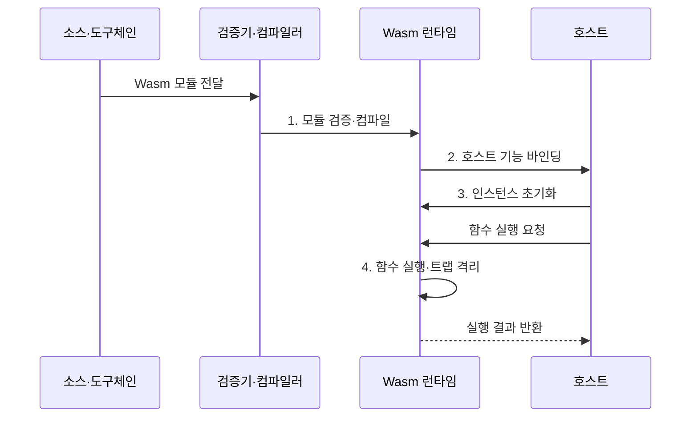

---
sidebar:
  order: 166
  label: "166. WebAssembly (WebAssembly)"
  badge:
    text: "미출 · 60%"
    variant: note
title: "WebAssembly (WebAssembly)"
date: "2026-07-31T08:57:40+09:00"
tags:
  - "notes-latest-tech"
weight: 166
extra:
  question_no: "166"
  source_status: "미출"
  source_history: ""
  priority: 60
  priority_note: "WebAssembly 샌드박스·이식성 비교가 유력"
---

## 미리 알고가기

- **WebAssembly(Wasm)**: 여러 언어로 작성한 프로그램을 이식 가능한 바이트코드 모듈로 변환해 실행하는 기술
- **런타임(runtime)**: Wasm 모듈을 검증하고 인스턴스화해 명령을 실행하는 환경
- **선형 메모리(linear memory)**: Wasm 인스턴스가 정수 주소로 접근하는 연속된 격리 메모리 공간
- **트랩(trap)**: 범위를 벗어난 메모리 접근처럼 실행 규칙을 위반했을 때 해당 실행을 중단하는 예외
- **가져오기·내보내기(import·export)**: 호스트가 제공하는 기능과 모듈이 외부에 공개하는 기능을 연결하는 명시적 계약
- **WASI(WebAssembly System Interface)**: 파일·네트워크 등 시스템 자원에 접근하기 위한 표준화된 호스트 인터페이스
- **WIT(WebAssembly Interface Type)**: 언어와 런타임이 달라도 컴포넌트 간 함수와 자료형 계약을 표현하는 인터페이스 정의 형식

## Ⅰ. 개요

- 정의/개념: 검증 가능한 이식형 바이트코드를 **샌드박스 런타임**에서 실행하는 WebAssembly
- 배경/필요성: 네이티브 확장은 운영체제·CPU 종속으로 **배포 이식성·권한 격리 동시 확보 불가**

### 쉽게 이해하기 (학습용)

- 다른 작업장에서도 같은 설계도로 부품을 조립하되, 관리자가 허용한 공구만 빌려 쓰게 하는 방식과 같습니다.

## Ⅱ. 특징

- 구조화된 제어 흐름·자료형을 실행 전 검사하는 **검증형 바이트코드**
- 모듈별 주소 공간과 경계 검사 기반 **선형 메모리 격리**
- 가져오기·내보내기와 WASI·WIT 기반 **명시적 호스트 계약**

### 쉽게 이해하기 (학습용)

- 프로그램을 작은 독립 작업실에 넣고, 작업실 밖의 기능은 허가증이 붙은 창구로만 사용하게 합니다.

## Ⅲ. 구조 및 구성요소

| 구성요소 | 책임 |
|:---|:---|
| **Wasm 모듈** | 명령, 함수, 자료형, 가져오기·내보내기 선언 보유 |
| **검증기·컴파일러** | 모듈 형식과 자료형을 검증하고 실행 코드 준비 |
| **런타임 인스턴스** | 모듈 상태를 생성하고 함수 호출과 트랩 처리 |
| **선형 메모리** | 모듈이 사용하는 격리 주소 공간 제공 |
| **호스트 인터페이스** | 허용된 시스템 기능과 외부 함수 연결 |

### 쉽게 이해하기 (학습용)

- 설계도를 검사한 뒤 독립 작업실을 만들고, 작업실의 창고와 외부 공구 대여 창구를 각각 연결하는 구조입니다.

## Ⅳ. 흐름도

1. **모듈 검증·컴파일**: 형식·자료형·제어 흐름 검사와 실행 코드 준비
2. **호스트 기능 바인딩**: 선언된 가져오기에 허용 기능만 연결
3. **인스턴스 초기화**: 선형 메모리와 테이블 등 독립 실행 상태 생성
4. **함수 실행·트랩 격리**: 위반 발생 시 해당 모듈 실행 중단

### 쉽게 이해하기 (학습용)

- 런타임은 모듈을 검증하고 허용된 호스트 기능만 연결한 뒤 격리된 실행 상태에서 함수를 처리합니다.

## Ⅴ. 종류 및 비교

| 구분 | WebAssembly | 네이티브 프로세스 | 컨테이너 |
|:---|:---|:---|:---|
| 적용 대상 | **플러그인·엣지 함수·다중 언어 모듈** | 직접 시스템 접근이 필요한 **고성능 프로그램** | 운영체제 사용자 공간을 포함한 **애플리케이션** |
| 핵심 경계 | **런타임·선형 메모리·명시적 가져오기** | **운영체제 프로세스·사용자 권한** | **네임스페이스·제어 그룹** |
| 주요 한계 | **호스트 인터페이스·런타임 제약** | **운영체제·CPU 종속성**과 넓은 권한 | **이미지 크기·운영 복잡도** |

### 쉽게 이해하기 (학습용)

- 작은 격리 모듈과 빠른 이식성이 중요하면 WebAssembly, 운영체제 환경 전체가 필요하면 컨테이너를 선택합니다.

## Ⅵ. 실무 고려사항 및 대책

| 고려사항 | 대책 | 효과 |
|:---|:---|:---|
| 과도한 **가져오기 권한**으로 샌드박스 경계 약화 | 기능 허용 목록과 **디렉터리·네트워크 최소 권한** | **샌드박스 이탈 범위** 축소 |
| **WASI·WIT 버전 불일치**로 인터페이스 계약 실패 | 계약 버전 고정·호환성 행렬·**교차 런타임 시험** | **실행 호환성** 확보 |
| **메모리 고갈·트랩**으로 요청 처리 중단 | 메모리·시간·연산량 한도와 **트랩 복구 경로** | **중단 영향** 제한 |

### 쉽게 이해하기 (학습용)

- 가져오기 권한과 자원 한도를 배포 전에 고정해야 샌드박스가 실제 보안 경계로 작동합니다.

## Ⅶ. 결론

- **호스트 권한·런타임 호환성**을 제한할 수 있는 비신뢰 모듈에 **WebAssembly** 적용

### 쉽게 이해하기 (학습용)

- 실행 속도만 보지 말고 필요한 시스템 권한과 런타임 호환성을 기준으로 적용 범위를 결정해야 합니다.
