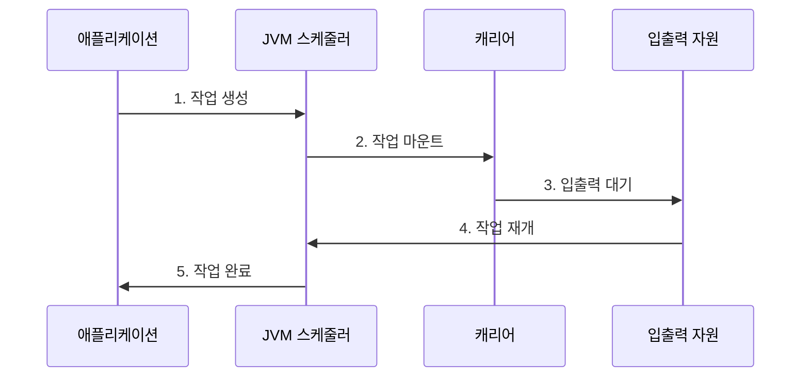

---
sidebar:
  order: 167
  label: "167. 가상 스레드 (Virtual Thread)"
  badge:
    text: "미출 · 60%"
    variant: note
title: "가상 스레드 (Virtual Thread)"
date: "2026-07-25T01:51:00+09:00"
tags:
  - "notes-latest-tech"
weight: 167
extra:
  question_no: "167"
  source_status: "미출"
  source_history: ""
  priority: 60
  priority_note: "가상 스레드의 실행 원리와 적용 한계가 유력"
---

## 미리 알고 가기

- **가상 스레드(virtual thread)**: 운영체제가 아니라 JVM이 생성·스케줄링하는 경량 스레드
- **플랫폼 스레드(platform thread)**: 운영체제 스레드와 직접 대응되는 기존 자바 스레드
- **캐리어 스레드(carrier thread)**: 가상 스레드의 코드를 실제 CPU에서 실행하는 플랫폼 스레드
- **마운트·언마운트(mount·unmount)**: 가상 스레드를 캐리어 스레드에 연결하거나 분리하는 동작
- **블로킹 입출력(blocking I/O)**: 작업이 끝날 때까지 호출 스레드가 기다리는 파일·네트워크 입출력 방식
- **피닝(pinning)**: 가상 스레드가 캐리어에서 분리되지 못해 캐리어를 계속 점유하는 상태
- **JFR(Java Flight Recorder)**: JVM 실행 사건과 성능 정보를 낮은 부하로 기록하는 진단 기능

## Ⅰ. 개요

- **정의**: 가상 스레드는 다수의 논리적 작업을 소수의 **캐리어 스레드** 위에 다중화하는 JVM 관리형 경량 스레드
- **필요성**: 요청마다 플랫폼 스레드를 할당하면 스택 메모리와 운영체제 스케줄링 비용이 커지므로, 동기식 코드 구조를 유지하면서 높은 입출력 동시성을 확보할 수단 필요

### 쉽게 이해하기

- 많은 손님이 주문을 기다리는 동안 직원이 한 손님 앞에 계속 서 있지 않고, 준비가 끝난 주문부터 다시 처리하는 방식입니다.

## Ⅱ. 특징

- **작업별 스레드 모델**: 요청마다 순차적인 동기식 코드를 작성하여 콜백 분할 없이 흐름과 예외 추적 유지
- **입출력 대기 분리**: 지원되는 블로킹 입출력 대기 시 가상 스레드를 언마운트하여 캐리어를 다른 작업에 재사용
- **JVM 다중화**: 독립 스택과 스레드 의미는 유지하되 실제 실행은 제한된 캐리어 집합에 스케줄링

### 쉽게 이해하기

- 주문표는 손님마다 따로 유지하지만, 실제 직원은 기다리지 않고 준비된 주문표를 번갈아 처리합니다.

## Ⅲ. 구조 및 구성요소

| 구성요소 | 책임 |
|:---|:---|
| **가상 스레드** | 요청별 실행 스택과 작업 상태 유지 |
| **JVM 스케줄러** | 실행 가능한 가상 스레드를 캐리어에 배정 |
| **캐리어 풀** | 가상 스레드의 명령을 실제 CPU에서 실행 |
| **입출력 연동** | 대기 작업을 감지해 언마운트와 재실행 지원 |
| **외부 자원 제한기** | 데이터베이스·외부 API의 동시 접근량 통제 |

### 쉽게 이해하기

- 개별 주문표, 배정 담당자, 실제 직원, 조리 완료 알림, 주방 수용량 제한 장치가 협력하는 구조입니다.

## Ⅳ. 흐름도

### 동작 원리

1. **작업 생성**: 요청별 가상 스레드와 독립 실행 상태 생성
2. **작업 마운트**: 스케줄러가 실행 가능한 가상 스레드를 캐리어에 연결
3. **입출력 대기**: 블로킹 입출력 시 가상 스레드를 언마운트해 캐리어 반환
4. **작업 재개**: 입출력 완료 후 준비 큐에 넣고 사용 가능한 캐리어에 다시 마운트
5. **작업 완료**: 결과와 예외를 호출자에 전달하고 진단 지표 기록

## Ⅴ. 종류 및 비교

| 구분 | 가상 스레드 | 플랫폼 스레드 | 이벤트 루프 |
|:---|:---|:---|:---|
| **적용 대상** | 대기 시간이 긴 요청별 입출력 작업 | CPU 집약 작업과 제한된 동시 작업 | 비동기 프레임워크 중심의 대규모 연결 |
| **핵심 방식** | JVM이 다수 작업을 캐리어에 다중화 | 운영체제 스레드가 작업을 직접 실행 | 소수 루프가 준비된 사건을 순차 처리 |
| **주요 한계** | 피닝과 외부 자원 과부하 관리 필요 | 스레드 수에 따른 메모리·문맥 전환 비용 | 콜백·비동기 흐름의 코드 복잡성 |

## Ⅵ. 실무 고려사항 및 대책

| 고려사항 | 위험 | 대책 |
|:---|:---|:---|
| **피닝·장기 CPU 점유** | 캐리어가 반환되지 않아 처리량 저하 | JFR로 관련 사건을 관찰하고 장기 CPU·네이티브 작업을 제한된 별도 실행기로 분리 |
| **외부 자원 과부하** | 늘어난 동시 요청이 DB 연결과 외부 API 한도 소진 | 세마포어, 연결 풀, 호출별 동시성 한도로 하류 용량에 맞게 제한 |
| **스레드 로컬 남용** | 가상 스레드 수만큼 큰 객체가 복제되어 힙 압박 | 수명 범위를 축소하고 대형 캐시 저장을 피하며 힙 프로파일링 수행 |

## Ⅶ. 결론

- 가상 스레드는 **입출력 대기 비율**, **피닝 여부**, **외부 자원 용량**을 기준으로 적용하여 동기식 개발성과 높은 동시성을 함께 확보해야 한다.
