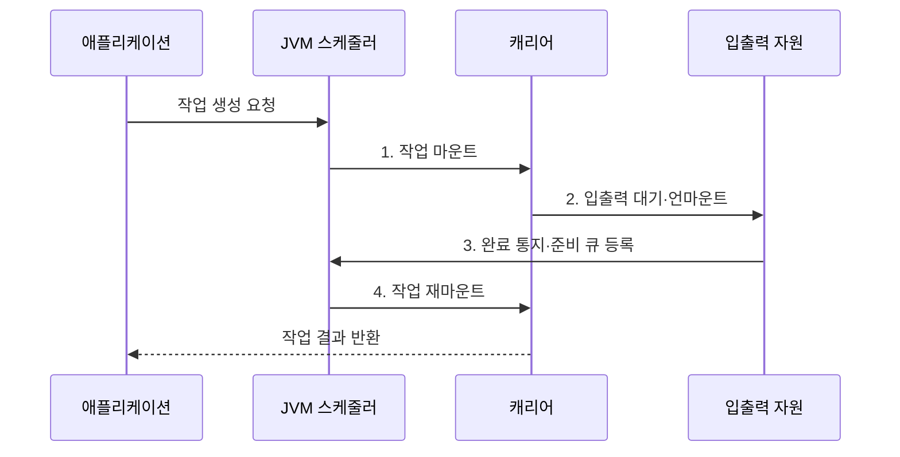

---
sidebar:
  order: 167
  label: "167. 가상 스레드 (Virtual Thread)"
  badge:
    text: "미출 · 60%"
    variant: note
title: "가상 스레드 (Virtual Thread)"
date: "2026-07-31T08:58:27+09:00"
tags:
  - "notes-latest-tech"
weight: 167
extra:
  question_no: "167"
  source_status: "미출"
  source_history: ""
  priority: 60
  priority_note: "가상 스레드의 실행 원리와 적용 한계가 유력"
---

## 미리 알고가기

- **가상 스레드(virtual thread)**: 운영체제가 아니라 JVM이 생성·스케줄링하는 경량 스레드
- **플랫폼 스레드(platform thread)**: 운영체제 스레드와 직접 대응되는 기존 자바 스레드
- **캐리어 스레드(carrier thread)**: 가상 스레드의 코드를 실제 CPU에서 실행하는 플랫폼 스레드
- **마운트·언마운트(mount·unmount)**: 가상 스레드를 캐리어 스레드에 연결하거나 분리하는 동작
- **블로킹 입출력(blocking I/O)**: 작업이 끝날 때까지 호출 스레드가 기다리는 파일·네트워크 입출력 방식
- **피닝(pinning)**: native·foreign 함수에서 가상 스레드가 캐리어를 계속 점유하는 상태로, JDK 24부터 synchronized 대기는 JEP 491로 대부분 해소
- **JFR(Java Flight Recorder)**: JVM 실행 사건과 성능 정보를 낮은 부하로 기록하는 진단 기능

## Ⅰ. 개요

- 정의/개념: 가상 스레드는 다수의 논리적 작업을 소수의 **캐리어 스레드** 위에 다중화하는 JVM 관리형 경량 스레드
- 배경/필요성: 요청별 플랫폼 스레드는 **스택 메모리·운영체제 스케줄링 비용 급증**

### 쉽게 이해하기 (학습용)

- 많은 손님이 주문을 기다리는 동안 직원이 한 손님 앞에 계속 서 있지 않고, 준비가 끝난 주문부터 다시 처리하는 방식입니다.

## Ⅱ. 특징

- 콜백 분할 없이 흐름·예외를 추적하는 **작업별 스레드 모델**
- 블로킹 입출력 대기에 캐리어를 반환하는 **마운트·언마운트**
- JDK 24 이후 synchronized 대기 해제와 **native·foreign 피닝 잔존**

### 쉽게 이해하기 (학습용)

- 주문표는 손님마다 따로 유지하지만, 실제 직원은 기다리지 않고 준비된 주문표를 번갈아 처리합니다.

## Ⅲ. 구조 및 구성요소

| 구성요소 | 책임 |
|:---|:---|
| **가상 스레드** | 요청별 실행 스택과 작업 상태 유지 |
| **JVM 스케줄러** | 실행 가능한 가상 스레드를 캐리어에 배정 |
| **캐리어 풀** | 가상 스레드의 명령을 실제 CPU에서 실행 |
| **입출력 연동** | 대기 작업을 감지해 언마운트와 재실행 지원 |
| **외부 자원 제한기** | 데이터베이스·외부 API의 동시 접근량 통제 |

### 쉽게 이해하기 (학습용)

- 개별 주문표, 배정 담당자, 실제 직원, 조리 완료 알림, 주방 수용량 제한 장치가 협력하는 구조입니다.

## Ⅳ. 흐름도

1. **작업 마운트**: 실행 가능한 가상 스레드를 캐리어에 연결
2. **입출력 대기·언마운트**: 블로킹 입출력 중 캐리어 반환
3. **완료 통지·준비 큐 등록**: 입출력 완료 작업을 실행 대기로 전환
4. **작업 재마운트**: 사용 가능한 캐리어에 연결해 실행 재개

### 쉽게 이해하기 (학습용)

- 입출력을 기다리는 작업은 캐리어에서 내려오고 준비된 작업이 그 자리를 사용해 동시성을 높입니다.

## Ⅴ. 종류 및 비교

| 구분 | 가상 스레드 | 플랫폼 스레드 | 이벤트 루프 |
|:---|:---|:---|:---|
| 적용 대상 | 대기 시간이 긴 **요청별 입출력 작업** | **CPU 집약·제한된 동시 작업** | 비동기 프레임워크의 **대규모 연결** |
| 핵심 방식 | JVM의 **캐리어 다중화** | **운영체제 스레드**가 작업 직접 실행 | 소수 **이벤트 루프**의 순차 처리 |
| 주요 한계 | **피닝·외부 자원 과부하** | **메모리·문맥 전환 비용** | **콜백·비동기 코드 복잡성** |

### 쉽게 이해하기 (학습용)

- 동기식 코드를 유지한 대규모 입출력 처리에는 가상 스레드가 적합하지만 CPU 집약 작업의 병렬성은 늘리지 않습니다.

## Ⅵ. 실무 고려사항 및 대책

| 고려사항 | 대책 | 효과 |
|:---|:---|:---|
| native·foreign 함수의 **피닝·장기 CPU 점유** | **JFR 관측**·장기 작업의 별도 실행기 분리 | **캐리어 반환 지연** 완화 |
| 동시 요청 증가의 **외부 자원 과부하** | **세마포어·연결 풀·호출 동시성 한도** | 하류 **동시성 한도** 준수 |
| 가상 스레드별 **스레드 로컬 남용** | 수명 범위 축소·대형 캐시 회피·**힙 프로파일링** | **힙 점유량** 축소 |

### 쉽게 이해하기 (학습용)

- 스레드 수가 늘어도 데이터베이스 연결 수는 늘지 않으므로 하류 자원의 동시성 한도를 별도로 적용해야 합니다.

## Ⅶ. 결론

- 입출력 대기가 많고 **native 피닝**이 적으며 **하류 동시성**을 제한할 때 가상 스레드 적용

### 쉽게 이해하기 (학습용)

- 입출력 대기가 많고 피닝이 적으며 하류 용량을 제한할 수 있을 때 가상 스레드를 선택합니다.
