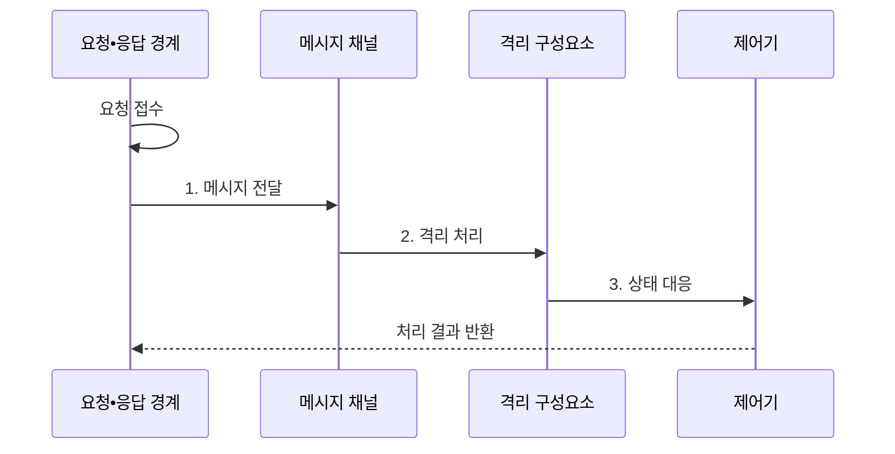

---
sidebar:
  order: 168
  label: "168. 리액티브 시스템 (Reactive System)"
  badge:
    text: "미출 • 60%"
    variant: note
title: "리액티브 시스템 (Reactive System)"
date: "2026-08-03T08:48:47+09:00"
tags: ["notes-latest-tech"]
weight: 168
extra:
  question_no: "168"
  source_status: "미출"
  source_history: ""
  priority: 60
  priority_note: "리액티브 4대 특성과 장애•부하 대응이 유력"
---

## Ⅰ. 개요

핵심 용어

- **리액티브 시스템(Reactive System)**: 부하와 장애가 변해도 응답성을 유지하도록 메시지•격리•탄력성을 함께 설계한 시스템이다.
- **응답성**: 정한 시간 안에 일관된 성공•실패 응답을 제공하는 성질이다.

- 정의/개념: 메시지 기반 분리•장애 격리•자원 탄력성으로 부하와 장애 변화에도 응답성을 유지하는 **리액티브 시스템(Reactive System)**
- 배경/필요성: 강결합 동기 호출은 **지연•장애 연쇄 전파와 응답 기한 상실**

#### 한줄 요약

- 한 창구가 막혀도 다른 창구가 계속 일하고, 대기 줄에 맞춰 창구 수와 입장 인원을 조절하는 운영 방식입니다.

## Ⅱ. 특징

핵심 용어

- **회복성**: 일부 장애를 격리하고 복구하여 전체 서비스를 지속하는 성질이다.
- **탄력성**: 부하 변화에 따라 자원을 늘리거나 줄여 처리 용량을 맞추는 성질이다.
- **메시지 구동**: 구성요소가 비동기 메시지로 느슨하게 연결되는 방식이다.

- 비동기 전달로 시간•위치•실패 결합을 낮추는 **메시지 구동 방식**
- 구성요소 격리•감독•대체 응답 기반 **회복성**
- 큐•지연에 따라 유입량•자원을 조정하는 **탄력적 응답성**

#### 한줄 요약

- 업무를 쪽지로 전달하고, 고장 난 창구는 따로 복구하며, 손님 수에 맞춰 창구를 조정합니다.

## Ⅲ. 구조 및 구성요소

핵심 용어

- **응답 경계**: 요청 기한과 성공•실패 응답 조건을 정의한 계약이다.
- **메시지 채널**: 구성요소를 시간•장소에서 분리해 비동기 메시지를 전달하는 통신 경로이다.
- **격리 구성요소**: 독립 상태와 실패 경계 안에서 업무를 처리해 장애 전파를 제한하는 단위이다.
- **감독•복구**: 실패한 구성요소를 격리하고 재시작•대체•상태 복구 정책으로 서비스 지속성을 회복한다.
- **흐름 제어(Flow Control)**: 소비 속도에 맞춰 생산량•버퍼•거부를 조절하여 과부하와 자원 고갈을 막는다.

| 구성요소 | 책임 |
|:---|:---|
| **응답 경계** | 요청 기한과 성공•실패 응답 계약 정의 |
| **메시지 채널** | 구성요소 사이의 비동기 전달과 완충 제공 |
| **격리 구성요소** | 독립 상태와 실패 경계 안에서 업무 처리 |
| **감독•복구** | 장애 감지, 재시작, 대체 인스턴스 전환 수행 |
| **흐름 제어** | 큐•지연•용량에 따라 유입과 자원 조정 |

#### 한줄 요약

- 접수 기한, 전달함, 독립 창구, 복구 관리자, 입장 조절기가 협력하는 구조입니다.

## Ⅳ. 흐름도

핵심 용어

- **역압(Backpressure)**: 소비자가 처리 가능한 속도를 생산자에게 전달해 유입량을 조절하는 기법이다.
- **상태 대응**: 큐•부하•장애 관측에 따라 확장•격리•복구•입장 제어를 선택하는 과정이다.

1. **메시지 전달**: 비동기 채널이 송신자와 처리자의 속도 차이 완충
2. **격리 처리**: 독립 구성요소가 자신의 상태와 실패 경계 안에서 실행
3. **상태 대응**: 큐•부하•장애에 따라 역압•확장•격리•복구 수행

#### 한줄 요약

- 요청을 메시지로 완충하고 장애와 부하 상태에 따라 격리•복구•역압을 적용해 응답 기한을 지킵니다.

## Ⅴ. 종류 및 비교

핵심 용어

- **리액티브 프로그래밍**: 데이터 변화에 반응하도록 비동기 연산과 선언적 변환을 조합하는 코드 구성 방식이다.
- **리액티브 스트림**: 비차단 비동기 데이터 흐름에서 역압을 전달하는 상호 운용 규약이다.

| 구분 | 리액티브 시스템 | 리액티브 프로그래밍 | 리액티브 스트림 |
|:---|:---|:---|:---|
| 적용 대상 | **분산 시스템 전체 아키텍처** | 변화에 반응하는 **코드 구성** | 비동기 데이터 흐름의 **상호 운용** |
| 핵심 방식 | **응답성•회복성•탄력성•메시지 구동** | **선언적 변환•비동기 연산** 조합 | **비차단 역압 규약** |
| 주요 한계 | **운영 정책•분산 장애 설계** 복잡성 | **디버깅•학습 난도** | **회복성•탄력성** 별도 설계 |

#### 한줄 요약

- 리액티브 시스템은 전체 아키텍처, 리액티브 프로그래밍은 코드 구성, 리액티브 스트림은 비동기 흐름 규약입니다.

## Ⅵ. 실무 고려사항 및 대책

핵심 용어

- **재시도 예산**: 장애 시 추가 부하를 제한하도록 원본 요청 대비 허용할 재시도량을 정한 값이다.
- **입장 제어**: 처리 용량을 넘는 요청을 대기•거부해 큐와 지연의 무한 증가를 막는 통제이다.

| 문제 | 대책 | 효과 |
|:---|:---|:---|
| 무제한 메시지 큐로 **메모리 고갈•지연 폭증** | 유한 큐•입장 제어•**역압•초과 요청 거부** | **메모리•지연 증가** 제한 |
| 재시도 폭주로 **하류 시스템 추가 압박** | **회로 차단기•지수 백오프•재시도 예산** | **재시도 부하** 감소 |
| **확장 지연**으로 응답 시간 목표 위반 | 큐 지연 임계값•**사전 준비 용량•확장 상한** | **서비스 수준 목표(Service Level Objective, SLO) 위반** 억제 |

#### 한줄 요약

- 무제한 큐와 무제한 재시도를 피하고 처리 용량에 맞춘 역압과 복구 예산을 운영해야 합니다.

## Ⅶ. 결론

핵심 용어

- **응답 기한**: 요청자가 유효한 성공•실패 결과를 받아야 하는 최대 시간이다.
- **부하 조절 정책**: 역압•입장 제어•확장 상한으로 시스템 유입량과 처리 용량을 맞추는 규칙이다.

- **리액티브 구조 선택 조건**: 응답 기한•장애 격리와 부하 조절 정책의 공동 운영

#### 한줄 요약

- 응답 기한과 장애 경계, 부하 조절 정책을 함께 설계할 수 있을 때 리액티브 구조를 선택합니다.
