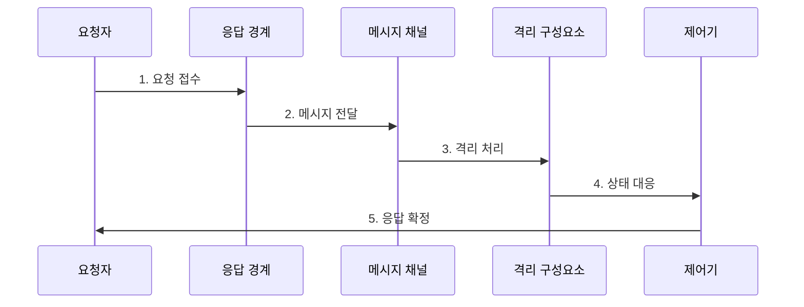

---
sidebar:
  order: 168
  label: "168. 리액티브 시스템 (Reactive System)"
  badge:
    text: "미출 · 60%"
    variant: note
title: "리액티브 시스템 (Reactive System)"
date: "2026-07-30T11:10:21+09:00"
tags: ["notes-latest-tech"]
weight: 168
extra:
  question_no: "168"
  source_status: "미출"
  source_history: ""
  priority: 60
  priority_note: "리액티브 4대 특성과 장애·부하 대응이 유력"
---

## 미리 알고 가기

- **리액티브 시스템**: 부하와 장애가 변해도 응답성을 유지하도록 메시지 기반으로 설계한 시스템
- **응답성**: 정해진 시간 안에 일관된 응답을 제공하는 성질
- **회복성**: 일부 장애를 격리하고 복구하여 전체 서비스를 지속하는 성질
- **탄력성**: 부하 변화에 따라 자원을 늘리거나 줄이는 성질
- **메시지 구동**: 구성요소가 비동기 메시지로 느슨하게 연결되는 방식
- **역압**: 소비자가 처리 가능한 속도를 생산자에게 전달해 유입량을 조절하는 기법

## Ⅰ. 개요

- **정의**: 리액티브 시스템은 비동기 메시지, 장애 격리, 복구, 자원 탄력성을 결합해 부하와 장애 상황에서도 **응답성**을 유지하는 아키텍처
- **필요성**: 동기 호출이 강하게 연결된 분산 시스템은 지연과 장애가 연쇄 전파되므로, 처리 경계와 흐름 제어를 중심으로 설계할 필요

### 쉽게 이해하기

- 한 창구가 막혀도 다른 창구가 계속 일하고, 대기 줄에 맞춰 창구 수와 입장 인원을 조절하는 운영 방식입니다.

## Ⅱ. 특징

- **메시지 기반 분리**: 비동기 전달로 송신자와 수신자의 시간·위치·실패 결합도 완화
- **회복성**: 구성요소 격리, 감독, 대체 응답으로 국소 장애의 전체 확산 방지
- **탄력적 응답성**: 큐와 지연을 관찰해 유입량과 자원을 조정하여 응답 시간 목표 유지

### 쉽게 이해하기

- 업무를 쪽지로 전달하고, 고장 난 창구는 따로 복구하며, 손님 수에 맞춰 창구를 조정합니다.

## Ⅲ. 구조 및 구성요소

| 구성요소 | 책임 |
|:---|:---|
| **응답 경계** | 요청 기한과 성공·실패 응답 계약 정의 |
| **메시지 채널** | 구성요소 사이의 비동기 전달과 완충 제공 |
| **격리 구성요소** | 독립 상태와 실패 경계 안에서 업무 처리 |
| **감독·복구** | 장애 감지, 재시작, 우회, 대체 응답 수행 |
| **흐름 제어** | 큐·지연·용량에 따라 유입과 자원 조정 |

### 쉽게 이해하기

- 접수 기한, 전달함, 독립 창구, 복구 관리자, 입장 조절기가 협력하는 구조입니다.

## Ⅳ. 흐름도

### 동작 원리

1. **요청 접수**: 응답 기한과 처리 계약을 지정해 요청을 메시지로 변환
2. **메시지 전달**: 비동기 채널이 송신자와 처리자의 속도 차이 완충
3. **격리 처리**: 독립 구성요소가 자신의 상태와 실패 경계 안에서 실행
4. **상태 대응**: 큐·부하·장애에 따라 역압, 확장, 격리, 복구 수행
5. **응답 확정**: 결과, 시간 초과, 대체 응답을 반환하고 관측 결과를 제어 정책에 반영

## Ⅴ. 종류 및 비교

| 구분 | 리액티브 시스템 | 리액티브 프로그래밍 | 리액티브 스트림 |
|:---|:---|:---|:---|
| **적용 대상** | 분산 시스템 전체 아키텍처 | 데이터·사건 변화에 반응하는 코드 구성 | 비동기 데이터 흐름의 상호 운용 |
| **핵심 방식** | 응답성·회복성·탄력성·메시지 구동 | 선언적 변환과 비동기 연산 조합 | 비차단 역압 규약 |
| **주요 한계** | 운영 정책과 분산 장애 설계 복잡성 | 디버깅과 학습 난도 | 시스템 전체의 회복성·탄력성은 별도 설계 |

## Ⅵ. 실무 고려사항 및 대책

| 고려사항 | 대책 | 효과 |
|:---|:---|:---|
| **무제한 메시지 큐** 미검증 시 적체가 메모리 고갈과 지연 폭증으로 전환 | 유한 큐, 입장 제어, 역압과 초과 요청 거부 정책 적용 | 큐 적체의 **메모리·지연 증가** 제한 |
| **재시도 폭주** 미검증 시 장애 중 재시도가 하류 시스템을 추가 압박 | 회로 차단기, 지수 백오프, 무작위 지연과 재시도 예산 적용 | 장애 중 **재시도 부하** 감소 |
| **확장 지연** 미검증 시 자원이 늦게 늘어나 응답 시간 목표 위반 | 큐 지연 기반 임계값, 사전 준비 용량, 확장 상한을 함께 관리 | 확장 지연에 따른 **SLO 위반** 억제 |

## Ⅶ. 결론

- 리액티브 시스템은 **응답 기한**, **장애 격리**, **부하 적응**을 하나의 피드백 구조로 설계해 변화 상황에서도 예측 가능한 서비스를 제공해야 한다.
