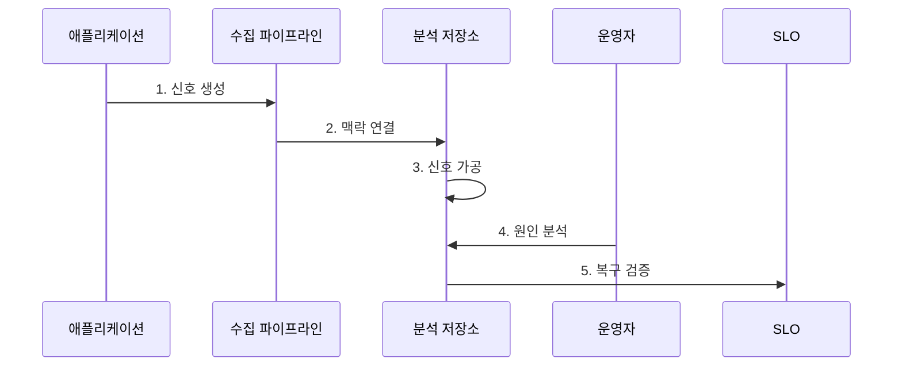

---
sidebar:
  order: 169
  label: "169. 클라우드 네이티브 관찰 가능성"
  badge:
    text: "미출 · 60%"
    variant: note
title: "클라우드 네이티브 관찰 가능성"
date: "2026-07-25T01:53:00+09:00"
tags: ["notes-latest-tech"]
weight: 169
extra:
  question_no: "169"
  source_status: "미출"
  source_history: ""
  priority: 60
  priority_note: "텔레메트리 상관분석과 SLO 연계가 유력"
---

## 미리 알고 가기

- **관찰 가능성**: 외부 출력으로 시스템 내부 상태와 원인을 추론할 수 있는 정도
- **텔레메트리**: 시스템이 생성하는 메트릭, 로그, 추적, 프로파일 자료
- **메트릭·로그·추적·프로파일**: 수치 추세, 사건 기록, 요청 경로, 자원 사용 원인을 각각 나타내는 신호
- **상관 식별자**: 동일 요청이나 자원에서 나온 여러 신호를 연결하는 값
- **카디널리티**: 속성에 존재하는 고유 값의 수
- **SLI·SLO**: 서비스 수준 지표와 그 지표에 대해 달성하기로 한 목표
- **샘플링**: 비용을 통제하기 위해 전체 사건 중 일부를 선택해 저장하는 기법

## Ⅰ. 개요

- **정의**: 클라우드 네이티브 관찰 가능성은 분산 환경의 텔레메트리와 실행 맥락을 연결하여 **내부 상태, 근본 원인, 사용자 영향**을 추론하는 능력
- **필요성**: 동적으로 변하는 서비스에서는 미리 정한 임계값 감시만으로 예상하지 못한 장애의 원인과 영향을 설명하기 어려우므로 다신호 상관분석 필요

### 쉽게 이해하기

- 체온만 보는 것이 아니라 증상 기록, 검사 결과, 발생 순서를 함께 연결해 병의 원인을 찾는 과정과 같습니다.

## Ⅱ. 특징

- **다신호 상관성**: 메트릭·로그·추적·프로파일을 시간, 요청, 자원, 배포 버전으로 연결
- **미지의 원인 탐색**: 풍부한 실행 맥락을 질의하여 사전에 정하지 않은 장애 가설도 검증
- **사용자 영향 중심**: 기술 신호를 SLI·SLO와 연결하여 우선순위와 복구 여부 판단

### 쉽게 이해하기

- 여러 검사 결과를 같은 환자와 시간에 묶고, 실제 생활에 얼마나 영향을 주는지까지 확인합니다.

## Ⅲ. 구조 및 구성요소

| 구성요소 | 책임 |
|:---|:---|
| **계측** | 애플리케이션과 기반 시설에서 텔레메트리 생성 |
| **수집 파이프라인** | 신호 수신, 정규화, 필터링, 전달 |
| **실행 맥락** | 요청·서비스·자원·버전의 상관관계 유지 |
| **저장·질의** | 신호별 보존과 교차 분석 기능 제공 |
| **SLO·대응** | 사용자 영향 판단, 경보, 복구 검증 수행 |

### 쉽게 이해하기

- 검사 장비가 자료를 모아 환자 정보로 연결하고, 분석실과 진료팀이 원인과 회복 여부를 판단합니다.

## Ⅳ. 흐름도

### 동작 원리

1. **신호 생성**: 코드와 기반 시설에서 메트릭, 로그, 추적, 프로파일 생성
2. **맥락 연결**: 상관 식별자와 자원·버전 속성을 전파해 신호 연결
3. **신호 가공**: 정규화, 필터링, 샘플링 후 목적별 저장소에 보존
4. **원인 분석**: 사용자 영향에서 출발해 관련 신호를 질의하고 장애 가설 검증
5. **복구 검증**: 조치 후 SLI가 SLO 범위로 회복했는지 확인하고 정책 개선

## Ⅴ. 종류 및 비교

| 구분 | 텔레메트리 | 모니터링 | 관찰 가능성 |
|:---|:---|:---|:---|
| **적용 대상** | 원시 실행 신호의 생성·전달 | 알려진 상태와 임계값 감시 | 알려지지 않은 내부 상태와 원인 탐색 |
| **핵심 방식** | 메트릭·로그·추적·프로파일 수집 | 대시보드와 규칙 기반 경보 | 맥락 기반 교차 질의와 가설 검증 |
| **주요 한계** | 자료 자체는 원인을 설명하지 못함 | 미리 정의하지 않은 장애 탐색에 취약 | 비용·카디널리티·분석 역량 관리 필요 |

## Ⅵ. 실무 고려사항 및 대책

| 고려사항 | 위험 | 대책 |
|:---|:---|:---|
| **추적 맥락 단절** | 서비스 간 신호를 연결하지 못해 원인 경로 유실 | 전파 규약을 통일하고 경계별 식별자 전달 검증 |
| **카디널리티 폭증** | 저장·질의 비용 증가와 분석 성능 저하 | 속성 허용 목록, 카디널리티 예산, 보존 등급 적용 |
| **희귀 오류 누락** | 균일 샘플링이 중요한 저빈도 실패를 제거 | 오류 우선 및 꼬리 기반 샘플링과 원본 로그 연계 |

## Ⅶ. 결론

- 클라우드 네이티브 관찰 가능성은 **맥락 연속성**, **신호 비용**, **사용자 SLO**를 함께 관리하여 탐지에서 원인 규명과 복구 검증까지 연결해야 한다.
