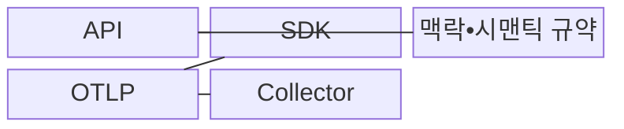
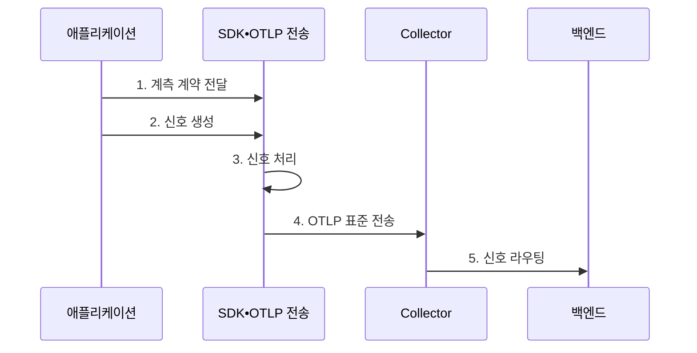

---
sidebar:
  order: 170
  label: "170. OpenTelemetry"
  badge:
    text: "미출 • 60%"
    variant: note
title: "OpenTelemetry"
date: "2026-08-03T08:48:47+09:00"
tags: ["notes-latest-tech"]
weight: 170
extra:
  question_no: "170"
  source_status: "미출"
  source_history: ""
  priority: 60
  priority_note: "OpenTelemetry 구성과 수집 파이프라인이 유력"
---

## Ⅰ. 개요

핵심 용어

- **오픈텔레메트리(OpenTelemetry, OTel)**: 텔레메트리를 생성•처리•전송하기 위한 공급자 중립 오픈소스 관찰 가능성 프레임워크이다.
- **공급자 중립**: 특정 관측 백엔드 제품에 종속되지 않는 공통 계측•전송 계약을 제공하는 성질이다.

- 정의/개념: 공급자 중립 응용 프로그래밍 인터페이스(Application Programming Interface, API)•소프트웨어 개발 키트(Software Development Kit, SDK)•오픈텔레메트리 프로토콜(OpenTelemetry Protocol, OTLP)•Collector로 텔레메트리를 생성•처리•전송하는 **오픈텔레메트리(OpenTelemetry, OTel) 프레임워크**
- 배경/필요성: 제품별 에이전트•속성 체계는 **언어•백엔드 종속과 중복 계측** 유발

#### 한줄 요약

- 여러 제조사의 측정 장비가 같은 단위와 운송 규격을 사용해 원하는 분석소로 자료를 보낼 수 있게 하는 공통 체계입니다.

## Ⅱ. 특징

핵심 용어

- **맥락 전파**: 서비스 경계를 넘어 추적 식별자와 부가 정보를 전달하는 과정이다.
- **시맨틱 규약**: 서비스•요청•자원 속성의 이름과 의미를 일관되게 정의한 규칙이다.

- 계측 생성 계약과 처리 정책을 분리하는 **응용 프로그래밍 인터페이스(Application Programming Interface, API)•소프트웨어 개발 키트(Software Development Kit, SDK) 분리**
- 맥락 전파와 시맨틱 규약 기반 **맥락•의미 표준화**
- 오픈텔레메트리 프로토콜(OpenTelemetry Protocol, OTLP)•Collector 기반 **중립 전송 파이프라인**

#### 한줄 요약

- 측정 방법, 자료 포장법, 항목 이름, 운송 규격을 통일하되 최종 분석소는 필요에 따라 선택합니다.

## Ⅲ. 구조 및 구성요소

핵심 용어

- **응용 프로그래밍 인터페이스(Application Programming Interface, API)**: 애플리케이션 코드가 텔레메트리를 생성할 때 사용하는 언어별 계약이다.
- **소프트웨어 개발 키트(Software Development Kit, SDK)**: API로 생성한 신호를 샘플링•가공•내보내는 구현체이다.
- **Collector**: 텔레메트리를 수신해 처리하고 하나 이상의 저장•분석 백엔드로 전달하는 독립 구성요소이다.
- **오픈텔레메트리 프로토콜(OpenTelemetry Protocol, OTLP)**: 프로세스와 Collector 사이에서 신호를 전송하는 표준 프로토콜이다.

| 구성요소 | 책임 |
|:---|:---|
| **API** | 코드가 스팬, 메트릭, 로그를 생성하는 계약 제공 |
| **SDK** | 샘플링, 자원 결합, 일괄 처리, 내보내기 정책 실행 |
| **맥락•시맨틱 규약** | 신호 간 상관관계와 속성 의미 통일 |
| **OTLP** | 프로세스와 Collector 사이의 표준 신호 전송 |
| **Collector** | 신호 수신, 변환, 필터링, 라우팅과 내보내기 수행 |

#### 한줄 요약

- 측정 계약과 처리 장치가 공통 이름표를 붙인 자료를 표준 운송 규격으로 집하장에 보내는 구조입니다.

## Ⅳ. 흐름도

핵심 용어

- **오픈텔레메트리 프로토콜(OpenTelemetry Protocol, OTLP)**: OpenTelemetry 신호를 프로세스와 Collector 사이에서 전송하는 표준 프로토콜이다.
- **내보내기 모듈(Exporter)**: 처리한 텔레메트리를 OTLP나 백엔드별 프로토콜로 전송하는 구성요소이다.

응용 프로그래밍 인터페이스(Application Programming Interface, API)로 생성한 신호를 소프트웨어 개발 키트(Software Development Kit, SDK)가 처리하고 오픈텔레메트리 프로토콜(OpenTelemetry Protocol, OTLP)로 전송한다.

1. **계측 계약 전달**: 맥락 전파 방식과 시맨틱 규약에 맞는 속성 정의
2. **신호 생성**: 자동•수동 계측이 API를 통해 메트릭, 로그, 추적 생성
3. **신호 처리**: SDK가 자원 정보를 결합하고 샘플링•일괄 처리 수행
4. **표준 전송**: 내보내기 모듈이 OTLP로 Collector에 신호 전달
5. **신호 라우팅**: Collector가 수신•변환•필터링 후 목적별 백엔드로 전송

#### 한줄 요약

- 애플리케이션이 공통 계약으로 신호를 만들면 SDK와 Collector가 이를 처리해 원하는 분석 백엔드로 보냅니다.

## Ⅴ. 종류 및 비교

핵심 용어

- **계측 코드**: 애플리케이션의 연산•요청•상태에서 텔레메트리를 생성하도록 추가한 코드이다.
- **수집 파이프라인**: 신호를 수신•변환•필터링•라우팅해 백엔드로 전달하는 처리 경로이다.

응용 프로그래밍 인터페이스(Application Programming Interface, API), 소프트웨어 개발 키트(Software Development Kit, SDK), Collector는 신호 생성•처리•수집을 분담한다.

| 구분 | API | SDK | Collector |
|:---|:---|:---|:---|
| 적용 대상 | 애플리케이션 **계측 코드** | 애플리케이션 **실행 프로세스** | 중앙•에이전트형 **수집 파이프라인** |
| 핵심 방식 | 공급자 중립 **신호 생성 계약** | **샘플링•처리•내보내기** 구현 | **수신기•처리기•내보내기** 조합 |
| 주요 한계 | 단독 **신호 처리 불가** | **프로세스 자원•설정** 영향 | 용량 부족 시 **병목•데이터 손실** |

#### 한줄 요약

- API는 생성 계약, SDK는 프로세스 안의 처리, Collector는 중앙 수집•변환•전송을 담당합니다.

## Ⅵ. 실무 고려사항 및 대책

핵심 용어

- **카디널리티 예산**: 저장•질의 비용 한도 안에서 허용할 속성 고유 값 수를 정한 기준이다.
- **영속 버퍼**: Collector 장애나 백엔드 지연에도 신호를 잃지 않도록 디스크 등에 임시 보관하는 큐이다.

| 문제 | 대책 | 효과 |
|:---|:---|:---|
| 맥락 전파 단절로 **호출 경로 유실** | 전파 형식 통일•경계별 **식별자 전달 시험** | **분산 추적 연속성** 확보 |
| 속성 규약 불일치로 **질의 분산•비용 증가** | 규약 버전•속성 허용 목록•**카디널리티 예산** | **질의 일관성•비용 예측성** 향상 |
| Collector 과부하로 **텔레메트리 손실** | 용량 시험•재시도 큐•**영속 버퍼•신호 우선순위** | **핵심 신호 보존율** 향상 |

#### 한줄 요약

- 속성 이름과 추적 맥락을 통일하고 Collector 용량을 시험해야 백엔드를 바꿔도 신호 품질이 유지됩니다.

## Ⅶ. 결론

핵심 용어

- **계측•백엔드 분리**: 애플리케이션의 신호 생성 계약을 유지한 채 저장•분석 제품을 바꿀 수 있게 하는 설계이다.
- **핵심 신호 보존율**: 수집 부하와 장애 상황에서도 우선순위가 높은 텔레메트리가 백엔드에 도달한 비율이다.

- **계측•백엔드 분리•핵심 신호 보존율 조건**: 속성•맥락 일관성과 Collector 용량 확보 후 오픈텔레메트리(OpenTelemetry, OTel) 적용

#### 한줄 요약

- 특정 관측 제품에 묶이지 않으려면 계측 계약과 전송 파이프라인을 표준으로 유지해야 합니다.
