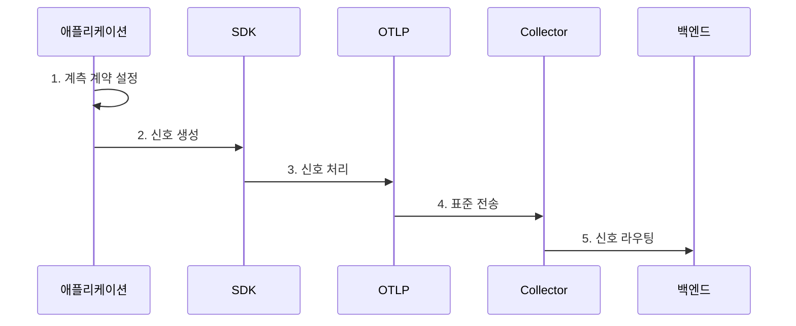

---
sidebar:
  order: 170
  label: "170. OpenTelemetry"
  badge:
    text: "미출 · 60%"
    variant: note
title: "OpenTelemetry"
date: "2026-07-25T01:54:00+09:00"
tags: ["notes-latest-tech"]
weight: 170
extra:
  question_no: "170"
  source_status: "미출"
  source_history: ""
  priority: 60
  priority_note: "OpenTelemetry 구성과 수집 파이프라인이 유력"
---

## 미리 알고 가기

- **OpenTelemetry(OTel)**: 텔레메트리를 생성·처리·전송하기 위한 공급자 중립 오픈소스 관찰 가능성 프레임워크
- **API**: 애플리케이션 코드가 텔레메트리를 생성할 때 사용하는 언어별 계약
- **SDK**: API로 생성한 신호를 샘플링·가공·내보내는 구현체
- **맥락 전파**: 서비스 경계를 넘어 추적 식별자와 부가 정보를 전달하는 과정
- **시맨틱 규약**: 서비스·요청·자원 속성의 이름과 의미를 일관되게 정의한 규칙
- **OTLP(OpenTelemetry Protocol)**: OpenTelemetry 신호를 전송하기 위한 표준 프로토콜
- **Collector**: 텔레메트리를 수신해 처리하고 하나 이상의 저장·분석 백엔드로 전달하는 독립 구성요소

## Ⅰ. 개요

- **정의**: OpenTelemetry는 메트릭·로그·추적 등 텔레메트리를 **공급자 중립 API, SDK, 규약, 프로토콜, 수집기**로 생성·처리·전송하는 프레임워크
- **필요성**: 제품별 에이전트와 속성 체계를 사용하면 언어·백엔드 종속성과 중복 계측이 커지므로, 관측 자료의 생성 계약과 전송 경로를 표준화할 필요

### 쉽게 이해하기

- 여러 제조사의 측정 장비가 같은 단위와 운송 규격을 사용해 원하는 분석소로 자료를 보낼 수 있게 하는 공통 체계입니다.

## Ⅱ. 특징

- **API·SDK 분리**: 계측 코드의 생성 계약과 실행 환경별 처리 정책을 분리하여 구현 교체 용이
- **맥락·의미 표준화**: 맥락 전파와 시맨틱 규약으로 언어와 서비스가 달라도 동일 요청과 자원을 연결
- **중립 전송 파이프라인**: OTLP와 Collector로 신호 처리와 백엔드 라우팅을 분리하며 저장·분석 백엔드 자체는 포함하지 않음

### 쉽게 이해하기

- 측정 방법, 자료 포장법, 항목 이름, 운송 규격을 통일하되 최종 분석소는 필요에 따라 선택합니다.

## Ⅲ. 구조 및 구성요소

| 구성요소 | 책임 |
|:---|:---|
| **API** | 코드가 스팬, 메트릭, 로그를 생성하는 계약 제공 |
| **SDK** | 샘플링, 자원 결합, 일괄 처리, 내보내기 정책 실행 |
| **맥락·시맨틱 규약** | 신호 간 상관관계와 속성 의미 통일 |
| **OTLP** | 프로세스와 Collector 사이의 표준 신호 전송 |
| **Collector** | 신호 수신, 변환, 필터링, 라우팅과 내보내기 수행 |

### 쉽게 이해하기

- 측정 계약과 처리 장치가 공통 이름표를 붙인 자료를 표준 운송 규격으로 집하장에 보내는 구조입니다.

## Ⅳ. 흐름도

### 동작 원리

1. **계측 계약 설정**: 맥락 전파 방식과 시맨틱 규약에 맞는 속성 정의
2. **신호 생성**: 자동·수동 계측이 API를 통해 메트릭, 로그, 추적 생성
3. **신호 처리**: SDK가 자원 정보를 결합하고 샘플링·일괄 처리 수행
4. **표준 전송**: 내보내기 모듈이 OTLP로 Collector에 신호 전달
5. **신호 라우팅**: Collector가 수신·변환·필터링 후 목적별 백엔드로 전송

## Ⅴ. 종류 및 비교

| 구분 | API | SDK | Collector |
|:---|:---|:---|:---|
| **적용 대상** | 애플리케이션 계측 코드 | 애플리케이션 실행 프로세스 | 중앙·에이전트형 수집 파이프라인 |
| **핵심 방식** | 공급자 중립 신호 생성 계약 | 샘플링·처리·내보내기 구현 | 수신기·처리기·내보내기 조합 |
| **주요 한계** | 단독으로는 신호 처리 불가 | 프로세스 자원과 설정에 영향 | 용량 부족 시 병목과 데이터 손실 가능 |

## Ⅵ. 실무 고려사항 및 대책

| 고려사항 | 위험 | 대책 |
|:---|:---|:---|
| **맥락 전파 단절** | 서비스 간 추적이 분리되어 호출 경로 유실 | 전파 형식을 통일하고 언어·프록시 경계의 식별자 전달 시험 |
| **속성 규약 불일치** | 질의 결과가 분산되고 높은 카디널리티로 비용 증가 | 시맨틱 규약 버전 관리, 속성 허용 목록, 카디널리티 예산 적용 |
| **Collector 과부하** | 큐 적체와 재시작 과정에서 텔레메트리 손실 | 용량 시험, 재시도 큐, 영속 버퍼, 과부하 시 우선순위별 감축 적용 |

## Ⅶ. 결론

- OpenTelemetry는 **속성 의미의 일관성**, **맥락의 연속성**, **Collector 처리 용량**을 관리하여 계측 코드를 특정 분석 제품과 분리하는 것이 핵심이다.
