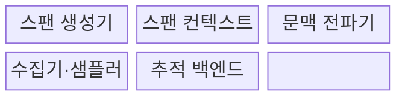
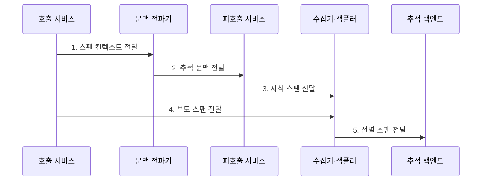

---
sidebar:
  order: 171
  label: "171. Distributed Tracing 분산 추적 (Distributed Tracing)"
  badge:
    text: "기출 · 70%"
    variant: note
title: "Distributed Tracing 분산 추적 (Distributed Tracing)"
date: "2026-07-30T20:20:00+09:00"
tags:
  - "notes-latest-tech"
weight: 171
extra:
  question_no: "171"
  source_status: "기출"
  source_history: "135회"
  priority: 70
  priority_note: "분산 추적의 맥락 전파·병목 분석이 기출됨"
---

## 미리 알고가기

- **분산 추적(Distributed Tracing)**: '디스트리뷰티드 트레이싱'으로 읽으며, 요청의 서비스 간 호출 경로와 시간을 연결하는 관측 기법
- **트레이스(Trace)**: 하나의 전체 요청을 구성하는 스팬 집합
- **스팬(Span)**: 요청 경로에서 개별 연산의 시작·종료·상태·속성을 기록한 단위
- **Trace ID·Span ID**: '트레이스 아이디·스팬 아이디'로 읽으며, 전체 요청과 개별 연산을 식별하기 위한 값
- **스팬 컨텍스트(Span Context)**: Trace ID·Span ID·표본화 정보 등 전파할 추적 문맥
- **배기지(Baggage)**: 서비스 간 함께 전파하는 업무 문맥이며, 민감정보와 크기를 통제해야 함
- **고카디널리티(High Cardinality)**: 속성값의 종류가 지나치게 많아 저장·색인 비용을 높이는 특성

## Ⅰ. 개요

- 정의/개념: Trace ID와 스팬의 부모·자식 관계로 **분산 요청의 종단 간 인과 경로·지연을 재구성**하는 관측 기법
- 배경/필요성: 서비스별 로그의 시간·호스트 정보만으로 식별하기 어려운 **서비스 간 호출 관계와 병목 구간**의 연결 필요

### 쉽게 이해하기 (학습용)

- 하나의 요청 번호로 여러 서비스의 처리 순서와 시간을 연결해 지연·오류 발생 구간을 찾는 방식이다.

## Ⅱ. 특징

- **1. 분산 연산의 인과관계 연결**: Trace ID·Span ID와 부모 관계 기반 분산 연산의 인과관계 연결
- **2. 요청 경로 연속성 유지**: 동기·비동기 경계의 스팬 컨텍스트 전파 기반 요청 경로 연속성 유지
- **3. 수집 비용·민감정보 통제**: 샘플링과 배기지 정책 기반 수집 비용·민감정보 통제
### 쉽게 이해하기 (학습용)

- 같은 요청 번호를 끊기지 않게 전달하되 기록 비용과 함께 전달할 업무 정보의 보안도 통제한다.

## Ⅲ. 구조 및 구성요소

| 구성요소 | 책임 |
|:---|:---|
| 스팬 생성기 | **연산 시작·종료·상태·속성 계측** |
| 스팬 컨텍스트 | **Trace ID·Span ID·표본화 정보 보존** |
| 문맥 전파기 | 통신 매체의 **컨텍스트 주입·추출** |
| 수집기·샘플러 | **스팬 수집·선별·전송** |
| 추적 백엔드 | 부모 관계 기반 **경로 재구성·지연 분석** |

### 쉽게 이해하기 (학습용)

- 각 거점이 같은 운송장 문맥으로 기록을 남기면 중앙에서 지연 구간을 찾을 수 있다.

## Ⅳ. 흐름도

**동작 원리**

- **1. 스팬 컨텍스트 전달**: 호출 연산의 Trace ID·Span ID·표본화 결정 생성
- **2. 추적 문맥 전달**: HTTP 헤더·메시지 속성 기반 부모 문맥 주입·추출
- **3. 자식 스팬 전달**: 피호출 연산의 부모 관계·시간·상태 계측
- **4. 부모 스팬 전달**: 호출 연산 완료 시 스팬 속성·이벤트 확정
- **5. 선별 스팬 전달**: 샘플링 후 부모·자식 관계와 임계경로 재구성

### 쉽게 이해하기 (학습용)

- 운송장 번호를 이어 쓰고 각 거점의 시간을 순서대로 연결해 지연 지점을 찾는다.

## Ⅴ. 종류 및 비교

| 샘플링 방식 | 전량 수집 | 헤드 샘플링 | 테일 샘플링 |
|:---|:---|:---|:---|
| 적용 기준 | 저트래픽·전체 감사 | 시작 시 저비용 선별 | 오류·고지연 우선 보존 |
| 핵심 특징 | 모든 스팬 저장 | 요청 시작 시 결정 | 트레이스 완료 후 결정 |
| 한계 | 저장·처리 비용 증가 | 후발 오류 누락 가능 | 버퍼·결정 지연 비용 |

### 쉽게 이해하기 (학습용)

- 모든 영상을 보관하거나, 촬영 전에 일부만 고르거나, 촬영 뒤 사고 장면을 우선 보관하는 차이다.

## Ⅵ. 실무 고려사항 및 대책

| 고려사항 | 대책 | 효과 |
|:---|:---|:---|
| **문맥 단절** 미검증 시 비동기·외부 호출의 **부모 관계 유실** | 표준 전파 형식과 경계별 **주입·추출 검사** | **부모-자식 추적 연속성** 확보 |
| **수집 비용** 미검증 시 고트래픽의 **저장·처리량 급증** | 헤드·테일 **샘플링 정책과 보존 등급** | **저장·처리 비용** 제한 |
| **배기지·속성** 미검증 시 민감정보 유출·**고카디널리티** | 허용 목록·크기 제한·**민감정보 제거** | 민감정보 노출·**질의 폭증** 억제 |

### 쉽게 이해하기 (학습용)

- 요청 경계의 문맥 전파를 검증하고, 오류·고지연 트레이스를 우선 보존하며, 민감한 속성은 수집 전에 제거한다.

## Ⅶ. 결론

- **문맥 전파 연속성·스팬 경계·샘플링 비용**을 함께 통제하는 종단 요청의 임계경로 분석 체계

### 쉽게 이해하기 (학습용)

- 요청 번호를 끊김 없이 전달하고 필요한 추적을 비용 범위 안에서 보존해야 한다.
