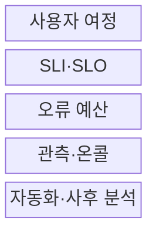
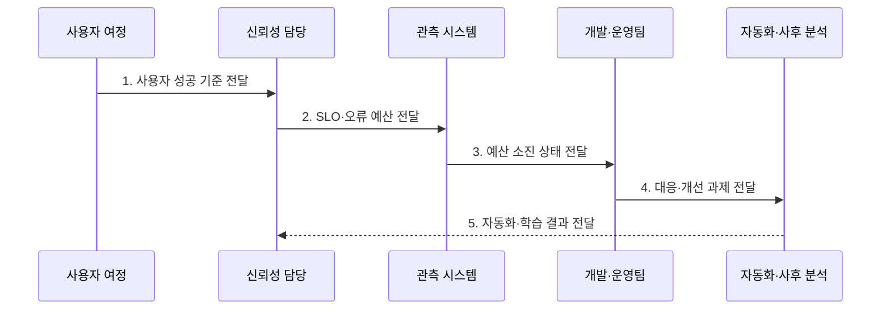

---
sidebar:
  order: 172
  label: "172. SRE 사이트 신뢰성 공학 (Site Reliability Engineering)"
  badge:
    text: "기출 · 70%"
    variant: note
title: "SRE 사이트 신뢰성 공학 (Site Reliability Engineering)"
date: "2026-07-30T11:10:21+09:00"
tags:
  - "notes-latest-tech"
weight: 172
extra:
  question_no: "172"
  source_status: "기출"
  source_history: "137회"
  priority: 70
  priority_note: "SRE 신뢰 목표·운영 자동화가 최근 출제됨"
---

## 미리 알고가기

- **사이트 신뢰성 공학(Site Reliability Engineering, SRE)**: '에스알이'로 읽으며, 소프트웨어 공학으로 서비스 신뢰성을 운영하는 체계
- **개발·운영(Development and Operations, DevOps)**: '데브옵스'로 읽으며, 개발과 운영의 협업·자동화·공동 책임 문화
- **서비스 수준 지표(Service Level Indicator, SLI)**: '에스엘아이'로 읽으며, 사용자가 경험한 서비스 품질 측정값
- **서비스 수준 목표(Service Level Objective, SLO)**: '에스엘오'로 읽으며, 일정 기간에 달성할 SLI 목표
- **오류 예산(Error Budget)**: SLO가 허용한 실패량으로, 변경과 안정화의 우선순위 판단 기준
- **토일(Toil)**: 반복적·수동적이며 자동화 가능한 운영 업무
- **온콜(On-call)**: 장애 경보를 받고 정해진 시간에 즉시 대응하는 담당 체계
- **비난 없는 사후 분석(Blameless Postmortem)**: 개인 비난보다 시스템 원인·교훈·재발 방지 조치에 집중하는 사고 분석

## Ⅰ. 개요

- 정의/개념: SLO·오류 예산·자동화를 이용해 **서비스 신뢰성을 소프트웨어 공학으로 운영**하는 공학 체계
- 배경/필요성: 서비스 규모에 따라 급증하는 **수동 운영·사후 대응 토일**과 변경 속도·안정성 간 객관적 조정 기준 필요

### 쉽게 이해하기 (학습용)

- 사용자에게 필요한 안전 수준을 수치로 정하고, 반복 대응은 자동화하며, 남은 실패 여유로 배포 여부를 결정하는 방식이다.

## Ⅱ. 특징

- 사용자 중심 SLI·SLO와 오류 예산 기반 **신뢰성 목표·변경 기준 정량화**
- 토일 감축·자동화·온콜 기반 **확장 가능한 운영 체계**
- 비난 없는 사후 분석 기반 **장애 원인의 설계·자동화 환류**

### 쉽게 이해하기 (학습용)

- 허용 실패량을 기준으로 배포와 안정화를 결정하고, 반복 사고와 수작업을 시스템 개선으로 줄인다.

## Ⅲ. 구조 및 구성요소

| 구성요소 | 책임 |
|:---|:---|
| 사용자 여정 | **핵심 사용자 행위와 영향 정의** |
| SLI·SLO | **품질 측정값과 목표 설정** |
| 오류 예산 | **허용 실패량과 변경 기준 제공** |
| 관측·온콜 | **증상 경보·대응 책임 운영** |
| 자동화·사후 분석 | **토일 감축·재발 방지 환류** |

> 요약: 사용자 목표를 측정하고 오류 예산·사고 대응·자동화로 신뢰성을 지속 개선한다.

### 쉽게 이해하기 (학습용)

- 고객이 중요하게 느끼는 품질을 재고, 사고 대응과 반복 업무 개선까지 하나의 운영 순환으로 묶는다.

## Ⅳ. 흐름도

### 동작 원리

- **1. 사용자 성공 기준 전달**: 핵심 사용자 여정과 성공·지연 SLI 선정
- **2. SLO·오류 예산 전달**: 평가 기간·목표 수준·허용 실패량 합의
- **3. 예산 소진 상태 전달**: 증상 기반 경보와 소진율 기반 위험 판정
- **4. 대응·개선 과제 전달**: 예산 상태에 따른 배포·복구·안정화 우선순위 전환
- **5. 자동화·학습 결과 전달**: 토일 감축과 비난 없는 사후 분석의 설계 환류

> 요약: 사용자 신뢰성 목표와 오류 예산 상태로 배포·복구·개선 우선순위를 정한다.

### 쉽게 이해하기 (학습용)

- 실패 여유가 충분하면 변경하고, 빠르게 소진되면 복구와 안정성 개선을 우선한다.

## Ⅴ. 종류 및 비교

| 서비스 운영 접근법 | SRE | 전통 운영 | DevOps |
|:---|:---|:---|:---|
| 적용 기준 | 정량적 신뢰성 운영 | 안정 가동·절차 통제 | 개발·운영 협업 개선 |
| 핵심 특징 | SLO·예산·자동화 | 승인·수동 대응 중심 | 공동 책임·빠른 피드백 |
| 한계 | 잘못된 SLO·도입 비용 | 확장성·변경 속도 한계 | 정량 운영 규칙 부족 가능 |

> 요약: SRE는 DevOps 원칙을 SLO·오류 예산·자동화라는 운영 메커니즘으로 구체화한다.

### 쉽게 이해하기 (학습용)

- DevOps가 협업 방향이라면 SRE는 신뢰성 목표와 변경 규칙을 실제 운영 방식으로 만든다.

## Ⅵ. 실무 고려사항 및 대책

| 고려사항 | 대책 | 효과 |
|:---|:---|:---|
| **SLO 품질** 미검증 시 내부 지표 중심의 **사용자 영향 왜곡** | 사용자 여정 기반 SLI와 **정기 목표 검토** | SLO **사용자 영향 대표성** 향상 |
| **오류 예산** 미검증 시 정책 부재에 따른 **배포 판단 충돌** | 소진율별 중지·재개·예외 **사전 합의** | 배포 **판단 일관성** 확보 |
| **토일·온콜** 미검증 시 반복 업무·경보의 **담당자 소진** | 토일 측정·자동화와 **증상 기반 경보** | **경보 피로** 감소 |

### 쉽게 이해하기 (학습용)

- 사용자 신뢰성 목표와 예산 정책을 합의하고 반복 수작업·무효 경보를 자동화 대상으로 관리한다.

## Ⅶ. 결론

- **사용자 중심 SLO·오류 예산·토일 자동화·사고 학습**으로 변경 속도와 신뢰성을 조정하는 공학적 운영 체계

### 쉽게 이해하기 (학습용)

- 신뢰성 목표를 수치화하고 실패 여유에 맞춰 배포와 안정화의 우선순위를 바꾼다.
