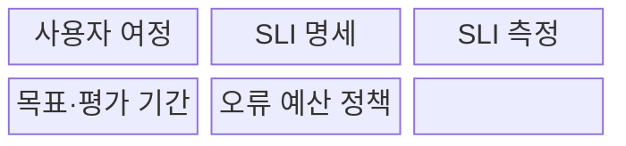
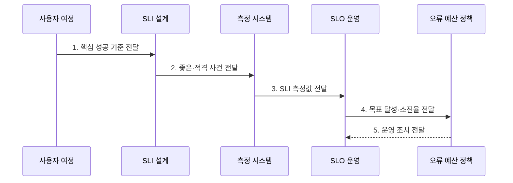

---
sidebar:
  order: 173
  label: "173. SLO 서비스수준목표 (Service Level Objective)"
  badge:
    text: "기출 · 70%"
    variant: note
title: "SLO 서비스수준목표 (Service Level Objective)"
date: "2026-07-30T20:20:00+09:00"
tags:
  - "notes-latest-tech"
weight: 173
extra:
  question_no: "173"
  source_status: "기출"
  source_history: "137회"
  priority: 70
  priority_note: "SLO 목표·오류 허용 판단이 최근 출제됨"
---

## 미리 알고가기

- **서비스 수준 지표(Service Level Indicator, SLI)**: '에스엘아이'로 읽으며, 사용자가 경험한 서비스 품질 측정값
- **서비스 수준 목표(Service Level Objective, SLO)**: '에스엘오'로 읽으며, 일정 평가 기간에 달성할 SLI 목표
- **서비스 수준 협약(Service Level Agreement, SLA)**: '에스엘에이'로 읽으며, 서비스 수준과 미달 시 책임을 정한 고객 계약
- **오류 예산(Error Budget)**: SLO가 허용한 실패량
- **소진율(Burn Rate)**: '번 레이트'로 읽으며, 오류 예산이 허용 속도보다 얼마나 빠르게 소진되는지 나타낸 비율
- **적격 사건(Eligible Event)**: SLI의 분모에 포함되는 전체 요청·작업
- **좋은 사건(Good Event)**: 적격 사건 중 성공·지연 임계값을 만족해 SLI의 분자에 포함되는 요청·작업

## Ⅰ. 개요

- 정의/개념: 특정 평가 기간에 **사용자 중심 SLI가 달성해야 할 목표 수준**을 정한 신뢰성 기준
- 배경/필요성: ‘고가용성’ 같은 모호한 요구를 **측정 가능한 품질 목표와 운영 조치**로 전환할 기준 필요

### 쉽게 이해하기 (학습용)

- 무엇을 어떻게 재고, 어느 기간에 어느 수준까지 달성할지를 함께 정한 사용자 품질 목표다.

## Ⅱ. 특징

- **1. 사용자 중심 SLI 명세**: 적격 사건 대비 좋은 사건 비율 기반 사용자 중심 SLI 명세
- **2. 달성 여부·허용 실패량 결정**: 목표값·평가 기간 결합 기반 달성 여부·허용 실패량 결정
- **3. 배포·복구·개선 조치 연결**: 오류 예산·소진율 정책 기반 배포·복구·개선 조치 연결
### 쉽게 이해하기 (학습용)

- 측정법·목표율·기간을 정하고, 허용 실패량이 줄어드는 속도에 따라 대응한다.

## Ⅲ. 구조 및 구성요소

| 구성요소 | 책임 |
|:---|:---|
| 사용자 여정 | **핵심 사용자 행위 범위 정의** |
| SLI 명세 | **좋은·적격 사건 판정 정의** |
| SLI 측정 | **대표 측정 지점·집계 질의 구현** |
| 목표·평가 기간 | **목표 비율과 준수 기간 합의** |
| 오류 예산 정책 | **소진 상태별 운영 조치 규정** |

### 쉽게 이해하기 (학습용)

- 고객이 성공했다고 느끼는 조건을 재고, 목표에 못 미칠 때 무엇을 할지 미리 정한다.

## Ⅳ. 흐름도

**동작 원리**

- **1. 핵심 성공 기준 전달**: 사용자 가치와 직접 연결된 가용성·지연 여정 선정
- **2. 좋은·적격 사건 전달**: SLI 분자·분모·성공 임계값 명세
- **3. SLI 측정값 전달**: 대표 측정 지점에서 평가 기간별 품질 집계
- **4. 목표 달성·소진율 전달**: 목표값 대비 달성 여부와 오류 예산 속도 계산
- **5. 운영 조치 전달**: 예산 상태별 배포·복구·목표 검토 정책 실행

### 쉽게 이해하기 (학습용)

- 중요한 사용자 행동을 골라 성공 기준을 재고, 실패 여유에 따라 대응한다.

## Ⅴ. 종류 및 비교

| 서비스 수준 개념 | SLI | SLO | SLA |
|:---|:---|:---|:---|
| 적용 기준 | 실제 품질 상태 측정 | 내부 신뢰성 목표 운영 | 고객 서비스 약속 체결 |
| 핵심 특징 | 측정 비율·수치 | 목표값·평가 기간 | 약속 수준·미달 책임 |
| 한계 | 측정 지점 편향 가능 | 잘못된 목표의 역유인 | 운영 세부 기준 부족 |

### 쉽게 이해하기 (학습용)

- 실제 점수는 SLI, 목표 점수는 SLO, 미달 책임을 포함한 약속은 SLA다.

## Ⅵ. 실무 고려사항 및 대책

| 고려사항 | 대책 | 효과 |
|:---|:---|:---|
| **측정 경계** 미검증 시 서버 지표 중심의 **사용자 경험 왜곡** | 사용자 여정과 가까운 **SLI 측정 지점** | SLI **사용자 경험 대표성** 향상 |
| **목표 수준** 미검증 시 과도한 목표의 **비용·변경 지연** | 기대 품질·비용 기반 **달성 가능한 목표** | 품질·**운영 비용** 균형 |
| **평가·조치** 미검증 시 단일 기간 경보의 **과민·지연 대응** | 다중 기간 소진율과 **단계별 운영 정책** | **탐지·대응 시간** 단축 |

### 쉽게 이해하기 (학습용)

- 결제 성공 여부처럼 사용자에게 의미 있는 기준을 정하고, 목표 수준과 평가 기간에 맞춰 운영 조치를 연결한다.

## Ⅶ. 결론

- **사용자 중심 SLI·목표값·평가 기간·오류 예산 정책**을 결합한 신뢰성 목표 운영 기준

### 쉽게 이해하기 (학습용)

- 측정법과 목표뿐 아니라 미달 위험에 따른 조치까지 정해야 운영 기준이 된다.
