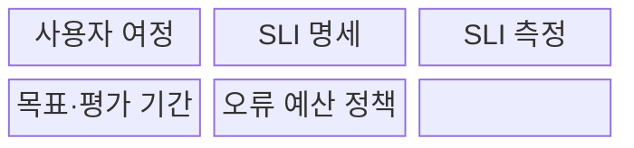
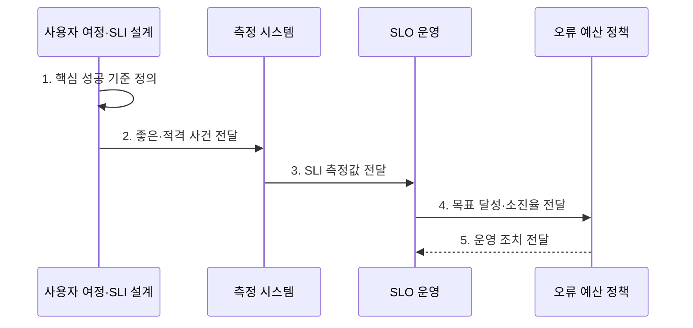

---
sidebar:
  order: 173
  label: "173. 서비스 수준 목표 (SLO)"
  badge:
    text: "기출 · 70%"
    variant: note
title: "서비스 수준 목표 (Service Level Objective, SLO)"
date: "2026-07-31T09:00:55+09:00"
tags:
  - "notes-latest-tech"
weight: 173
extra:
  question_no: "173"
  source_status: "기출"
  source_history: "137회"
  priority: 70
  priority_note: "SLO 목표·오류 허용 판단이 최근 출제됨"
---

## Ⅰ. 개요

핵심 용어

- **서비스 수준 목표(Service Level Objective, SLO)**: 일정 평가 기간에 사용자 중심 서비스 수준 지표(Service Level Indicator, SLI)가 달성해야 할 목표 수준을 정한 신뢰성 기준이다.
- **서비스 수준 지표(Service Level Indicator, SLI)**: 사용자가 경험한 서비스 품질을 측정한 값이다.

- 정의/개념: 특정 평가 기간에 사용자 중심 서비스 수준 지표(Service Level Indicator, SLI)가 달성해야 할 목표를 정한 **서비스 수준 목표(Service Level Objective, SLO)**
- 배경/필요성: 모호한 고가용성 요구로는 **품질 달성 여부·운영 조치 판단 불가**

#### 한줄 요약

- 무엇을 어떻게 재고, 어느 기간에 어느 수준까지 달성할지를 함께 정한 사용자 품질 목표다.

## Ⅱ. 특징

핵심 용어

- **적격 사건(Eligible Event)**: 서비스 수준 지표(Service Level Indicator, SLI)의 분모에 포함되는 전체 요청이나 작업이다.
- **좋은 사건(Good Event)**: 적격 사건 중 성공·지연 임계값을 만족해 서비스 수준 지표의 분자에 포함되는 요청이나 작업이다.

- 적격 사건 대비 좋은 사건 비율 기반 **사용자 중심 SLI 명세**
- 목표값·평가 기간 기반 **달성 여부·허용 실패량 결정**
- 오류 예산·소진율 기반 **배포·복구·개선 조치 연결**
#### 한줄 요약

- 측정법·목표율·기간을 정하고, 허용 실패량이 줄어드는 속도에 따라 대응한다.

## Ⅲ. 구조 및 구성요소

핵심 용어

- **사용자 여정**: 사용자가 서비스에서 목표를 달성하기 위해 거치는 핵심 행위와 경로이다.
- **서비스 수준 지표 명세(Service Level Indicator Specification, SLI Specification)**: 성공 사건·전체 사건·데이터 원천·집계 방식으로 사용자 품질 측정법을 정의한다.
- **서비스 수준 목표(Service Level Objective, SLO)**: 정한 평가 기간에 서비스 수준 지표가 달성해야 할 목표 수준이다.
- **오류 예산 정책**: 서비스 수준 목표(Service Level Objective, SLO)가 허용한 실패량의 소진 상태별로 배포·복구·개선 조치를 정한 규칙이다.

서비스 수준 지표(Service Level Indicator, SLI)의 명세·측정과 오류 예산 정책을 연결한다.

| 구성요소 | 책임 |
|:---|:---|
| 사용자 여정 | **핵심 사용자 행위 범위 정의** |
| SLI 명세 | **좋은·적격 사건 판정 정의** |
| SLI 측정 | **대표 측정 지점·집계 질의 구현** |
| 목표·평가 기간 | **목표 비율과 준수 기간 합의** |
| 오류 예산 정책 | **소진 상태별 운영 조치 규정** |

#### 한줄 요약

- 고객이 성공했다고 느끼는 조건을 재고, 목표에 못 미칠 때 무엇을 할지 미리 정한다.

## Ⅳ. 흐름도

핵심 용어

- **소진율(Burn Rate)**: 오류 예산이 허용 속도보다 얼마나 빠르게 소진되는지 나타낸 비율이다.
- **평가 기간**: 서비스 수준 지표(Service Level Indicator, SLI) 실적과 서비스 수준 목표(Service Level Objective, SLO) 달성 여부를 집계하는 고정 또는 이동 시간 구간이다.

**동작 원리**

- **1. 핵심 성공 기준 정의**: 사용자 가치와 직접 연결된 가용성·지연 여정 선정
- **2. 좋은·적격 사건 전달**: SLI 분자·분모·성공 임계값 명세
- **3. SLI 측정값 전달**: 대표 측정 지점에서 평가 기간별 품질 집계
- **4. 목표 달성·소진율 전달**: 목표값 대비 달성 여부와 오류 예산 속도 계산
- **5. 운영 조치 전달**: 예산 상태별 배포·복구·목표 검토 정책 실행

#### 한줄 요약

- 중요한 사용자 행동을 골라 성공 기준을 재고, 실패 여유에 따라 대응한다.

## Ⅴ. 종류 및 비교

핵심 용어

- **서비스 수준 협약(Service Level Agreement, SLA)**: 서비스 수준과 미달 시 책임을 정한 고객 계약이다.
- **측정 지점**: SLI의 좋은 사건과 적격 사건을 실제로 관측·집계하는 시스템 경계이다.

서비스 수준 지표(Service Level Indicator, SLI)는 실제 품질, 서비스 수준 목표(Service Level Objective, SLO)는 내부 목표, 서비스 수준 협약(Service Level Agreement, SLA)은 고객 약속이다.

| 서비스 수준 개념 | SLI | SLO | SLA |
|:---|:---|:---|:---|
| 적용 기준 | 실제 **품질 상태 측정** | 내부 **신뢰성 목표 운영** | 고객 **서비스 약속 체결** |
| 핵심 특징 | **측정 비율·수치** | **목표값·평가 기간** | **약속 수준·미달 책임** |
| 한계 | **측정 지점 편향** 가능 | 잘못된 **목표의 역유인** | **운영 세부 기준** 부족 |

#### 한줄 요약

- 실제 점수는 SLI, 목표 점수는 SLO, 미달 책임을 포함한 약속은 SLA다.

## Ⅵ. 실무 고려사항 및 대책

핵심 용어

- **다중 기간 소진율**: 짧은 구간과 긴 구간의 예산 소진 속도를 함께 평가해 급격한 장애와 지속 열화를 구분하는 방식이다.
- **목표 역유인**: 잘못 정한 서비스 수준 목표(Service Level Objective, SLO)가 불필요한 비용이나 변경 회피를 유발하는 현상이다.

서비스 수준 지표(Service Level Indicator, SLI)의 측정 경계와 목표 수준을 함께 검증한다.

| 문제 | 대책 | 효과 |
|:---|:---|:---|
| **측정 경계** 미검증 시 서버 지표 중심의 **사용자 경험 왜곡** | 사용자 여정과 가까운 **SLI 측정 지점** | SLI **사용자 경험 대표성** 향상 |
| **목표 수준** 미검증 시 과도한 목표의 **비용·변경 지연** | 기대 품질·비용 기반 **달성 가능한 목표** | 품질·**운영 비용** 균형 |
| **평가·조치** 미검증 시 단일 기간 경보의 **과민·지연 대응** | 다중 기간 소진율과 **단계별 운영 정책** | **탐지·대응 시간** 단축 |

#### 한줄 요약

- 결제 성공 여부처럼 사용자에게 의미 있는 기준을 정하고, 목표 수준과 평가 기간에 맞춰 운영 조치를 연결한다.

## Ⅶ. 결론

핵심 용어

- **달성 가능한 목표**: 사용자 기대 품질과 구현·운영 비용을 함께 고려해 합의한 서비스 수준 목표(Service Level Objective, SLO) 수준이다.
- **단계별 운영 정책**: 소진율과 잔여 예산 구간별로 경보·배포 중지·복구·재개 조건을 정한 규칙이다.

- **단계별 운영 정책**: 서비스 수준 지표(Service Level Indicator, SLI)·목표·기간을 명세하고 소진율이 높으면 안정화, 낮으면 배포

#### 한줄 요약

- 측정법과 목표뿐 아니라 미달 위험에 따른 조치까지 정해야 운영 기준이 된다.
