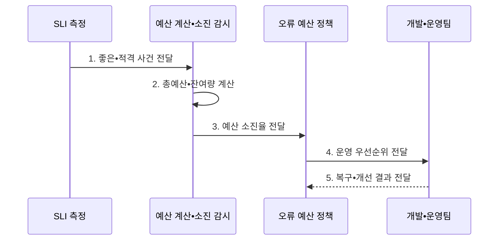

---
sidebar:
  order: 174
  label: "174. 오류 예산 (Error Budget)"
  badge:
    text: "기출 • 70%"
    variant: note
title: "오류 예산 (Error Budget)"
date: "2026-08-03T08:48:47+09:00"
tags:
  - "notes-latest-tech"
weight: 174
extra:
  question_no: "174"
  source_status: "기출"
  source_history: "137회"
  priority: 70
  priority_note: "오류 예산의 배포•신뢰 균형이 최근 출제됨"
---

## Ⅰ. 개요

핵심 용어

- **오류 예산(Error Budget)**: 서비스 수준 목표(Service Level Objective, SLO) 평가 기간에 사용자 품질 목표가 허용하는 실패량을 운영 의사결정에 연결한 기준이다.
- **서비스 수준 목표(Service Level Objective, SLO)**: 평가 기간에 달성하기로 정한 사용자 중심 품질 지표의 목표이다.

- 정의/개념: 서비스 수준 목표(Service Level Objective, SLO) 평가 기간에 허용되는 실패량을 계산하여 배포•안정화 우선순위에 연결하는 **오류 예산(Error Budget)**
- 배경/필요성: 100% 신뢰성 비용과 무제한 변경 위험으로 **배포•안정화 우선순위 충돌**

#### 한줄 요약

- 사용자 목표를 지키면서 허용할 수 있는 실패 여유를 계산해 변경 속도를 조절하는 기준이다.

## Ⅱ. 특징

핵심 용어

- **오류 예산율**: 서비스 수준 목표(Service Level Objective, SLO) 목표율을 1에서 뺀 허용 실패 비율이다.
- **소진율(Burn Rate)**: 허용 속도 대비 오류 예산의 실제 소진 속도를 나타낸 비율이다.

- `오류 예산율 = 1 - SLO` 기반 **총허용 실패량 산정**
- 실제 실패•잔여량•소진율 기반 **예산 고갈 위험 조기 판단**
- 사전 합의 정책 기반 **배포•안정화 우선순위 전환**
#### 한줄 요약

- 허용 실패량과 남은 양, 줄어드는 속도를 함께 보고 배포를 계속할지 안정화할지 결정한다.

## Ⅲ. 구조 및 구성요소

핵심 용어

- **서비스 수준 지표(Service Level Indicator, SLI)**: 실제 사용자 품질을 좋은 사건과 적격 사건의 비율로 측정한 값이다.
- **예산 계산기**: 서비스 수준 목표(Service Level Objective, SLO)•평가 기간•실제 실패량으로 총예산•사용량•잔여량을 산출하는 구성요소이다.

| 구성요소 | 책임 |
|:---|:---|
| 사용자 SLI | **좋은•적격 사건 판정** |
| SLO•평가 기간 | **목표 비율과 측정 경계** |
| 예산 계산기 | **총예산•사용량•잔여량 산출** |
| 소진율 경보 | **예산 고갈 속도 탐지** |
| 오류 예산 정책 | **배포•복구•개선 조치 결정** |

#### 한줄 요약

- 품질 계기판과 목표선으로 실패 여유를 계산하고, 빠르게 줄면 정해 둔 대응 규칙을 실행한다.

## Ⅳ. 흐름도

핵심 용어

- **적격 사건(Eligible Event)**: 서비스 수준 지표(Service Level Indicator, SLI) 계산 대상에 포함되는 전체 요청이나 작업이다.
- **잔여 예산**: 평가 기간의 총허용 실패량에서 실제 실패량을 뺀 값이다.

서비스 수준 목표(Service Level Objective, SLO)로 총허용 실패량을 정하고 서비스 수준 지표(Service Level Indicator, SLI)로 실제 실패를 측정한다.

**동작 원리**

- **1. 좋은•적격 사건 전달**: 사용자 SLI의 성공•실패 판정과 대상 요청 집계
- **2. 총예산•잔여량 전달**: `적격 사건 수 × (1 - 서비스 수준 목표(Service Level Objective, SLO))`와 실제 실패량 계산
- **3. 예산 소진율 전달**: 허용 속도 대비 실제 소진 속도로 고갈 위험 판정
- **4. 운영 우선순위 전달**: 정상•경고•고갈 상태별 배포•복구•안정화 정책 실행
- **5. 복구•개선 결과 전달**: 사용자 영향 해소와 재개 조건 충족 여부 검증

#### 한줄 요약

- 실패 여유를 미리 정하고 얼마나 남았고 얼마나 빨리 줄어드는지에 따라 계획을 바꾼다.

## Ⅴ. 종류 및 비교

핵심 용어

- **좋은 사건**: 적격 사건 중 성공•지연 임계값을 만족한 요청이나 작업이다.
- **변경•안정화 판단**: 남은 오류 예산과 소진율을 근거로 신규 배포와 신뢰성 개선의 우선순위를 정하는 의사결정이다.

서비스 수준 지표(Service Level Indicator, SLI)는 실제 품질, 서비스 수준 목표(Service Level Objective, SLO)는 목표 품질, 오류 예산은 허용 실패량을 나타낸다.

| 신뢰성 운영 개념 | SLI | SLO | 오류 예산 |
|:---|:---|:---|:---|
| 적용 기준 | 실제 **품질 측정** | **목표 품질 합의** | **변경•안정화 판단** |
| 핵심 특징 | **좋은 사건 비율•수치** | **목표값•평가 기간** | **허용 실패량•소진율** |
| 한계 | **측정 편향** 가능 | 부적절한 **목표 역유인** | **정책 합의** 없으면 무력 |

#### 한줄 요약

- 실제 점수는 SLI, 목표 점수는 SLO, 목표 안에서 허용한 오답 수는 오류 예산이다.

## Ⅵ. 실무 고려사항 및 대책

핵심 용어

- **다중 소진율 경보**: 단기•장기 시간 구간의 예산 소진 속도를 함께 평가하는 경보 방식이다.
- **재개 조건**: 배포 중지 뒤 사용자 품질과 예산 위험이 정한 수준으로 회복했음을 확인하는 기준이다.

서비스 수준 지표(Service Level Indicator, SLI)의 대표성과 평가 경계를 먼저 검증한다.

| 문제 | 대책 | 효과 |
|:---|:---|:---|
| **예산 산정** 미검증 시 비대표 SLI의 **허용 실패량 왜곡** | 사용자 여정 기반 SLI와 **평가 경계 검증** | **허용 실패량 정확도** 향상 |
| **소진율** 미검증 시 잔여량만 확인한 **고갈 위험 지연 탐지** | 단기•장기 구간의 **다중 소진율 경보** | 예산 고갈 **조기 탐지력** 향상 |
| **운영 정책** 미검증 시 예산 고갈 후 **배포 중지•재개 충돌** | 중지•예외•재개 조건의 **사전 합의** | 배포 **운영 충돌** 감소 |

#### 한줄 요약

- 총예산뿐 아니라 소진 속도와 사용자 영향을 함께 보고 배포 중지•복구•재개 조건을 적용한다.

## Ⅶ. 결론

핵심 용어

- **고갈 임계치**: 안정화와 배포 중지를 시작하도록 정한 잔여 예산 또는 소진율 기준이다.
- **운영 우선순위**: 오류 예산 상태에 따라 배포•복구•자동화•재발 방지의 수행 순서를 정한 기준이다.

- **운영 우선순위**: 오류 예산•소진율이 충분하면 배포하고 고갈 임계치 도달 시 안정화

#### 한줄 요약

- 남은 실패 여유와 소진 속도를 함께 보고 배포와 안정화 우선순위를 바꾼다.
