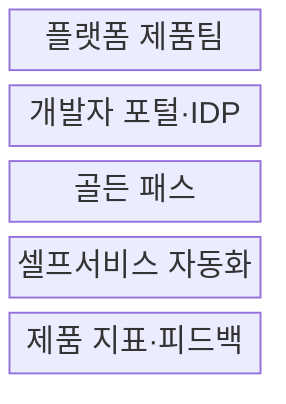
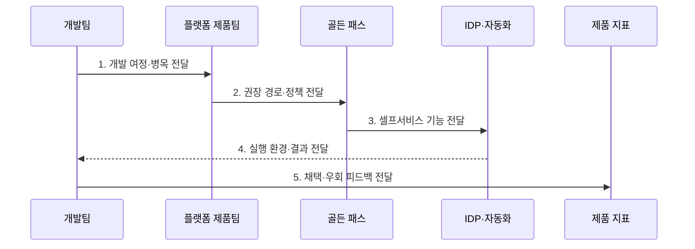

---
sidebar:
  order: 175
  label: "175. Platform Engineering 플랫폼 엔지니어링 (Platform Engineering)"
  badge:
    text: "기출 · 70%"
    variant: note
title: "Platform Engineering 플랫폼 엔지니어링 (Platform Engineering)"
date: "2026-07-27T23:59:59+09:00"
tags:
  - "notes-latest-tech"
weight: 175
extra:
  question_no: "175"
  source_status: "기출"
  source_history: "135회"
  priority: 70
  priority_note: "플랫폼 엔지니어링의 셀프서비스 설계가 기출됨"
---

## 미리 알고가기

- **플랫폼 엔지니어링(Platform Engineering)**: 인프라·배포·관측·보안 기능을 개발자가 스스로 사용하는 내부 제품으로 제공하는 접근
- **내부 개발자 플랫폼(Internal Developer Platform, IDP)**: '아이디피'로 읽으며, 개발자가 표준 기능을 셀프서비스로 소비하는 통합 인터페이스
- **골든 패스(Golden Path)**: 조직의 권장 도구·정책·절차를 안전한 기본값으로 조합한 개발 경로
- **개발자 경험(Developer Experience, DevEx)**: '데브엑스'로 읽으며, 개발 과정의 생산성·인지부하·대기 시간에 대한 경험
- **탈출 경로(Escape Hatch)**: 골든 패스로 해결하지 못하는 요구에 예외·확장 선택권을 제공하는 장치
- **DevOps**: '데브옵스'로 읽으며, 개발·운영의 협업·자동화·공동 책임을 강조하는 문화와 실천 원칙
- **사이트 신뢰성 공학(Site Reliability Engineering, SRE)**: '에스알이'로 읽으며, 신뢰성 목표와 자동화로 서비스를 운영하는 공학 체계
- **서비스 수준 목표(Service Level Objective, SLO)**: '에스엘오'로 읽으며, 일정 기간에 달성할 사용자 중심 서비스 품질 목표

## Ⅰ. 개요

- 정의/개념: 공통 개발·운영 기능을 **IDP·골든 패스·셀프서비스**로 제공하는 내부 제품 중심의 공학 접근
- 배경/필요성: 팀별 도구 조합과 티켓 기반 인프라 요청으로 발생하는 **개발자 인지부하·대기 시간·운영 편차**의 감소 필요

### 쉽게 이해하기 (학습용)

- 플랫폼 팀이 반복되는 개발·운영 기능을 내부 제품으로 제공하고 개발자는 검증된 경로를 스스로 선택해 사용한다.

## Ⅱ. 특징

- 개발자 여정·피드백 기반 **내부 플랫폼 제품 로드맵**
- 골든 패스·정책 자동화 기반 **안전한 셀프서비스 기본 경로**
- 추상화·탈출 경로 기반 **표준화와 개발자 자율성의 균형**

### 쉽게 이해하기 (학습용)

- 반복 작업에는 안전한 기본 경로를 제공하되 특수 요구에는 확장 선택권을 열고, 실제 채택·대기 시간으로 제품 효과를 개선한다.

## Ⅲ. 구조 및 구성요소

| 구성요소 | 책임 |
|:---|:---|
| 플랫폼 제품팀 | **개발자 요구·제품 수명주기 소유** |
| 개발자 포털·IDP | **기능 탐색·요청·상태 확인 인터페이스** |
| 골든 패스 | **권장 도구·정책·절차 조합** |
| 셀프서비스 자동화 | **인프라·배포·관측·보안 자동 제공** |
| 제품 지표·피드백 | **채택률·대기 시간·우회 원인 분석** |

> 요약: 플랫폼 팀이 골든 패스와 셀프서비스를 IDP로 제공하고 사용 결과를 제품 개선에 반영한다.

### 쉽게 이해하기 (학습용)

- 개발자는 포털에서 검증된 개발 경로를 선택하고, 플랫폼 팀은 채택·우회 원인으로 기능을 개선한다.

## Ⅳ. 흐름도

### 동작 원리

- **1. 개발 여정·병목 전달**: 반복 작업·대기 시간·인지부하 기반 제품 문제 탐색
- **2. 권장 경로·정책 전달**: 공통 수요와 위험도 기반 골든 패스·탈출 경로 설계
- **3. 셀프서비스 기능 전달**: 포털·요청 양식·템플릿으로 인프라·배포·관측 기능 노출
- **4. 실행 환경·결과 전달**: 정책 자동화 기반 일관된 환경 제공과 상태 확인
- **5. 채택·우회 피드백 전달**: 채택률·완료 시간·우회 원인 기반 로드맵 개선

> 요약: 개발자 병목을 골든 패스와 셀프서비스로 제품화하고 채택 결과로 개선한다.

### 쉽게 이해하기 (학습용)

- 자주 필요한 개발 경로를 셀프서비스로 제공하고, 사용하지 않는 이유까지 분석해 내부 제품을 개선한다.

## Ⅴ. 종류 및 비교

| 운영 접근 | 플랫폼 엔지니어링 | DevOps | SRE |
|:---|:---|:---|:---|
| 적용 기준 | IDP·golden path | 자동화·문화 확산 | SLO·오류 예산 |
| 핵심 특징 | 내부 플랫폼 제품 제공 | 개발·운영 공동 책임 | 신뢰성 공학·운영 자동화 |
| 한계 | 강제 표준·플랫폼 비대화 | 구체적 구현 책임 불명확 | 측정·온콜·오류 예산 부담 |

> 요약: 플랫폼 엔지니어링은 DevOps 원칙을 개발자용 제품으로 구현하며 SRE의 신뢰성 운영 기준과 결합한다.

### 쉽게 이해하기 (학습용)

- DevOps는 협업 원칙, 플랫폼 엔지니어링은 개발자용 제품, SRE는 신뢰성 운영 메커니즘에 초점을 둔다.

## Ⅵ. 실무 고려사항 및 대책

| 고려사항 | 위험 | 대책 |
|:---|:---|:---|
| 제품 적합성 | 공급자 중심 기능의 **낮은 채택률** | 개발자 여정 조사와 **제품 관리자 책임** |
| 표준화 경계 | 강제 골든 패스의 **자율성·혁신 저하** | 탈출 경로·확장점과 **예외 검토 절차** |
| 플랫폼 운영 | 기능 비대화·팀 의존의 **새 병목** | 최소 공통 기능·SLO·**채택 효과 지표** |

### 쉽게 이해하기 (학습용)

- 개발자가 실제로 겪는 병목부터 제품화하고, 골든 패스의 채택률과 서비스 생성·배포 완료 시간을 함께 측정한다.

## Ⅶ. 결론

- **개발자 수요·골든 패스·셀프서비스·탈출 경로·채택 지표**로 표준화와 자율성을 조정하는 내부 플랫폼 제품 운영

### 쉽게 이해하기 (학습용)

- 제공 기능의 수보다 개발자의 대기 시간·인지부하 감소와 자발적 채택이 플랫폼의 성공 기준이다.
