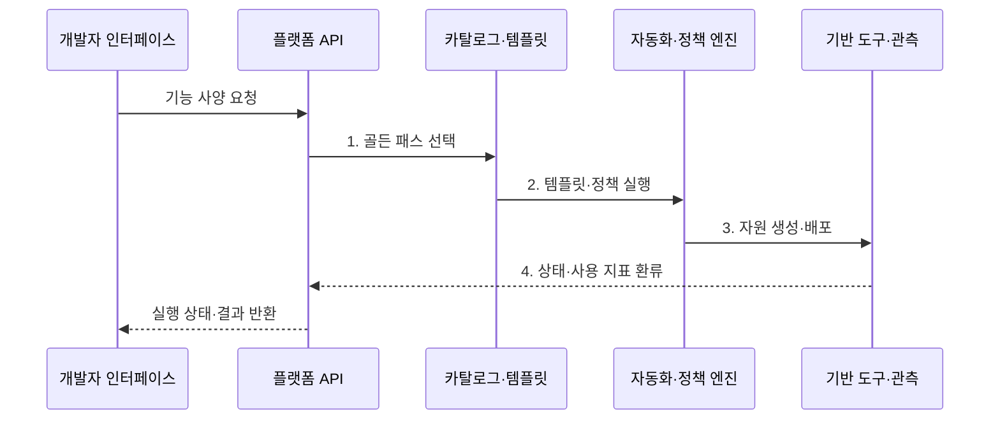

---
sidebar:
  order: 176
  label: "176. 내부 개발자 플랫폼 (Internal Developer Platform, IDP)"
  badge:
    text: "기출 · 70%"
    variant: note
title: "내부 개발자 플랫폼 (Internal Developer Platform, IDP)"
date: "2026-07-31T09:02:22+09:00"
tags:
  - "notes-latest-tech"
weight: 176
extra:
  question_no: "176"
  source_status: "기출"
  source_history: "135회"
  priority: 70
  priority_note: "내부 개발자 플랫폼의 골든 패스 설계가 기출됨"
---

## Ⅰ. 개요

핵심 용어

- **내부 개발자 플랫폼(Internal Developer Platform, IDP)**: 공통 인프라·배포·운영 기능을 개발자가 직접 소비하는 셀프서비스 제품이다.
- **플랫폼 엔지니어링**: 개발자가 인프라 복잡성을 직접 다루지 않도록 재사용 가능한 내부 제품을 설계·운영하는 활동이다.

- 정의/개념: **IDP**는 공통 인프라·배포·운영 기능을 표준 인터페이스와 골든 패스로 묶어 셀프서비스 제품으로 제공하는 내부 개발자 플랫폼
- 배경/필요성: 팀별 도구 조합에서 발생하는 **인지 부하·중복 자동화·정책 편차** 완화

### 쉽게 이해하기 (학습용)

- 검증된 메뉴에서 선택하면 저장소와 배포 환경 및 운영 기준이 함께 준비되는 내부 서비스다.

## Ⅱ. 특징

핵심 용어

- **골든 패스(Golden Path)**: 조직의 보안·운영 기준을 안전한 기본값으로 내장한 권장 개발·배포 경로이다.
- **확장 지점**: 표준 경로로 처리하지 못한 요구를 관리된 방식으로 연결·변경하도록 제공하는 인터페이스이다.

- 포털·CLI가 공유하는 **플랫폼 API 계약**
- 표준 템플릿과 기본 정책을 묶은 **골든 패스**
- 강제 경로가 아닌 **셀프서비스·확장 지점**
### 쉽게 이해하기 (학습용)

- 표준 경로는 쉽게 쓰게 만들고 예외가 필요한 팀에는 관리된 확장 방법을 제공한다.

## Ⅲ. 구조 및 구성요소

핵심 용어

- **플랫폼 API**: 포털·CLI·선언 파일이 공통으로 사용하는 기능 계약과 자원 상태의 진입점이다.
- **정책 엔진**: 셀프서비스 요청이 보안·운영 가드레일을 만족하는지 자동 검증하는 구성요소이다.

| 구성요소 | 책임 |
|:---|:---|
| **개발자 인터페이스** | 포털·CLI·선언 파일의 요청·상태 제공 |
| **플랫폼 API** | 기능 계약과 자원 상태의 공통 진입점 |
| **카탈로그·템플릿** | 승인된 서비스·골든 패스 탐색 |
| **자동화·정책 엔진** | CI/CD·IaC 실행과 가드레일 검증 |
| **기반 도구·관측** | 클라우드·클러스터 연계와 사용 지표 수집 |

### 쉽게 이해하기 (학습용)

- 화면과 명령이 달라도 같은 주문 API가 검증된 메뉴와 자동화된 주방을 호출한다.

## Ⅳ. 흐름도

핵심 용어

- **카탈로그**: 개발자가 승인된 서비스 유형·템플릿·골든 패스를 탐색하는 목록이다.
- **채택률**: 대상 개발팀이나 서비스 가운데 플랫폼 기능을 실제 사용한 비율이다.

**동작 원리**

- **1. 골든 패스 선택**: 지원 범위와 승인 템플릿 결정
- **2. 템플릿·정책 실행**: 기본값 결합과 보안·운영 규칙 검증
- **3. 자원 생성·배포**: 저장소·파이프라인·실행 환경 자동 구성
- **4. 상태·사용 지표 환류**: 결과와 리드 타임·실패·채택률을 플랫폼에 반영

### 쉽게 이해하기 (학습용)

- 주문한 표준 코스를 자동으로 만들고 실제 이용 시간과 실패 이유를 다음 메뉴 개선에 쓴다.

## Ⅴ. 종류 및 비교

핵심 용어

- **개발자 포털**: 플랫폼 기능·카탈로그·문서의 탐색과 요청 진입점을 제공하는 사용자 인터페이스이다.
- **플랫폼 팀**: IDP의 로드맵·지원·운영·성과를 제품 관점으로 소유하는 조직이다.

| 플랫폼 개념 | IDP | 개발자 포털 | 플랫폼 팀 |
|:---|:---|:---|:---|
| 적용 기준 | **셀프서비스 전체 제품** | **탐색·요청 진입점** | **제품 소유·운영 조직** |
| 핵심 특징 | **API·템플릿·자동화·정책** 통합 | **UI·카탈로그·문서** 제공 | **로드맵·지원·성과** 관리 |
| 한계 | **통합·추상화·운영 복잡성** | 포털만으로 **실행 자동화 불가** | **공급자 중심화** |

### 쉽게 이해하기 (학습용)

- 식당 전체 체계가 IDP, 메뉴판이 포털, 메뉴와 주방을 개선하는 조직이 플랫폼 팀이다.

## Ⅵ. 실무 고려사항 및 대책

핵심 용어

- **셀프서비스**: 개발자가 수동 요청이나 대기 없이 API·포털·CLI로 필요한 기능을 직접 사용하는 방식이다.
- **탈출 경로**: 추상화 아래의 실행 상태와 원본 도구에 접근해 예외 처리·진단을 수행하는 경로이다.

| 문제 | 대책 | 효과 |
|:---|:---|:---|
| 사용하지 않는 **골든 패스** | 개발자 조사·파일럿·**채택률 측정** | **인지 부하** 감소 |
| 과도한 **추상화·디버깅 어려움** | 상태·실행 로그·**탈출 경로 노출** | **장애 대응력** 확보 |
| **플랫폼 팀 지원 병목** | 제품별 소유권·SLO·**문서 자동화** | **셀프서비스 지속성** 향상 |

### 쉽게 이해하기 (학습용)

- 웹 API 템플릿은 저장소부터 배포까지 만들되 실패 단계와 원본 도구 상태도 개발자가 확인할 수 있어야 한다.

## Ⅶ. 결론

핵심 용어

- **인지부하**: 개발자가 업무 목표 외에 도구·인프라·정책을 이해하고 선택하는 데 드는 부담이다.
- **리드 타임**: 개발 요청이 시작된 시점부터 실행 환경·배포 결과가 준비될 때까지 걸린 시간이다.

- 반복 공통 작업은 **IDP 골든 패스**, 예외 요구는 **확장 지점**, 채택률이 낮으면 개선

### 쉽게 이해하기 (학습용)

- 보기 좋은 포털이 아니라 개발자가 실제로 더 빠르고 안전하게 전달하도록 만드는 플랫폼이 목표다.
