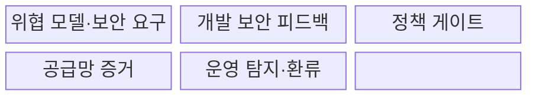
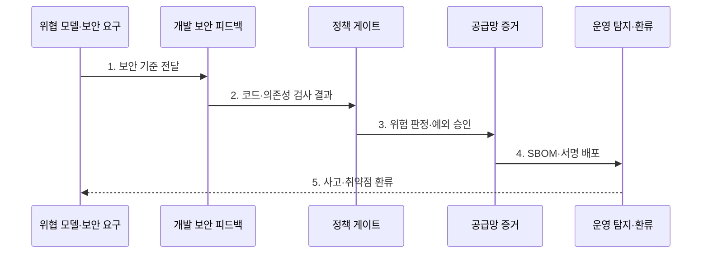

---
sidebar:
  order: 177
  label: "177. DevSecOps"
  badge:
    text: "기출 · 85%"
    variant: note
title: "DevSecOps"
date: "2026-07-31T09:02:44+09:00"
tags:
  - "notes-latest-tech"
weight: 177
extra:
  question_no: "177"
  source_status: "기출"
  source_history: "128회, 134회, 135회"
  priority: 85
  priority_note: "DevSecOps 보안 내재화가 여러 회차 반복됨"
---

## Ⅰ. 개요

핵심 용어

- **개발·보안·운영(DevSecOps)**: 개발·보안·운영이 소프트웨어 수명주기 전반의 보안 결과를 공동 소유하고 자동 검증·운영 피드백을 지속하는 체계이다.
- **공동 소유**: 보안을 별도 심사 조직에 넘기지 않고 개발·보안·운영이 역할별 책임을 함께 지는 원칙이다.

- 정의/개념: **개발·보안·운영(Development, Security and Operations, DevSecOps)** 은 개발·보안·운영 조직이 **소프트웨어 개발 수명주기(Software Development Life Cycle, SDLC)** 전반의 보안 결과를 공동 소유하고 자동 검증과 운영 피드백을 지속하는 협업·운영 체계
- 배경/필요성: 릴리스 직전 수동 심사의 **늦은 취약점 발견·배포 지연·공급망 변경 추적 한계** 개선

#### 한줄 요약

- 출고 직전에만 검사하지 않고 설계부터 운영까지 보안 확인과 개선을 이어 간다.

## Ⅱ. 특징

핵심 용어

- **Shift Left·Right**: 개발 초기의 예방 활동과 운영 단계의 탐지·피드백을 연결하는 보안 접근이다.
- **위험도 기반 게이트**: 심각도·노출도·악용 가능성에 따라 변경 차단·승인·예외를 자동 판단하는 통제이다.

- 위협 모델과 개발 단계 검사의 **Shift Left**
- 운영 탐지·사고 환류의 **Shift Right**
- 위험도 기반 **자동 게이트·예외 승인**
#### 한줄 요약

- 모든 경고를 막는 것이 아니라 위험을 분류해 빠르게 고치고 승인된 예외도 추적한다.

## Ⅲ. 구조 및 구성요소

핵심 용어

- **정책 코드화(Policy as Code)**: 보안·준수 판단 규칙을 버전 관리하고 자동 실행 가능한 코드로 표현하는 방식이다.
- **소프트웨어 자재 명세서(SBOM)**: 소프트웨어에 포함된 구성요소와 버전을 추적하는 명세서이다.

개발 보안 피드백은 **정적 애플리케이션 보안 테스트(Static Application Security Testing, SAST)** 와 **소프트웨어 구성 분석(Software Composition Analysis, SCA)** 결과를 제공하고, 공급망 증거는 **소프트웨어 자재 명세서(Software Bill of Materials, SBOM)** 로 구성요소를 추적한다.

| 구성요소 | 책임 |
|:---|:---|
| **위협 모델·보안 요구** | 보호 자산·위협·허용 위험 정의 |
| **개발 보안 피드백** | SAST·SCA·비밀 탐지 결과와 수정 문맥 제공 |
| **정책 게이트** | 위험도별 차단·승인·예외 적용 |
| **공급망 증거** | SBOM·서명·출처·무결성 기록 |
| **운영 탐지·환류** | 런타임 사고 탐지와 정책 개선 |

#### 한줄 요약

- 지킬 대상을 정하고 제작 과정과 부품표를 검사하며 사용 중 문제를 다음 설계에 반영한다.

## Ⅳ. 흐름도

핵심 용어

- **기한부 예외**: 차단 기준을 충족한 위험을 소유자·만료일·보완 통제와 함께 일시 허용하는 승인이다.
- **공급망 증거**: 산출물의 구성요소·출처·서명·무결성을 검증할 수 있도록 보존한 자료이다.

**동작 원리**

- **1. 보안 기준 전달**: 자산·위협과 차단 임계값 정의
- **2. 코드·의존성 검사 결과**: 결함과 영향 및 수정 정보를 개발자에게 제공
- **3. 위험 판정·예외 승인**: 심각도·노출도에 따라 차단 또는 기한부 예외 적용
- **4. 소프트웨어 자재 명세서(Software Bill of Materials, SBOM)·서명 배포**: 검증된 산출물과 공급망 증거를 함께 전달
- **5. 사고·취약점 환류**: 운영 사건을 위협 모델·검사 규칙·우선순위에 반영

#### 한줄 요약

- 검사 결과의 실제 위험을 판정해 출고하고 운영 중 발견한 문제로 검사 규칙을 고친다.

## Ⅴ. 종류 및 비교

핵심 용어

- **파이프라인 보안**: 지속적 통합·지속적 배포 과정에서 코드·의존성·비밀·산출물을 규칙 기반으로 자동 검사하는 방식이다.
- **릴리스 보안 심사**: 출시 시점에 고위험 변경을 전문가가 직접 검토하는 방식이다.

| 보안 적용 방식 | 개발·보안·운영(Development, Security and Operations, DevSecOps) | 파이프라인 보안 | 릴리스 보안 심사 |
|:---|:---|:---|:---|
| 적용 기준 | **전 수명주기 위험 관리** | **지속적 통합·지속적 배포(Continuous Integration/Continuous Delivery, CI/CD) 자동 검사** 중심 | 고위험 변경의 **전문가 검토** |
| 핵심 특징 | **공동 책임·예방·운영 환류** | 규칙 기반 **자동 게이트** | 출시 시점 **심층 판단** |
| 한계 | **책임·도구·예외 운영** 복잡성 | **설계·런타임 위험** 사각지대 | **늦은 발견·출시 지연** |

#### 한줄 요약

- 자동 검사와 전문가 판단을 연결하되 누가 어떤 위험을 언제 고칠지 책임을 명확히 한다.

## Ⅵ. 실무 고려사항 및 대책

핵심 용어

- **오탐(False Positive)**: 실제 취약하지 않거나 악용 가능성이 낮은 대상을 위험으로 잘못 판정한 결과이다.
- **격리 빌드**: 외부 변경과 비인가 접근을 제한한 환경에서 재현 가능하게 산출물을 생성하는 방식이다.

| 문제 | 대책 | 효과 |
|:---|:---|:---|
| **오탐 경보**로 개발 흐름 마비 | **노출도·악용 가능성** 기반 우선순위 | **고위험 결함** 집중 |
| **예외 승인 후 영구 방치** | **소유자·만료일·보완 통제** 의무화 | **잔여 위험 누적** 방지 |
| **빌드 산출물 변조** | **격리 빌드·서명·배포 전 검증** | **공급망 무결성** 확보 |

#### 한줄 요약

- 결제 **응용 프로그래밍 인터페이스(Application Programming Interface, API)** 는 고위험 비밀·취약점만 병합을 막고 예외에는 소유자와 만료일을 붙인다.

## Ⅶ. 결론

핵심 용어

- **잔여 위험**: 보완 통제와 예외 승인을 적용한 뒤에도 조직이 수용하는 보안 위험이다.
- **공급망 무결성**: 소스부터 빌드·배포까지 산출물이 승인된 구성과 절차에서 변조 없이 만들어졌음을 보장하는 성질이다.

- 고위험은 **정책 게이트**로 차단하고 허용 위험은 **소유자·만료일 예외**로 추적

#### 한줄 요약

- 검사 수를 늘리는 것이 아니라 중요한 위험을 더 일찍 정확히 알려 안전한 변경을 빠르게 만드는 것이 목표다.
