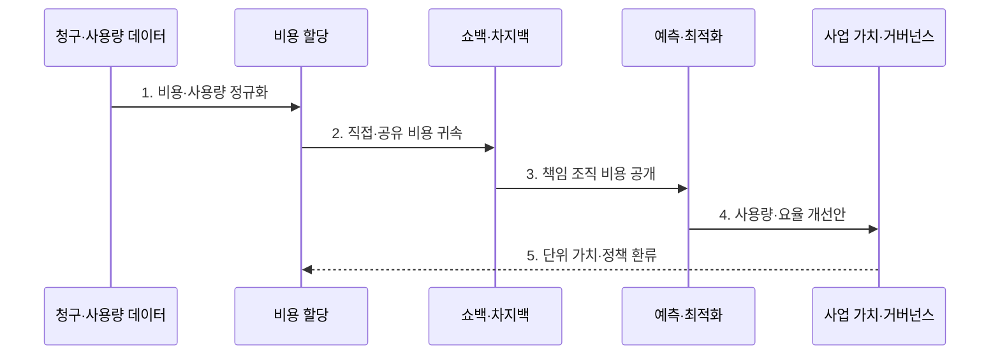

---
sidebar:
  order: 178
  label: "178. 핀옵스 (FinOps)"
  badge:
    text: "기출 · 70%"
    variant: note
title: "핀옵스 (FinOps)"
date: "2026-07-31T12:05:34+09:00"
tags:
  - "notes-latest-tech"
weight: 178
extra:
  question_no: "178"
  source_status: "기출"
  source_history: "135회"
  priority: 70
  priority_note: "FinOps 비용 할당·가치 최적화가 기출됨"
---

## Ⅰ. 개요

핵심 용어

- **FinOps**: 기술·재무·사업 조직이 변동하는 기술 비용과 사업 가치를 공동 최적화하는 운영 체계이다.
- **단위 경제성(Unit Economics)**: 요청·고객·거래 등 사업 가치 단위당 기술 비용이다.

- 정의/개념: **FinOps**는 기술·재무·사업 조직이 사용량 기반 기술 지출을 할당·분석·예측해 비용과 사업 가치를 공동 최적화하는 운영 체계
- 배경/필요성: 중앙 청구서만으로는 **사용 주체·제품 가치·낭비 원인**을 연결하기 어려운 한계

#### 한줄 요약

- 누가 왜 썼고 그 지출이 어떤 제품 가치로 이어졌는지를 기술·재무·사업 팀이 함께 판단한다.

## Ⅱ. 특징

핵심 용어

- **쇼백(Showback)**: 비용을 사용 조직에 보여 주되 실제 예산에는 부과하지 않는 방식이다.
- **차지백(Chargeback)**: 사용 조직의 실제 예산에 배분된 기술 비용을 부과하는 방식이다.

- 팀·제품·환경별 **비용 가시성·할당**
- 쇼백·차지백 기반 **분산 책임**
- 정보·최적화·운영을 반복하는 **Inform·Optimize·Operate**
#### 한줄 요약

- 무조건 적게 쓰는 것이 아니라 품질을 지키며 사용법과 구매 방식을 개선한다.

## Ⅲ. 구조 및 구성요소

핵심 용어

- **비용 할당**: 직접·공유 기술 비용을 팀·제품·환경 등 책임 단위에 귀속하는 과정이다.
- **거버넌스**: 예산·이상 지출·구매 약정·성과를 공동 규칙과 책임으로 관리하는 체계이다.

| 구성요소 | 책임 |
|:---|:---|
| **청구·사용량 데이터** | 공급자 비용·자원 사용·가격 정규화 |
| **비용 할당** | 직접·공유 비용을 책임 단위에 귀속 |
| **쇼백·차지백** | 팀별 비용 정보 제공·예산 부과 |
| **예측·최적화** | 수요 예측과 사용량·요율·약정 개선 |
| **사업 가치·거버넌스** | 단위 경제성·예산·이상·성과 관리 |

#### 한줄 요약

- 총고지서를 제품별로 나눈 뒤 다음 사용을 예측하고 가치가 큰 개선부터 실행한다.

## Ⅳ. 흐름도

핵심 용어

- **비용 정규화**: 공급자마다 다른 청구 항목과 사용량을 공통 분류·단위로 변환하는 과정이다.
- **요율 최적화**: 수요 예측에 맞춰 온디맨드·약정·할인 구매 구성을 조정하는 활동이다.

**동작 원리**

- **1. 비용·사용량 정규화**: 공급자별 청구 항목을 공통 분류로 변환
- **2. 직접·공유 비용 귀속**: 태그·계정·사용량 기준으로 소유자 배분
- **3. 책임 조직 비용 공개**: 쇼백 또는 차지백으로 행동 신호 제공
- **4. 사용량·요율 개선안**: 낭비 제거·규모 조정·약정 구매 검토
- **5. 단위 가치·정책 환류**: 품질과 거래당 비용을 확인해 할당·예산 정책 갱신

#### 한줄 요약

- 팀별 고지서를 보여 주고 개선한 뒤 요청당 비용과 서비스 품질이 나아졌는지 확인한다.

## Ⅴ. 종류 및 비교

핵심 용어

- **중앙 비용 처리**: 공용 기술 비용을 사용 조직에 배분하지 않고 중앙 조직이 부담하는 방식이다.
- **공유 비용**: 클러스터·네트워크·지원 조직처럼 여러 제품과 팀이 함께 사용해 직접 귀속하기 어려운 비용이다.

| 비용 책임 방식 | 쇼백 | 차지백 | 중앙 비용 처리 |
|:---|:---|:---|:---|
| 적용 기준 | **자율 개선** 유도 | **비용 회수·강한 책임** | **초기·공용 기반 비용** |
| 핵심 특징 | 팀별 **비용 정보 제공** | 팀 예산에 **실제 비용 부과** | **중앙 조직**이 비용 부담 |
| 한계 | **행동 변화 강제력** 부족 | **배분 분쟁·공유비 왜곡** | **사용 책임·최적화 동기** 약화 |

#### 한줄 요약

- 고지서만 보여 줄지 실제 예산에서 낼지 회사 공용비로 둘지를 비용 성숙도에 맞춰 정한다.

## Ⅵ. 실무 고려사항 및 대책

핵심 용어

- **커버리지**: 전체 적격 사용량 가운데 할인 약정이 적용된 비율이다.
- **활용률**: 구매한 약정 용량 가운데 실제 워크로드가 사용한 비율이다.

| 문제 | 대책 | 효과 |
|:---|:---|:---|
| **태그 누락·공유 비용 미배분** | 계정·태그·사용량 기반 **단계적 할당** | **비용 책임 정확도** 향상 |
| 할인 구매 후 **유휴 약정** | **수요 예측·커버리지·활용률** 공동 관리 | **약정 비용 낭비** 방지 |
| 절감으로 **서비스 품질 저하** | **SLO·단위 경제성** 동시 평가 | **비용·가치 균형** |

#### 한줄 요약

- 공유 Kubernetes 비용은 네임스페이스 사용량으로 배분하되 SLO와 거래당 비용을 함께 본다.

## Ⅶ. 결론

핵심 용어

- **SLO(Service Level Objective)**: 일정 기간에 달성하기로 정한 사용자 중심 서비스 품질 목표이다.
- **가치 최적화**: 단순 지출 감축이 아니라 품질을 유지하며 사업 성과 단위당 기술 비용을 개선하는 활동이다.

- **단위 경제성**이 개선되고 **SLO**가 유지되는 비용 최적화만 적용

#### 한줄 요약

- 목표는 가장 적게 쓰는 것이 아니라 누가 왜 쓰는지 알고 가장 가치 있게 쓰는 것이다.
