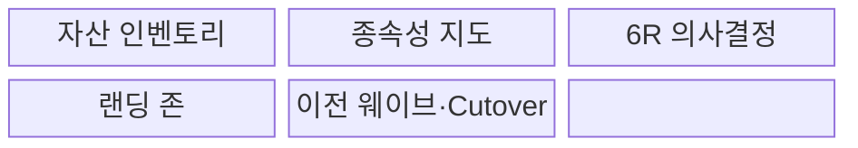
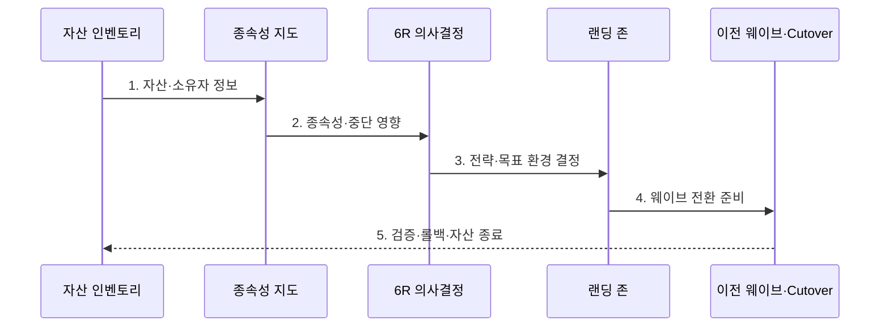

---
sidebar:
  order: 179
  label: "179. 클라우드 마이그레이션 6R (Cloud Migration 6R)"
  badge:
    text: "기출 · 70%"
    variant: note
title: "클라우드 마이그레이션 6R (Cloud Migration 6R)"
date: "2026-07-30T20:20:00+09:00"
tags:
  - "notes-latest-tech"
weight: 179
extra:
  question_no: "179"
  source_status: "기출"
  source_history: "138회"
  priority: 70
  priority_note: "클라우드 6R 선택·전환 설계가 138회 출제됨"
---

## 미리 알고가기

- **6R**: Retain·Retire·Rehost·Replatform·Refactor·Repurchase의 애플리케이션 전환 전략
- **종속성 지도**: 애플리케이션·데이터·인터페이스 사이 연결과 전환 순서를 식별하는 자료
- **마이그레이션 웨이브**: 종속성과 위험을 고려해 함께 이전하는 대상 묶음

## Ⅰ. 개요

- 정의/개념: 업무 가치와 기술 조건에 따라 애플리케이션별 **유지·폐기·이전·개선·재설계·교체** 전략을 선택하는 체계
- 배경/필요성: 일괄 이전의 **기술 부채 유지·불필요 자산 이전·과도한 재설계 비용** 방지

### 쉽게 이해하기 (학습용)

- 이사할 때 물건마다 남길지 버릴지 그대로 옮길지 고치거나 새로 살지를 정한다.

## Ⅱ. 특징

- **1. 이전 제외 판단**: Retain·Retire의 이전 제외 판단
- **2. 속도와 개선 폭 조절**: Rehost·Replatform의 속도와 개선 폭 조절
- **3. 구조·제품 전환**: Refactor·Repurchase의 구조·제품 전환
### 쉽게 이해하기 (학습용)

- 각 시스템의 가치와 제약뿐 아니라 서로 연결된 순서까지 보고 이전 방식을 정한다.

## Ⅲ. 구조 및 구성요소

| 구성요소 | 책임 |
|:---|:---|
| 자산 인벤토리 | 소유자·가치·기술·비용·수명 상태 관리 |
| 종속성 지도 | 호출·데이터·인증·운영 연결 식별 |
| 6R 의사결정 | 가치·위험·기한에 따른 전략 선택 |
| 랜딩 존 | 계정·네트워크·신원·보안·관측 준비 |
| 이전 웨이브·Cutover | 대상 그룹·순서·데이터·트래픽 전환 |

### 쉽게 이해하기 (학습용)

- 짐 목록과 연결 관계를 조사한 뒤 이사법을 정하고 새집의 기반을 준비해 묶음별로 옮긴다.

## Ⅳ. 흐름도

**동작 원리**

- **1. 자산·소유자 정보**: 가치·비용·기술 상태와 책임자 확인
- **2. 종속성·중단 영향**: 호출·데이터 흐름과 허용 중단 시간 분석
- **3. 전략·목표 환경 결정**: 대상별 6R과 성공 기준 선택
- **4. 웨이브 전환 준비**: 랜딩 존·데이터 동기화·순서·롤백 구성
- **5. 검증·롤백·자산 종료**: 수용 기준 확인 후 구환경 폐기 또는 복귀

### 쉽게 이해하기 (학습용)

- 옮긴 뒤 정상 작동과 복귀 방법을 확인해야 이전과 기존 시스템 종료가 완성된다.

## Ⅴ. 종류 및 비교

| 6R 전략군 | Retain·Retire | Rehost·Replatform | Refactor·Repurchase |
|:---|:---|:---|:---|
| 적용 기준 | 유지 가치·폐기 가능성 | 빠른 이전·일부 최적화 | 차별화·제품 교체 요구 |
| 핵심 특징 | 현상 유지·시스템 종료 | 인프라 이관·관리형 플랫폼 적용 | 구조 재설계·SaaS 교체 |
| 한계 | 기술 부채·종료 종속성 | 기존 구조 제약 잔존 | 높은 변경 비용·업무 변화 |

### 쉽게 이해하기 (학습용)

- 가치가 없으면 폐기하고 빠르게 옮길지 일부 고칠지 새로 설계하거나 구매할지를 결정한다.

## Ⅵ. 실무 고려사항 및 대책

| 고려사항 | 대책 | 효과 |
|:---|:---|:---|
| 누락된 종속성으로 전환 실패 | 트래픽·CMDB·인터뷰 교차 검증 | 웨이브 장애 감소 |
| 데이터 불일치와 긴 중단 | 증분 복제·리허설·Cutover 기준 설정 | RPO·RTO 준수 |
| 이전 후 구환경 비용 지속 | 종료 책임자·완료 조건·폐기 일정 지정 | 이중 운영 비용 제거 |

### 쉽게 이해하기 (학습용)

- 3계층 시스템은 호출과 데이터 순서를 확인하고 리허설한 뒤 수용 기준을 통과해야 구환경을 끈다.

## Ⅶ. 결론

- 전환 위험과 과도한 변경을 줄이기 위해 **업무 가치·기술 부채·종속성·RTO·RPO·웨이브·종료 조건**을 검토하고 워크로드별 6R을 선택한다.

### 쉽게 이해하기 (학습용)

- 전략 이름을 붙이는 데서 끝나지 않고 연결된 시스템의 전환 순서와 구환경 종료까지 설계해야 한다.
