---
sidebar:
  order: 180
  label: "180. 멀티클라우드 (Multi-Cloud)"
  badge:
    text: "기출 · 70%"
    variant: note
title: "멀티클라우드 (Multi-Cloud)"
date: "2026-07-31T09:04:31+09:00"
tags:
  - "notes-latest-tech"
weight: 180
extra:
  question_no: "180"
  source_status: "기출"
  source_history: "135회"
  priority: 70
  priority_note: "멀티클라우드 배치·종속성 비교가 기출됨"
---

## 미리 알고가기

- **멀티클라우드**: 둘 이상의 공용 클라우드 제공자를 목적별로 함께 사용하는 전략
- **하이브리드 클라우드**: 온프레미스·사설 환경과 공용 클라우드를 연결해 운영하는 모델
- **이식성(Portability)**: 애플리케이션·데이터·운영 절차를 다른 환경으로 옮길 수 있는 정도

> **키워드:** 멀티클라우드 (Multi-Cloud)

## Ⅰ. 개요

- 정의/개념: 기능·지역·복원력·협상력을 위해 **복수 클라우드 제공자**에 워크로드를 목적별 배치하는 운영 전략
- 배경/필요성: 단일 제공자의 **지역·기능·장애·가격 정책 변화에 대한 집중 위험** 완화

### 쉽게 이해하기 (학습용)

- 여러 운송사를 쓰되 각 회사의 역할과 대체 절차를 미리 정하는 방식이다.

## Ⅱ. 특징

- 제공자별 강점을 활용한 **목적별 워크로드 배치**
- 독립 실패 영역과 전환 훈련 기반 **복원력**
- 공통 신원·정책·관측의 **통합 거버넌스**
### 쉽게 이해하기 (학습용)

- 공급자를 늘리는 것만으로 복구력이 생기지 않으며 데이터와 운영 절차까지 준비해야 한다.

## Ⅲ. 구조 및 구성요소

| 구성요소 | 책임 |
|:---|:---|
| **워크로드 배치 정책** | 기능·지역·규제·복구 목표별 제공자 역할 정의 |
| **공통 신원·거버넌스** | 계정·권한·정책 코드·태그 기준 통합 |
| **클라우드 A** | 지정 워크로드와 데이터 서비스 제공 |
| **클라우드 B** | 보완 기능·독립 용량·대체 경로 제공 |
| **연결·관측·복원 운영** | 회선·복제·통합 텔레메트리·전환 훈련 |

### 쉽게 이해하기 (학습용)

- 회사는 달라도 같은 고객 확인과 비용표를 쓰고 창고 간 이동과 대체 운송을 관리한다.

## Ⅳ. 흐름도

```mermaid
sequenceDiagram
  participant B as 업무 목표
  participant P as 워크로드 배치 정책
  participant G as 공통 신원·거버넌스
  participant C as 복수 클라우드
  participant O as 연결·관측·복원 운영
  B->>P: 기능·지역·복구 목표
  P->>G: 1. 제공자 역할·책임 결정
  G->>C: 2. 공통 통제 적용
  C->>O: 3. 배포·복제·관측
  O-->>B: 전환·비용·SLO 검증 결과
```

**동작 원리**

- **1. 제공자 역할·책임 결정**: 워크로드와 데이터의 주·보조 위치 선택
- **2. 공통 통제 적용**: 신원·정책·태그·배포 기준을 각 환경에 구현
- **3. 배포·복제·관측**: 연결과 데이터 동기화 및 통합 텔레메트리 운영

### 쉽게 이해하기 (학습용)

- 한 운송사가 멈췄을 때 다른 회사가 정해진 시간과 비용 안에서 대신할 수 있는지 훈련한다.

## Ⅴ. 종류 및 비교

| 클라우드 운영 모델 | 멀티클라우드 | 하이브리드 클라우드 | 단일 클라우드 |
|:---|:---|:---|:---|
| 적용 기준 | **제공자 분산·기능 선택** | **온프레미스 연계·규제 경계** | **단순 운영·제공자 내 복원력** |
| 핵심 특징 | **복수 공용 클라우드** 배치 | **사설·공용 환경** 연결 | **단일 제공자** 중심 표준화 |
| 한계 | **통제·기술·전송·인력 비용** | **연계 복잡성·지연** | **제공자 집중 위험** |

### 쉽게 이해하기 (학습용)

- 여러 회사, 자체 창고와 외부 회사, 한 회사의 여러 센터는 장애 대비와 운영비가 다르다.

## Ⅵ. 실무 고려사항 및 대책

| 고려사항 | 대책 | 효과 |
|:---|:---|:---|
| **데이터 복제 지연·충돌** | 소유권·일관성·RPO별 **복제 설계** | 전환 시 **데이터 오류** 억제 |
| 제공자 간 **전송·중복 비용** | **데이터 중력 기반 배치·비용 한도** | 예상 밖 **운영비** 감소 |
| 문서상 **대체 용량 미작동** | 정기 장애 전환·**키·DNS·용량 훈련** | **실질적 복구 능력** 확보 |

### 쉽게 이해하기 (학습용)

- 금융 거래 채널은 대체 클라우드의 데이터 시점과 키 접근 및 실제 처리 용량을 반복 검증한다.

## Ⅶ. 결론

- **제공자 집중 위험 감소**가 **데이터 복제·운영 비용**보다 큰 워크로드에 멀티클라우드 적용

### 쉽게 이해하기 (학습용)

- 공급자 수가 아니라 장애 때 실제 선택권과 복구 능력이 생기는지가 성공 기준이다.
