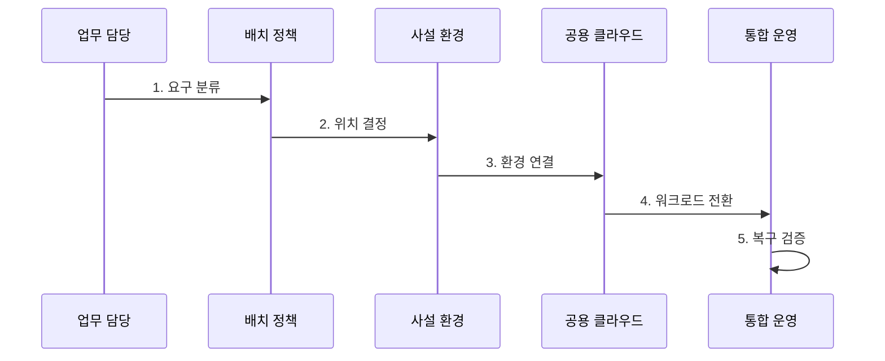

---
sidebar:
  order: 181
  label: "181. 하이브리드 클라우드 (Hybrid Cloud)"
  badge:
    text: "기출 · 70%"
    variant: note
title: "하이브리드 클라우드 (Hybrid Cloud)"
date: "2026-07-27T23:59:59+09:00"
tags: ["notes-latest-tech"]
weight: 181
extra:
  question_no: "181"
  source_status: "기출"
  source_history: "135회"
  priority: 70
  priority_note: "하이브리드 클라우드 연계·배치가 기출됨"
---

## 미리 알고 가기

- **하이브리드 클라우드**: 온프레미스·사설 클라우드와 공용 클라우드를 연결해 하나의 운영 모델로 사용하는 방식
- **온프레미스**: 조직이 직접 통제하는 시설에 정보시스템을 구축·운영하는 형태
- **데이터 중력**: 데이터 규모가 커질수록 응용 프로그램과 서비스가 데이터 위치 가까이 모이는 성질
- **페더레이션**: 서로 다른 신원·관리 영역이 신뢰 관계를 맺어 자원을 공동 사용하는 방식
- **클라우드 버스팅**: 평상시 내부에서 처리하고 수요 급증분을 공용 클라우드로 확장하는 방식
- **RPO·RTO**: 허용 가능한 데이터 손실 시점과 서비스 복구 목표 시간

## Ⅰ. 개요

- **정의**: 하이브리드 클라우드는 사설 환경과 공용 클라우드를 **연결·배치·운영 정책**으로 통합하는 클라우드 운영 모델
- **필요성**: 내부 환경만으로는 규제·기존 시스템 통제를 유지하면서 급격한 수요와 관리형 서비스를 민첩하게 수용하기 어려우므로 환경 간 역할 분담 필요

### 쉽게 이해하기

- 중요한 물품은 내부 창고에 두고, 수요가 늘면 전용 통로로 외부 물류센터의 공간과 설비를 빌려 쓰는 방식입니다.

## Ⅱ. 특징

- **정책 기반 배치**: 규제, 지연, 데이터 중력, 비용에 따라 업무와 데이터의 실행 위치 결정
- **환경 간 일관성**: 신원, 보안, 배포, 관측 정책을 서로 다른 플랫폼에 공통 적용
- **단절 내성 연결**: 회선 지연·장애를 전제로 동기화와 독립 운영 및 복구 경로 설계

### 쉽게 이해하기

- 물품 성격에 따라 창고를 정하되 출입·재고 규칙은 통일하고 통로가 끊겨도 각 창고가 일할 수 있게 합니다.

## Ⅲ. 구조 및 구성요소

| 구성요소 | 책임 |
|:---|:---|
| **사설 환경** | 규제·지연 민감 업무와 원본 데이터 운영 |
| **연결 계층** | 전용 회선, 가상 사설망, 라우팅, 이름 해석 제공 |
| **신원·보안** | 페더레이션, 최소 권한, 키와 정책의 공통 통제 |
| **데이터 통합** | 원본·복제본 정의와 동기화·정합성 관리 |
| **공용 클라우드** | 탄력적 처리 용량과 관리형 서비스 제공 |

### 쉽게 이해하기

- 내부·외부 창고를 전용도로로 잇고 출입증과 재고 원장 규칙을 공동 운영합니다.

## Ⅳ. 흐름도

### 동작 원리

1. **요구 분류**: 규제, 지연, 확장, 데이터 이동 조건 분석
2. **위치 결정**: 실행 위치와 데이터 원본·복제본 및 책임 주체 지정
3. **환경 연결**: 회선, 신원, 보안, 배포, 관측 정책 연계
4. **워크로드 전환**: 데이터 정합성을 확인하며 단계적으로 배포·확장·이관
5. **복구 검증**: 단절과 장애를 주입해 독립 운영, RPO·RTO, 복귀 절차 확인

## Ⅴ. 종류 및 비교

| 구분 | 하이브리드 클라우드 | 멀티클라우드 | 사설 클라우드 |
|:---|:---|:---|:---|
| **적용 대상** | 사설·공용 환경 간 업무 분담 | 복수 사업자 서비스 조합 | 전용 통제가 필요한 업무 |
| **핵심 방식** | 환경 간 연결·이동·공통 운영 | 사업자별 장점과 복원력 활용 | 조직 전용 자원과 정책 운영 |
| **주요 한계** | 연계 복잡성, 지연, 이중 운영비 | 정책 분산과 전송 비용 | 확장 용량과 서비스 선택 제약 |

## Ⅵ. 실무 고려사항 및 대책

| 고려사항 | 위험 | 대책 |
|:---|:---|:---|
| **데이터 정합성** | 양방향 갱신 충돌과 오래된 복제본 사용 | 단일 원본 지정, 동기화 방향·충돌 정책, 복제 지연 감시 |
| **연결 단절** | 환경 간 호출이 연쇄 실패하고 업무 중단 | 이중화 회선, 시간 초과·회로 차단, 독립 운영 모드와 복구 훈련 |
| **정책·비용 분산** | 환경별 권한·배포 편차와 중복 자원 비용 증가 | 정책 코드화, 공통 자산 목록·관측, 총소유비용과 반출 비용 정기 검토 |

## Ⅶ. 결론

- 하이브리드 클라우드는 **워크로드 배치**, **데이터 원본**, **단절 복구**를 먼저 결정하고 연결 편익이 이중 운영 복잡도보다 큰 업무에 적용해야 한다.
