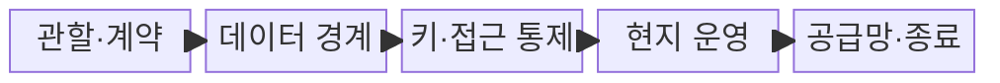
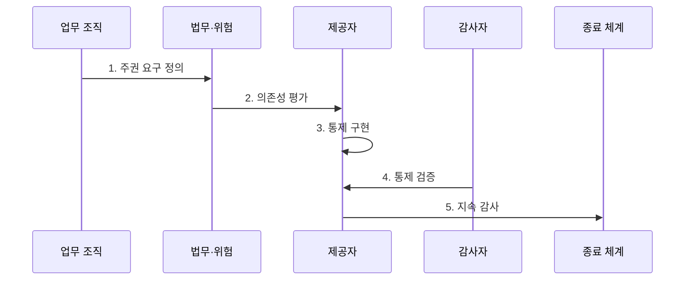

---
sidebar:
  order: 182
  label: "182. 소버린 클라우드 (Sovereign Cloud)"
  badge:
    text: "기출 · 70%"
    variant: note
title: "소버린 클라우드 (Sovereign Cloud)"
date: "2026-07-27T23:59:59+09:00"
tags: ["notes-latest-tech"]
weight: 182
extra:
  question_no: "182"
  source_status: "기출"
  source_history: "138회"
  priority: 70
  priority_note: "주권 클라우드의 데이터·운영 통제가 최근 출제됨"
---

## 미리 알고 가기

- **소버린 클라우드**: 지정 국가·권역이 데이터와 클라우드 운영의 실질적 통제권을 유지하는 모델
- **데이터 주권**: 데이터가 속한 국가의 법률과 통제 요구를 따르는 원칙
- **데이터 레지던시**: 데이터 저장·처리 위치를 특정 지역으로 제한하는 요구
- **운영 주권**: 지정된 법인·인력·절차가 관리 접근과 서비스 운영을 통제하는 능력
- **기술 주권**: 공급 중단에도 기술을 유지·대체·이전할 수 있는 능력
- **종료 전략**: 계약 종료나 공급 중단 시 데이터와 업무를 다른 환경으로 이전·복구하는 계획

## Ⅰ. 개요

- **정의**: 소버린 클라우드는 지정 권역이 **데이터·법적 관할·운영·기술 공급망**의 통제권을 유지하는 클라우드 모델
- **필요성**: 데이터 저장 위치만 제한해도 외국 법률 적용, 원격 관리자 접근, 고객 키 통제 상실, 공급 중단 위험은 남으므로 실질적 주권 통제 필요

### 쉽게 이해하기

- 금고 위치뿐 아니라 열쇠, 관리자, 적용 법률, 예비 부품과 비상 이전 권한까지 통제하는 방식입니다.

## Ⅱ. 특징

- **데이터 주권**: 저장·처리·전송·삭제와 반출 승인 권한을 지정 권역에서 통제
- **운영 주권**: 현지 법인·인력, 고객 통제 키, 다중 승인으로 외부 관리자 접근 제한
- **기술 주권**: 공급망 투명성과 대체·이전·독립 복구 능력으로 서비스 연속성 확보

### 쉽게 이해하기

- 자료, 운영자, 열쇠, 부품, 비상 복구 수단을 모두 정해진 관할 안에서 관리합니다.

## Ⅲ. 구조 및 구성요소

| 구성요소 | 책임 |
|:---|:---|
| **관할·계약** | 제공자·하도급자의 법 적용과 외부 요구 대응 절차 통제 |
| **데이터 경계** | 데이터·메타데이터의 저장, 처리, 전송, 삭제 위치 제한 |
| **키·접근 통제** | 고객 통제 키, 다중 승인, 접근 기록과 철회 집행 |
| **현지 운영** | 권역 내 인력·도구로 배포, 보안 대응, 복구 수행 |
| **공급망·종료** | 의존성 추적과 대체 공급, 반출, 이전 가능성 확보 |

### 쉽게 이해하기

- 법적 울타리 안에서 금고, 열쇠, 관리자, 부품과 비상 반출 절차를 함께 운영합니다.

## Ⅳ. 흐름도

### 동작 원리

1. **주권 요구 정의**: 법률·업무 민감도별 데이터·운영·기술 통제 수준 결정
2. **의존성 평가**: 관할, 관리자 접근, 하도급, 키, 공급망과 중단 영향 분석
3. **통제 구현**: 위치 제한, 현지 운영, 다중 승인, 반출 정책과 기술 차단 적용
4. **통제 검증**: 계약 권리와 실제 접근 차단·감사 증적의 일치 여부 시험
5. **지속 감사**: 공급망을 재평가하고 정기적으로 데이터 반출·서비스 이전 훈련

## Ⅴ. 종류 및 비교

| 구분 | 데이터 레지던시 | 규제 준수 리전 | 소버린 클라우드 |
|:---|:---|:---|:---|
| **적용 대상** | 데이터 위치 제한 | 인증·계약 통제가 필요한 업무 | 국가·산업의 독립 통제 업무 |
| **핵심 방식** | 지정 위치 저장·처리 | 지역 서비스와 보호조치 적용 | 법적·데이터·운영·기술 주권 결합 |
| **주요 한계** | 원격 접근·법적 관할 통제 부족 | 제공자 본사 운영과 공급망 의존 | 높은 비용과 서비스 선택 제약 |

## Ⅵ. 실무 고려사항 및 대책

| 고려사항 | 위험 | 대책 |
|:---|:---|:---|
| **명목상 지역성** | 국내 저장이어도 외부 법·관리자 접근 가능 | 법인·하도급·지원 경로 조사와 고객 승인·기록 기반 접근 |
| **키 통제 상실** | 제공자가 단독으로 복호화해 데이터 주권 약화 | 고객 관리 키, 키 외부 보관, 다중 승인과 비상 접근 감사 |
| **공급자 종속** | 제재·계약 종료 시 서비스와 데이터 복구 불가 | 개방 형식, 대체 공급자, 반출 권리와 정기 이전·복구 훈련 |

## Ⅶ. 결론

- 소버린 클라우드는 **저장 위치의 명칭**이 아니라 법적 관할, 관리자 접근, 암호키, 공급망, 종료 전략을 실제로 누가 통제하는지 증명해야 한다.
