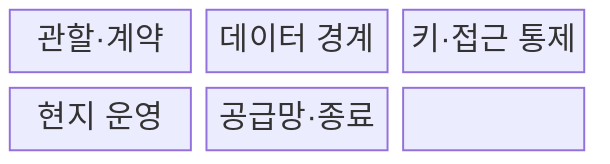
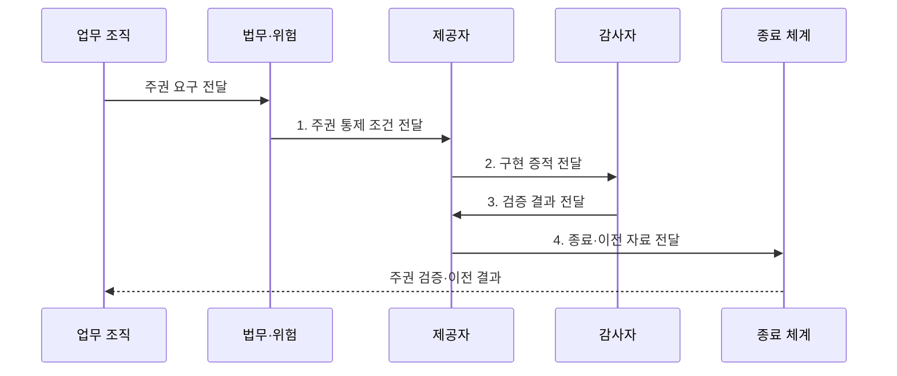

---
sidebar:
  order: 182
  label: "182. 소버린 클라우드 (Sovereign Cloud)"
  badge:
    text: "기출 · 70%"
    variant: note
title: "소버린 클라우드 (Sovereign Cloud)"
date: "2026-07-31T08:57:00+09:00"
tags: ["notes-latest-tech"]
weight: 182
extra:
  question_no: "182"
  source_status: "기출"
  source_history: "138회"
  priority: 70
  priority_note: "주권 클라우드의 데이터·운영 통제가 최근 출제됨"
---

## 미리 알고가기

- **소버린 클라우드**: 지정 국가·권역이 데이터와 클라우드 운영의 실질적 통제권을 유지하는 모델
- **데이터 주권**: 데이터가 속한 국가의 법률과 통제 요구를 따르는 원칙
- **데이터 레지던시**: 데이터 저장·처리 위치를 특정 지역으로 제한하는 요구
- **운영 주권**: 지정된 법인·인력·절차가 관리 접근과 서비스 운영을 통제하는 능력
- **기술 주권**: 공급 중단에도 기술을 유지·대체·이전할 수 있는 능력
- **종료 전략**: 계약 종료나 공급 중단 시 데이터와 업무를 다른 환경으로 이전·복구하는 계획

> **키워드:** 소버린 클라우드 (Sovereign Cloud)

## Ⅰ. 개요

- 정의/개념: **소버린 클라우드**는 지정 권역이 데이터·운영·기술 통제권을 유지하는 모델
- 배경/필요성: 국내 저장만으로는 외국 법률·원격 관리자·공급 중단의 **통제권 상실** 방지 곤란

### 쉽게 이해하기 (학습용)

- 금고 위치뿐 아니라 열쇠, 관리자, 적용 법률, 예비 부품과 비상 이전 권한까지 통제하는 방식입니다.

## Ⅱ. 특징

- **1. 데이터 주권**: 저장·처리·전송·삭제와 반출 승인 권한을 지정 권역에서 통제
- **2. 운영 주권**: 현지 법인·인력, 고객 통제 키, 다중 승인으로 외부 관리자 접근 제한
- **3. 기술 주권**: 공급망 투명성과 대체·이전·독립 복구 능력으로 서비스 연속성 확보
### 쉽게 이해하기 (학습용)

- 자료, 운영자, 열쇠, 부품, 비상 복구 수단을 모두 정해진 관할 안에서 관리합니다.

## Ⅲ. 구조 및 구성요소

| 구성요소 | 책임 |
|:---|:---|
| 관할·계약 | 제공자·하도급자의 **법 적용·외부 요구 대응** 통제 |
| 데이터 경계 | 데이터·메타데이터의 **저장·처리 위치** 제한 |
| 키·접근 통제 | 고객 통제 키·다중 승인 기반 **접근 철회** 집행 |
| 현지 운영 | 권역 내 인력·도구로 배포와 **보안 대응·복구** 수행 |
| 공급망·종료 | 의존성 추적과 대체 공급·반출 및 **이전 가능성** 보장 |

### 쉽게 이해하기 (학습용)

- 법적 울타리 안에서 금고, 열쇠, 관리자, 부품과 비상 반출 절차를 함께 운영합니다.

## Ⅳ. 흐름도

**동작 원리**

1. **주권 통제 조건 전달**: 법률·민감도별 데이터와 **운영·기술 조건** 제공
2. **구현 증적 전달**: 위치·현지 운영·접근 차단의 **통제 증거** 제공
3. **검증 결과 전달**: 계약 권리와 실제 통제의 **일치 여부** 제공
4. **종료·이전 자료 전달**: 반출 권리·대체 공급자의 **복구 자료** 제공

### 쉽게 이해하기 (학습용)

- 각 단계의 판정 결과가 다음 주체의 실행 조건으로 이어지는 흐름이다.

## Ⅴ. 종류 및 비교

| 구분 | 데이터 레지던시 | 규제 준수 리전 | 소버린 클라우드 |
|:---|:---|:---|:---|
| 적용 대상 | **데이터 위치 제한** | 인증·계약 통제가 필요한 **규제 업무** | 국가·산업의 **독립 통제 업무** |
| 핵심 방식 | 지정 위치의 **저장·처리** | 지역 서비스와 **보호조치** 적용 | 법적·데이터·운영·기술 **주권 결합** |
| 주요 한계 | **원격 접근·법적 관할** 통제 부족 | 본사 운영과 **공급망 의존** | **높은 비용·서비스 선택** 제약 |

### 쉽게 이해하기 (학습용)

- 적용 기준과 핵심 특징 및 한계를 함께 비교해 대안을 선택한다.

## Ⅵ. 실무 고려사항 및 대책

| 고려사항 | 대책 | 효과 |
|:---|:---|:---|
| **명목상 지역성** 미검증 시 국내 저장이어도 외부 법·관리자 접근 가능 | 법인·하도급·지원 경로 조사와 고객 승인·기록 기반 접근 | **관할권 통제력** 확보 |
| **키 통제 상실** 미검증 시 제공자가 단독으로 복호화해 데이터 주권 약화 | 고객 관리 키, 키 외부 보관, 다중 승인과 비상 접근 감사 | **단독 복호화 가능성** 제거 |
| **공급자 종속** 미검증 시 제재·계약 종료 시 서비스와 데이터 복구 불가 | 개방 형식, 대체 공급자, 반출 권리와 정기 이전·복구 훈련 | 서비스·데이터 **이전성** 확보 |

### 쉽게 이해하기 (학습용)

- 핵심 운영 위험마다 실행 가능한 대책과 검증 효과를 함께 확인한다.

## Ⅶ. 결론

- 외국 관할·원격 접근 위험이 크면 **소버린 클라우드**, 위치 제한만 필요하면 **레지던시** 선택

### 쉽게 이해하기 (학습용)

- 핵심 판단 기준을 먼저 정한 뒤 적용 범위를 결정하는 것이 중요하다.
