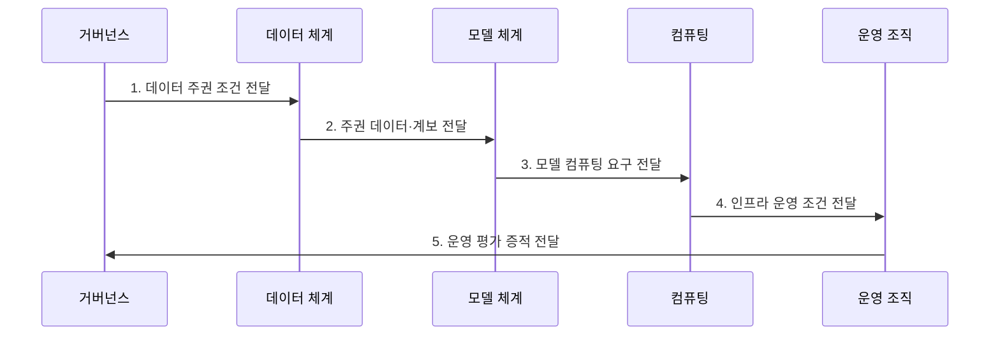

---
sidebar:
  order: 183
  label: "183. 소버린 AI (Sovereign AI)"
  badge:
    text: "미출 · 70%"
    variant: note
title: "소버린 AI (Sovereign AI)"
date: "2026-07-31T08:57:48+09:00"
tags: ["notes-latest-tech"]
weight: 183
extra:
  question_no: "183"
  source_status: "미출"
  source_history: ""
  priority: 70
  priority_note: "주권 AI의 데이터·모델·컴퓨팅 통제가 유력"
---

## 미리 알고가기

- **소버린 AI**: 국가·권역이 AI의 데이터, 모델, 컴퓨팅, 운영 의사결정에 실질적 통제권을 확보하는 체계
- **모델 가중치**: 학습으로 조정되어 모델의 출력 특성을 결정하는 수치 집합
- **데이터 계보**: 데이터의 출처, 권리, 가공, 학습 사용 과정을 추적하는 정보
- **컴퓨팅 주권**: 학습·추론에 필요한 가속기와 기반 시설을 확보·대체할 수 있는 능력
- **정책 정렬**: 모델 동작을 자국의 법률, 언어, 문화, 위험 기준에 맞추는 과정
- **공급망 의존성**: 반도체, 소프트웨어, 모델, 전문 인력의 외부 공급 중단에 노출되는 정도

## Ⅰ. 개요

- 정의/개념: **소버린 AI**는 국가·권역이 AI 데이터·모델·컴퓨팅의 결정권을 확보하는 생태계
- 배경/필요성: 외부 모델·인프라 종속은 공급 중단과 법률 충돌 시 **독자 교체·복구** 제약

### 쉽게 이해하기 (학습용)

- 재료와 조리법뿐 아니라 주방, 요리사, 검사 기준과 비상시 대체 조리법까지 확보하는 것입니다.

## Ⅱ. 특징

- **1. 데이터·정책 자율성**: 데이터 권리와 수명주기 및 자국 기준의 모델 행동 통제
- **2. 모델 수명주기 통제**: 평가, 배포, 감시, 개선, 중단과 교체 권한 확보
- **3. 운영 지속성**: 컴퓨팅·소프트웨어·인력 공급망의 가시성과 대체 경로 유지
### 쉽게 이해하기 (학습용)

- 재료 사용 권한, 음식 검사와 교체 결정, 주방과 요리사의 비상 대안을 직접 관리합니다.

## Ⅲ. 구조 및 구성요소

| 구성요소 | 책임 |
|:---|:---|
| 법·거버넌스 | 데이터 권리·위험 기준과 **감사·중단 권한** 집행 |
| 주권 데이터 | 출처·동의·반출·삭제의 **데이터 계보** 관리 |
| 모델·도구 | 가중치 접근·평가·배포와 **교체 가능성** 확보 |
| 컴퓨팅·공급망 | 가속기·소프트웨어 용량과 **대체 경로** 유지 |
| 인력·운영 | 현지 전문가의 학습·추론과 **사고 대응·복구** 수행 |

### 쉽게 이해하기 (학습용)

- 법과 운영자가 재료, 조리법, 주방 설비를 통제하여 필요한 AI 서비스를 지속합니다.

## Ⅳ. 흐름도

**동작 원리**

1. **데이터 주권 조건 전달**: 권리·반출·삭제의 **통제 요구** 제공
2. **주권 데이터·계보 전달**: 허가된 학습 데이터와 **출처 이력** 제공
3. **모델 컴퓨팅 요구 전달**: 학습·추론에 필요한 **가속기·도구 조건** 제공
4. **인프라 운영 조건 전달**: 공급 중단을 견딜 **용량·대체 경로** 제공
5. **운영 평가 증적 전달**: 품질·편향·교체·복구의 **시험 결과** 제공

### 쉽게 이해하기 (학습용)

- 각 단계의 판정 결과가 다음 주체의 실행 조건으로 이어지는 흐름이다.

## Ⅴ. 종류 및 비교

| 구분 | 소버린 AI | 데이터 레지던시 | 소버린 클라우드 |
|:---|:---|:---|:---|
| 적용 대상 | **AI 생태계·수명주기** | 데이터의 **저장·처리 위치** | 클라우드 **인프라·운영** |
| 핵심 방식 | 데이터·모델·컴퓨팅의 **결정권 통제** | 지정 권역 내 **데이터 유지** | 법적·운영·기술 **주권 확보** |
| 주요 한계 | **투자 비용·기술 변화** 부담 | **모델·컴퓨팅 통제** 미보장 | **모델·데이터 권리** 미보장 |

### 쉽게 이해하기 (학습용)

- 적용 기준과 핵심 특징 및 한계를 함께 비교해 대안을 선택한다.

## Ⅵ. 실무 고려사항 및 대책

| 고려사항 | 대책 | 효과 |
|:---|:---|:---|
| **학습 데이터 권리** 미검증 시 무단 학습·반출과 결과물 분쟁 | 데이터 계보, 이용 허가, 삭제·반출 정책과 독립 감사 | 데이터 **적법성·추적성** 확보 |
| **핵심 기술 종속** 미검증 시 모델·가속기·도구 공급 중단 시 운영 불가 | 의존성 목록, 대체 모델·도구, 이식 가능한 자료 형식과 전환 훈련 | 기술 중단 시 **서비스 연속성** 향상 |
| **자국 기준 편향** 미검증 시 언어·문화·공공 가치에 맞지 않는 출력 | 대표 평가 자료, 분야 전문가 검토, 배포 후 위험 감시와 중단 권한 | **출력 적합성** 향상 |

### 쉽게 이해하기 (학습용)

- 핵심 운영 위험마다 실행 가능한 대책과 검증 효과를 함께 확인한다.

## Ⅶ. 결론

- 국가안보·공공 핵심 AI는 **직접 통제**, 비핵심 기능은 **외부 조달** 선택

### 쉽게 이해하기 (학습용)

- 핵심 판단 기준을 먼저 정한 뒤 적용 범위를 결정하는 것이 중요하다.
