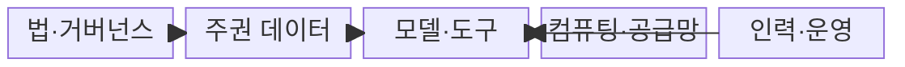
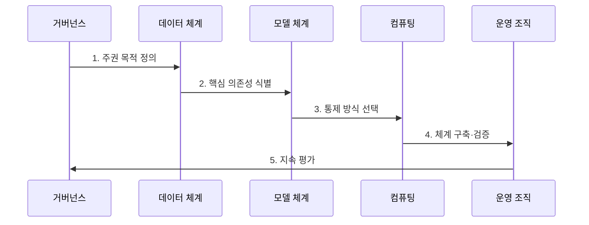

---
sidebar:
  order: 183
  label: "183. 소버린 AI (Sovereign AI)"
  badge:
    text: "미출 · 70%"
    variant: note
title: "소버린 AI (Sovereign AI)"
date: "2026-07-25T03:12:00+09:00"
tags: ["notes-latest-tech"]
weight: 183
extra:
  question_no: "183"
  source_status: "미출"
  source_history: ""
  priority: 70
  priority_note: "주권 AI의 데이터·모델·컴퓨팅 통제가 유력"
---

## 미리 알고 가기

- **소버린 AI**: 국가·권역이 AI의 데이터, 모델, 컴퓨팅, 운영 의사결정에 실질적 통제권을 확보하는 체계
- **모델 가중치**: 학습으로 조정되어 모델의 출력 특성을 결정하는 수치 집합
- **데이터 계보**: 데이터의 출처, 권리, 가공, 학습 사용 과정을 추적하는 정보
- **컴퓨팅 주권**: 학습·추론에 필요한 가속기와 기반 시설을 확보·대체할 수 있는 능력
- **정책 정렬**: 모델 동작을 자국의 법률, 언어, 문화, 위험 기준에 맞추는 과정
- **공급망 의존성**: 반도체, 소프트웨어, 모델, 전문 인력의 외부 공급 중단에 노출되는 정도

## Ⅰ. 개요

- **정의**: 소버린 AI는 국가·권역이 **데이터·모델·컴퓨팅·인력·거버넌스**의 핵심 의사결정과 운영 지속성을 확보하는 AI 생태계
- **필요성**: 외부 모델과 인프라에 전적으로 의존하면 공급 중단, 법률 충돌, 자국어·문화 편향, 사고 시 교체·복구 문제에 독자 대응하기 어려움

### 쉽게 이해하기

- 재료와 조리법뿐 아니라 주방, 요리사, 검사 기준과 비상시 대체 조리법까지 확보하는 것입니다.

## Ⅱ. 특징

- **데이터·정책 자율성**: 데이터 권리와 수명주기 및 자국 기준의 모델 행동 통제
- **모델 수명주기 통제**: 평가, 배포, 감시, 개선, 중단과 교체 권한 확보
- **운영 지속성**: 컴퓨팅·소프트웨어·인력 공급망의 가시성과 대체 경로 유지

### 쉽게 이해하기

- 재료 사용 권한, 음식 검사와 교체 결정, 주방과 요리사의 비상 대안을 직접 관리합니다.

## Ⅲ. 구조 및 구성요소

| 구성요소 | 책임 |
|:---|:---|
| **법·거버넌스** | 데이터 권리, 위험 기준, 감사·중단·종료 권한 집행 |
| **주권 데이터** | 출처·동의·품질·반출·삭제와 데이터 계보 관리 |
| **모델·도구** | 가중치 접근, 평가, 배포, 감시와 교체 가능성 확보 |
| **컴퓨팅·공급망** | 가속기·통신·소프트웨어 용량과 대체 경로 유지 |
| **인력·운영** | 현지 전문가가 학습, 추론, 사고 대응과 복구 수행 |

### 쉽게 이해하기

- 법과 운영자가 재료, 조리법, 주방 설비를 통제하여 필요한 AI 서비스를 지속합니다.

## Ⅳ. 흐름도

### 동작 원리

1. **주권 목적 정의**: 국가안보·공공·산업별로 필요한 통제 결과와 허용 의존성 결정
2. **핵심 의존성 식별**: 데이터·모델·가속기·소프트웨어·인력의 소유자와 중단 영향 분석
3. **통제 방식 선택**: 직접 확보, 공동 개발, 신뢰 공급자 사용과 대체 경로를 중요도별 선택
4. **체계 구축·검증**: 보안, 편향, 품질, 공급 중단, 모델 교체·복구 시나리오 시험
5. **지속 평가**: 접근과 데이터 계보를 감사하고 기술·법률 변화에 따라 통제 범위 조정

## Ⅴ. 종류 및 비교

| 구분 | 소버린 AI | 데이터 레지던시 | 소버린 클라우드 |
|:---|:---|:---|:---|
| **적용 대상** | AI 생태계와 수명주기 | 데이터 저장·처리 위치 | 클라우드 인프라와 운영 |
| **핵심 방식** | 데이터·모델·컴퓨팅·인력 통제 | 지정 권역 내 데이터 유지 | 법적·운영·기술 주권 확보 |
| **주요 한계** | 투자 비용과 기술 변화 대응 부담 | 모델·컴퓨팅 통제는 보장하지 않음 | AI 모델·데이터 권리까지 자동 보장하지 않음 |

## Ⅵ. 실무 고려사항 및 대책

| 고려사항 | 위험 | 대책 |
|:---|:---|:---|
| **학습 데이터 권리** | 무단 학습·반출과 결과물 분쟁 | 데이터 계보, 이용 허가, 삭제·반출 정책과 독립 감사 |
| **핵심 기술 종속** | 모델·가속기·도구 공급 중단 시 운영 불가 | 의존성 목록, 대체 모델·도구, 이식 가능한 자료 형식과 전환 훈련 |
| **자국 기준 편향** | 언어·문화·공공 가치에 맞지 않는 출력 | 대표 평가 자료, 분야 전문가 검토, 배포 후 위험 감시와 중단 권한 |

## Ⅶ. 결론

- 소버린 AI는 모든 기술의 국산화가 아니라 **핵심 의존성을 식별하고 운영·교체·복구의 최종 결정권**을 필요한 주권 수준에 맞게 확보하는 전략이다.
