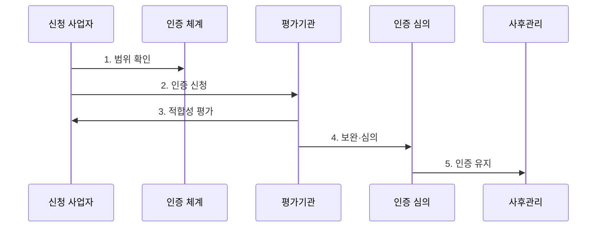

---
sidebar:
  order: 184
  label: "184. CSAP 클라우드 보안인증"
  badge:
    text: "기출 · 70%"
    variant: note
title: "CSAP 클라우드 보안인증 (Cloud Security Assurance Program)"
date: "2026-07-30T11:10:21+09:00"
tags: ["notes-latest-tech"]
weight: 184
extra:
  question_no: "184"
  source_status: "기출"
  source_history: "128회, 132회"
  priority: 70
  priority_note: "CSAP 통제·인증 적용이 공공 범위에서 반복됨"
---

## 미리 알고 가기

- **CSAP(클라우드서비스 보안인증)**: 클라우드서비스가 정해진 보안인증기준에 적합한지 평가·인증하는 제도
- **인증 범위**: 인증 효력이 적용되는 서비스, 자산, 조직, 물리 위치와 운영 절차의 경계
- **평가기관**: 서면·현장·기술 평가를 수행하고 부적합 보완 결과를 확인하는 기관
- **인증위원회**: 평가 결과를 심의해 인증 여부를 판단하는 조직
- **사후평가**: 인증 이후 보호조치가 계속 유지되는지 확인하는 평가
- **변경관리**: 인증받은 서비스와 기반 환경의 변경 영향 및 재평가 필요성을 통제하는 활동

## Ⅰ. 개요

- **정의**: CSAP는 클라우드서비스의 관리적·물리적·기술적 보호조치가 **보안인증기준**에 적합한지 평가하고 인증 상태를 관리하는 제도
- **필요성**: 사업자 자체 설명과 기관별 점검만으로는 공공 업무가 사용하는 서비스의 보호 수준과 적용 범위를 일관되게 판단하기 어려우므로 공통 검증 체계 필요

### 쉽게 이해하기

- 클라우드 서비스와 실제 운영 범위를 공통 검사표로 확인하고, 인증 후에도 유지 상태를 살피는 제도입니다.

## Ⅱ. 특징

- **범위 한정 인증**: 인증서에 명시된 서비스·자산·운영 조직과 적용 조건에만 효력 부여
- **증적 기반 평가**: 서면, 현장, 기술 점검과 보완조치로 기준의 설계·운영 적합성 확인
- **수명주기 관리**: 최초 인증 이후 사후·변경·갱신 절차로 유효 상태 지속 확인

### 쉽게 이해하기

- 회사 전체에 합격표를 주는 것이 아니라 검사받은 서비스 범위를 정하고, 변경 후에도 기준을 지키는지 확인합니다.

## Ⅲ. 구조 및 구성요소

| 구성요소 | 책임 |
|:---|:---|
| **인증신청인** | 서비스 범위 정의, 보호조치 구현, 평가 증적 제출 |
| **인증 범위** | 서비스·자산·조직·위치와 외부 의존성 경계 명시 |
| **보안인증기준** | 관리적·물리적·기술적 보호조치의 판단 기준 제공 |
| **평가기관** | 서면·현장·기술 평가와 부적합 보완 결과 확인 |
| **인증·사후관리** | 결과 심의, 인증서 발급과 유지·변경·갱신 상태 관리 |

### 쉽게 이해하기

- 사업자가 검사 대상을 정해 증거를 내면 평가자가 기준에 따라 확인하고 인증 상태를 계속 관리합니다.

## Ⅳ. 흐름도

### 동작 원리

1. **범위 확인**: 서비스 유형과 인증 대상 자산·조직·운영 경계 확정
2. **인증 신청**: 신청 명세와 보호조치 구현 증적 제출
3. **적합성 평가**: 서면·현장·기술 점검으로 기준 충족 여부 확인
4. **보완·심의**: 부적합을 시정하고 평가 결과를 바탕으로 인증 여부 결정
5. **인증 유지**: 사후·변경·갱신 절차로 운영 상태와 인증 효력 관리

## Ⅴ. 종류 및 비교

| 구분 | 최초평가 | 사후평가 | 갱신평가 |
|:---|:---|:---|:---|
| **적용 대상** | 신규 인증 서비스 | 인증 유효 상태의 서비스 | 유효기간 연장이 필요한 서비스 |
| **핵심 방식** | 인증 범위와 기준 적합성 종합 검증 | 보호조치 유지와 주요 변경 확인 | 기준 적합성을 다시 검증해 갱신 판단 |
| **주요 한계** | 준비 기간과 증적 구축 부담 | 범위 밖 변경은 별도 통제 필요 | 미갱신 시 인증 효력 유지 불가 |

## Ⅵ. 실무 고려사항 및 대책

| 고려사항 | 대책 | 효과 |
|:---|:---|:---|
| **실사용 범위 불일치** 미검증 시 인증되지 않은 리전·기능·외부 서비스 사용 | 인증서의 서비스·자산·위치·유효 상태를 실제 구성과 대조 | 인증 범위·**실제 구성 일치성** 확보 |
| **변경 누락** 미검증 시 아키텍처·하도급·운영 절차 변경으로 통제 무효화 | 변경 영향 분석, 구성 기준선, 재평가·신고 필요성 사전 확인 | **인증 통제 유효성** 유지 |
| **인증 과신** 미검증 시 기관별 업무 위험과 추가 요구를 놓침 | 인증을 최소 기준으로 활용하고 업무별 위험평가·계약·운영 통제 추가 | 업무 **잔여 위험** 감소 |

## Ⅶ. 결론

- CSAP는 인증 마크 자체보다 **인증 범위와 실제 이용 구성의 일치**, 변경 통제, 유효 상태를 확인하여 공공 업무의 보안 요구와 연결해야 한다.
