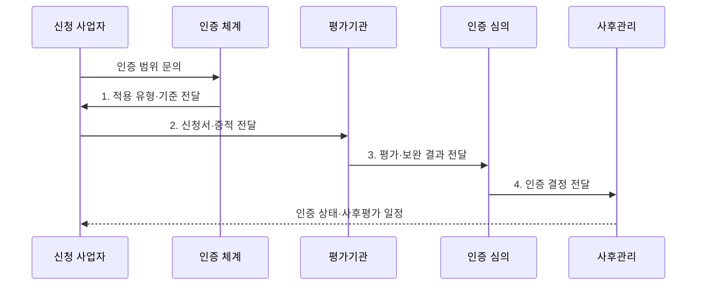

---
sidebar:
  order: 184
  label: "184. CSAP 클라우드 보안인증"
  badge:
    text: "기출 · 70%"
    variant: note
title: "CSAP 클라우드 보안인증 (Cloud Security Assurance Program)"
date: "2026-07-31T12:07:02+09:00"
tags: ["notes-latest-tech"]
weight: 184
extra:
  question_no: "184"
  source_status: "기출"
  source_history: "128회, 132회"
  priority: 70
  priority_note: "CSAP 통제·인증 적용이 공공 범위에서 반복됨"
---

## 미리 알고가기

- **클라우드서비스 보안인증(Cloud Security Assurance Program, CSAP)**: 클라우드서비스가 정해진 보안인증기준에 적합한지 평가·인증하는 제도
- **서비스 유형**: 서비스형 인프라스트럭처(Infrastructure as a Service, IaaS)·서비스형 소프트웨어(Software as a Service, SaaS)·서비스형 데스크톱(Desktop as a Service, DaaS)의 인증 구분
- **보안인증 등급**: 서비스의 중요도에 따라 상·중·하로 구분하는 인증 체계
- **인증 범위**: 인증 효력이 적용되는 서비스, 자산, 조직, 물리 위치와 운영 절차의 경계
- **평가기관**: 서면·현장·기술 평가를 수행하고 부적합 보완 결과를 확인하는 기관
- **인증위원회**: 평가 결과를 심의해 인증 여부를 판단하는 조직
- **사후평가**: 인증 이후 보호조치가 계속 유지되는지 확인하는 평가
- **변경관리**: 인증받은 서비스와 기반 환경의 변경 영향 및 재평가 필요성을 통제하는 활동

## Ⅰ. 개요

- 정의/개념: **CSAP**는 클라우드서비스의 보안인증기준 적합성을 평가·관리하는 제도
- 배경/필요성: 기관별 자체 점검만으로는 공공 클라우드의 **보호 수준·인증 범위** 일관 판단 곤란

### 쉽게 이해하기 (학습용)

- 클라우드 서비스와 실제 운영 범위를 공통 검사표로 확인하고, 인증 후에도 유지 상태를 살피는 제도입니다.

## Ⅱ. 특징

- **1. 범위 한정 인증**: 인증서에 명시된 서비스·자산·운영 조직과 적용 조건에만 효력 부여
- **2. 증적 기반 평가**: 서면, 현장, 기술 점검과 보완조치로 기준의 설계·운영 적합성 확인
- **3. 사후·변경 관리**: 최초 인증 이후 사후·변경·갱신 절차로 유효 상태 지속 확인
### 쉽게 이해하기 (학습용)

- 회사 전체에 합격표를 주는 것이 아니라 검사받은 서비스 범위를 정하고, 변경 후에도 기준을 지키는지 확인합니다.

## Ⅲ. 구조 및 구성요소

| 구성요소 | 책임 |
|:---|:---|
| 인증신청인 | 서비스 범위 정의와 **보호조치·평가 증적** 제출 |
| 인증 범위 | 서비스·자산·조직·위치의 **적용 경계** 명시 |
| 보안인증기준 | 서비스 유형·등급별 **보안인증기준** 제공 |
| 평가기관 | 서면·현장·기술 평가와 **부적합 보완** 확인 |
| 인증·사후관리 | 인증서 발급과 유지·변경 및 **갱신 상태** 관리 |

### 쉽게 이해하기 (학습용)

- 사업자가 검사 대상을 정해 증거를 내면 평가자가 기준에 따라 확인하고 인증 상태를 계속 관리합니다.

## Ⅳ. 흐름도

**동작 원리**

1. **적용 유형·기준 전달**: **서비스 유형·등급**별 평가 기준 제공
2. **신청서·증적 전달**: 인증 범위와 **보호조치 구현 증거** 제출
3. **평가·보완 결과 전달**: 기준 충족 여부와 **부적합 시정 결과** 제공
4. **인증 결정 전달**: **인증위원회** 심의에 따른 인증·보완 결정 제공

### 쉽게 이해하기 (학습용)

- 각 단계의 판정 결과가 다음 주체의 실행 조건으로 이어지는 흐름이다.

## Ⅴ. 종류 및 비교

| 구분 | 최초평가 | 사후평가 | 갱신평가 |
|:---|:---|:---|:---|
| 적용 대상 | 신규·중대 변경 **인증 서비스** | 유효기간 중 **인증 서비스** | 유효기간 연장 **대상 서비스** |
| 핵심 방식 | 범위와 기준 적합성의 **종합 검증** | 보호조치 유지와 **주요 변경** 확인 | 기준 적합성의 **재검증·갱신** |
| 주요 한계 | **준비 기간·증적 구축** 부담 | 범위 밖 변경의 **별도 통제** | 미갱신 시 **인증 효력 상실** |

### 쉽게 이해하기 (학습용)

- 적용 기준과 핵심 특징 및 한계를 함께 비교해 대안을 선택한다.

## Ⅵ. 실무 고려사항 및 대책

| 고려사항 | 대책 | 효과 |
|:---|:---|:---|
| **실사용 범위 불일치** 미검증 시 인증되지 않은 리전·기능·외부 서비스 사용 | 인증서의 서비스·자산·위치·유효 상태를 실제 구성과 대조 | 인증 범위·**실제 구성 일치성** 확보 |
| **변경 누락** 미검증 시 아키텍처·하도급·운영 절차 변경으로 통제 무효화 | 변경 영향 분석, 구성 기준선, 재평가·신고 필요성 사전 확인 | **인증 통제 유효성** 유지 |
| **인증 과신** 미검증 시 기관별 업무 위험과 추가 요구를 놓침 | 인증을 최소 기준으로 활용하고 업무별 위험평가·계약·운영 통제 추가 | 업무 **잔여 위험** 감소 |

### 쉽게 이해하기 (학습용)

- 핵심 운영 위험마다 실행 가능한 대책과 검증 효과를 함께 확인한다.

## Ⅶ. 결론

- 인증 범위가 실제 구성과 일치할 때만 **CSAP 서비스**를 채택하고 변경 시 **재평가** 수행

### 쉽게 이해하기 (학습용)

- 핵심 판단 기준을 먼저 정한 뒤 적용 범위를 결정하는 것이 중요하다.
