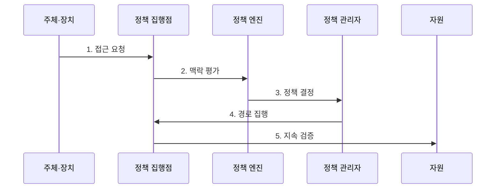

---
sidebar:
  order: 185
  label: "185. 제로 트러스트 아키텍처 (Zero Trust Architecture)"
  badge:
    text: "기출 · 85%"
    variant: note
title: "제로 트러스트 아키텍처 (Zero Trust Architecture)"
date: "2026-07-30T20:20:00+09:00"
tags: ["notes-latest-tech"]
weight: 185
extra:
  question_no: "185"
  source_status: "기출"
  source_history: "126회, 134회, 135회"
  priority: 85
  priority_note: "제로 트러스트 검증·최소 권한이 지속 반복됨"
---

## 미리 알고가기

- **제로 트러스트**: 네트워크 위치만으로 암묵적 신뢰를 부여하지 않는 보안 원칙
- **제로 트러스트 아키텍처(ZTA)**: 제로 트러스트 원칙을 자원 중심 접근 정책과 지속 검증으로 구현한 구조
- **정책 엔진(PE)**: 주체·장치·자원·위험 정보를 평가해 접근 허용·거부·회수를 결정하는 기능
- **정책 관리자(PA)**: 정책 엔진의 결정에 따라 연결 경로와 자격증명을 생성·종료하는 기능
- **정책 집행점(PEP)**: 주체와 자원 사이에서 접근 결정을 실제로 집행하는 지점
- **최소 권한**: 업무에 필요한 자원·행위·시간만 허용하는 원칙
- **횡적 이동**: 침해된 계정이나 장치를 발판으로 내부의 다른 자원에 접근하는 공격

## Ⅰ. 개요

- 정의/개념: 제로 트러스트 아키텍처는 네트워크 위치의 암묵적 신뢰 없이 주체·장치·자원·행위 맥락을 **접근마다 동적으로 검증**하는 자원 중심 보안 구조
- 배경/필요성: 경계 내부를 신뢰하면 계정·단말 침해 후 과도한 권한과 횡적 이동을 막기 어려우므로 세션별 최소 권한과 지속 재평가 필요

### 쉽게 이해하기 (학습용)

- 건물에 들어왔다는 이유만으로 모든 방을 열어 주지 않고, 각 방 앞에서 사람·기기·업무 목적을 다시 확인합니다.

## Ⅱ. 특징

- **1. 자원 중심 검증**: 위치가 아닌 주체·장치 상태와 대상 자원의 민감도를 결합해 접근 판단
- **2. 동적 최소 권한**: 허용 자원, 행위, 시간, 세션 조건을 정책으로 세밀하게 제한
- **3. 지속적 재평가**: 세션 중 행위·위협·장치 상태 변화를 관찰해 권한 축소·회수·재인증 수행
### 쉽게 이해하기 (학습용)

- 출입증, 기기 상태, 작업 목적을 방마다 확인하고 위험이 커지면 사용 중에도 문을 닫습니다.

## Ⅲ. 구조 및 구성요소

| 구성요소 | 책임 |
|:---|:---|
| **주체·장치** | 사용자·서비스 신원과 접속 장치 상태 제시 |
| **정책 집행점** | 자원 연결의 허용·차단과 세션 활동 집행 |
| **정책 관리자** | 경로 생성·종료와 세션 자격증명 발급 |
| **정책 엔진** | 정책·위험 신호를 평가해 허용·거부·회수 결정 |
| **신호·자원** | 신원, 자산, 위협, 행위 정보를 제공하고 보호 대상 구성 |

### 쉽게 이해하기 (학습용)

- 문 앞 장치가 출입을 집행하고, 관리자가 통행 경로를 만들며, 심사관이 여러 위험 정보를 보고 결정합니다.

## Ⅳ. 흐름도

**동작 원리**

- **1. 접근 요청**: 주체·장치·대상 자원과 요청 행위를 식별
- **2. 맥락 평가**: 인증 강도, 장치 상태, 행위, 위협, 자원 민감도 수집
- **3. 정책 결정**: 정책 엔진이 허용·거부·제한 조건과 세션 수명 결정
- **4. 경로 집행**: 정책 관리자가 경로를 설정하고 집행점이 허용된 자원·행위만 연결
- **5. 지속 검증**: 세션 신호 변화를 관찰해 재인증, 권한 축소, 연결 종료 수행

### 쉽게 이해하기 (학습용)

- 각 단계의 판정 결과가 다음 주체의 실행 조건으로 이어지는 흐름이다.

## Ⅴ. 종류 및 비교

| 구분 | 제로 트러스트 아키텍처 | 경계형 보안 | 가상 사설망 |
|:---|:---|:---|:---|
| **적용 대상** | 분산 자원의 세밀한 접근 | 고정 내부망 경계 보호 | 원격 사용자의 사설망 연결 |
| **핵심 방식** | 자원별 동적 정책과 지속 검증 | 경계 통과 전 집중 통제 | 암호화된 네트워크 경로 제공 |
| **주요 한계** | 자산 식별과 정책·신호 품질 관리 복잡 | 내부 침해의 횡적 이동 위험 | 접속 후 자원별 최소 권한 부족 |

### 쉽게 이해하기 (학습용)

- 적용 기준과 핵심 특징 및 한계를 함께 비교해 대안을 선택한다.

## Ⅵ. 실무 고려사항 및 대책

| 고려사항 | 대책 | 효과 |
|:---|:---|:---|
| **자산·주체 식별 누락** 미검증 시 보호 대상과 서비스 계정이 정책 밖에 남음 | 지속 자산 탐지, 소유자·민감도 지정, 미관리 자산 기본 거부 | 미관리 자산 **정책 우회** 차단 |
| **정책 과잉·충돌** 미검증 시 업무 차단 또는 과도한 예외로 최소 권한 약화 | 관찰 모드, 정책 시뮬레이션, 단계 배포와 만료되는 예외 적용 | 업무 차단·**장기 예외** 감소 |
| **신호 신뢰성 부족** 미검증 시 오래되거나 위조된 장치·위협 정보로 오판 | 신호 출처 검증, 최신성 기준, 다중 신호 결합과 장애 시 안전 정책 | **접근 오판률** 감소 |

### 쉽게 이해하기 (학습용)

- 핵심 운영 위험마다 실행 가능한 대책과 검증 효과를 함께 확인한다.

## Ⅶ. 결론

- 제로 트러스트 아키텍처는 단일 제품이 아니라 **자산 가시성**, **동적 최소 권한**, **지속 검증**을 운영 수명주기 전체에 적용하는 보안 체계이다.

### 쉽게 이해하기 (학습용)

- 핵심 판단 기준을 먼저 정한 뒤 적용 범위를 결정하는 것이 중요하다.
