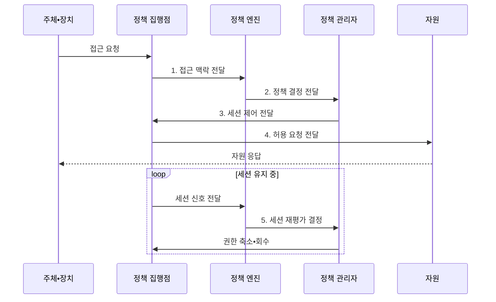

---
sidebar:
  order: 185
  label: "185. 제로 트러스트 아키텍처 (Zero Trust Architecture)"
  badge:
    text: "기출 • 85%"
    variant: note
title: "제로 트러스트 아키텍처 (Zero Trust Architecture)"
date: "2026-08-04T14:48:39+09:00"
tags: ["notes-latest-tech"]
weight: 185
extra:
  question_no: "185"
  source_status: "기출"
  source_history: "126회, 134회, 135회"
  priority: 85
  priority_note: "제로 트러스트 검증•최소 권한이 지속 반복됨"
---

## Ⅰ. 개요

핵심 용어

- **제로 트러스트 아키텍처(Zero Trust Architecture, ZTA)**: 네트워크 위치의 암묵적 신뢰 없이 자원별 접근을 지속 검증하고 최소 권한으로 집행하는 보안 구조이다.
- **제로 트러스트**: 네트워크 위치만으로 주체나 장치를 암묵적으로 신뢰하지 않는 보안 원칙이다.

- 정의/개념: **ZTA** 는 네트워크 위치의 암묵적 신뢰 없이 자원별 접근을 지속 검증하고 최소 권한으로 집행하는 보안 구조
- 배경/필요성: 경계 내부 신뢰는 계정•단말 침해 후 **과도한 권한•횡적 이동** 차단 곤란

#### 한줄 요약

- 네트워크 위치를 믿지 않고 자원마다 주체•장치•업무 목적을 다시 검증한다.

## Ⅱ. 특징

핵심 용어

- **최소 권한**: 업무에 필요한 자원•행위•시간만 허용하는 원칙이다.
- **지속적 재평가**: 세션 중 행위•위협•장치 상태 변화를 관찰해 권한을 축소•회수하거나 재인증하는 과정이다.

- **1. 자원 중심 검증**: 위치가 아닌 주체•장치 상태와 대상 자원의 민감도를 결합해 접근 판단
- **2. 동적 최소 권한**: 허용 자원, 행위, 시간, 세션 조건을 정책으로 세밀하게 제한
- **3. 지속적 재평가**: 세션 중 행위•위협•장치 상태 변화를 관찰해 권한 축소•회수•재인증 수행

#### 한줄 요약

- 신원•장치•업무 목적을 자원마다 확인하고 위험이 커지면 세션 중에도 권한을 회수한다.

## Ⅲ. 구조 및 구성요소

핵심 용어

- **정책 엔진(Policy Engine, PE)**: 주체•장치•자원•위험 정보를 평가해 접근 허용•거부•회수를 결정하는 기능이다.
- **정책 관리자(Policy Administrator, PA)**: 정책 결정에 따라 연결 경로와 자격증명을 생성•종료하는 기능이다.
- **정책 집행점(Policy Enforcement Point, PEP)**: 주체와 자원 사이에서 접근 결정을 실제로 집행하는 지점이다.

**PEP** 의 접근 집행, **PA** 의 연결 제어, **PE** 의 위험 기반 허용 결정

| 구성요소 | 책임 |
|:---|:---|
| 주체•장치 | 사용자•서비스 **신원•장치 상태** 제시 |
| 정책 집행점 | 자원 연결의 허용•차단과 **세션 활동** 집행 |
| 정책 관리자 | 경로 생성•종료와 **세션 자격증명** 발급 |
| 정책 엔진 | 정책•위험 신호 기반 허용•거부와 **권한 회수** 결정 |
| 신호•자원 | 신원•자산•위협 정보와 **보호 대상** 제공 |

#### 한줄 요약

- 정책 집행•연결 제어•위험 기반 접근 결정의 역할 분리

## Ⅳ. 흐름도

핵심 용어

- **접근 맥락**: 주체 신원•장치 상태•요청 행위•자원 민감도를 결합한 판단 정보이다.
- **세션 수명**: 승인한 연결과 자격증명이 유효하게 유지되는 시간과 종료 조건이다.

**동작 원리**

1. **접근 맥락 전달**: 신원•장치•행위와 **자원 민감도** 제공
2. **정책 결정 전달**: 허용•거부•제한과 **세션 수명** 제공
3. **세션 제어 전달**: 경로•자격증명의 **생성•종료 조건** 제공
4. **허용 요청 전달**: 승인된 **자원•행위 범위** 만 연결
5. **세션 재평가 결정**: 위험 변화에 따라 **권한 유지•축소•회수** 결정

#### 한줄 요약

- 각 단계의 판정 결과가 다음 주체의 실행 조건으로 이어지는 흐름이다.

## Ⅴ. 종류 및 비교

핵심 용어

- **경계형 보안**: 내부망과 외부망의 경계 통과를 중심으로 접근을 집중 통제하는 구조이다.
- **가상 사설망(Virtual Private Network, VPN)**: 원격 사용자를 사설망에 암호화된 네트워크 경로로 연결하는 기술이다.

| 구분 | 제로 트러스트 아키텍처 | 경계형 보안 | 가상 사설망 |
|:---|:---|:---|:---|
| 적용 대상 | 분산 자원의 **세밀한 접근** | 고정 **내부망 경계** 보호 | 원격 사용자의 **사설망 연결** |
| 핵심 방식 | 자원별 **동적 정책•지속 검증** | 경계 통과 전 **집중 통제** | **암호화 네트워크 경로** 제공 |
| 주요 한계 | **자산 식별•신호 품질** 관리 복잡 | 내부 침해의 **횡적 이동** 위험 | 접속 후 **자원별 최소 권한** 부족 |

#### 한줄 요약

- 적용 기준과 핵심 특징 및 한계를 함께 비교해 대안을 선택한다.

## Ⅵ. 실무 고려사항 및 대책

핵심 용어

- **횡적 이동**: 침해된 계정이나 장치를 발판으로 내부의 다른 자원에 접근하는 공격이다.
- **관찰 모드**: 새 접근 정책을 바로 차단에 쓰지 않고 예상 판정과 업무 영향을 기록하는 검증 방식이다.

| 문제 | 대책 | 효과 |
|:---|:---|:---|
| **자산•주체 식별 누락** 미검증 시 보호 대상과 서비스 계정이 정책 밖에 남음 | 지속 자산 탐지, 소유자•민감도 지정, 미관리 자산 기본 거부 | 미관리 자산 **정책 우회** 차단 |
| **정책 과잉•충돌** 미검증 시 업무 차단 또는 과도한 예외로 최소 권한 약화 | 관찰 모드, 정책 시뮬레이션, 단계 배포와 만료되는 예외 적용 | 업무 차단•**장기 예외** 감소 |
| **신호 신뢰성 부족** 미검증 시 오래되거나 위조된 장치•위협 정보로 오판 | 신호 출처 검증, 최신성 기준, 다중 신호 결합과 장애 시 안전 정책 | **접근 오판률** 감소 |

#### 한줄 요약

- 핵심 운영 위험마다 실행 가능한 대책과 검증 효과를 함께 확인한다.

## Ⅶ. 결론

핵심 용어

- **권한 회수**: 세션 위험이 커졌을 때 이미 허용한 자원 접근과 자격증명을 즉시 종료하는 통제이다.
- **자원 민감도**: 침해 시 업무•법률•개인정보에 미치는 영향에 따라 보호 대상의 중요도를 분류한 값이다.

- 자원 민감도가 높으면 **접근별 검증**, 세션 위험이 커지면 **권한 회수** 적용

#### 한줄 요약

- 핵심 판단 기준을 먼저 정한 뒤 적용 범위를 결정하는 것이 중요하다.
