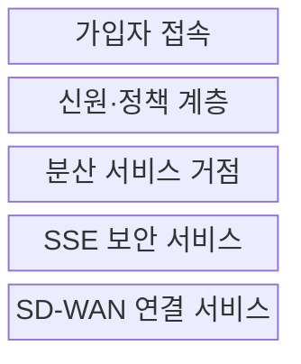
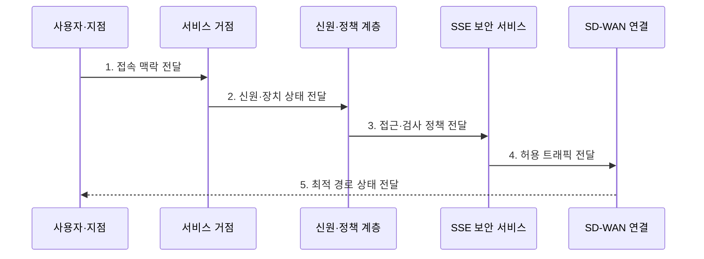

---
sidebar:
  order: 186
  label: "186. SASE 보안접근서비스엣지 (Secure Access Service Edge)"
  badge:
    text: "기출 · 70%"
    variant: note
title: "SASE 보안접근서비스엣지 (Secure Access Service Edge)"
date: "2026-07-27T23:59:59+09:00"
tags:
  - "notes-latest-tech"
weight: 186
extra:
  question_no: "186"
  source_status: "기출"
  source_history: "135회"
  priority: 70
  priority_note: "SASE 연결·보안 통합 구조가 기출됨"
---

## 미리 알고가기

- **SASE(새시)**: Secure Access Service Edge의 머리글자로, 광역망 연결과 보안을 클라우드 엣지에서 통합하는 아키텍처
- **SD-WAN(에스디완)**: Software-Defined WAN의 약자로, 애플리케이션별 광역망 경로와 품질을 제어하는 연결 요소
- **SSE(에스에스이)**: Security Service Edge의 머리글자로, SASE에서 SD-WAN 연결을 제외한 보안 서비스 집합
- **서비스 거점(Point of Presence, PoP)**: '피오피'로 읽으며, 사용자 가까이에서 연결·보안 정책을 집행하는 분산 엣지 위치
- **백홀(Backhaul)**: 지점·원격 사용자의 트래픽을 중앙 데이터센터로 우회해 전달하는 방식
- **제로 트러스트 네트워크 접근(Zero Trust Network Access, ZTNA)**: '지티엔에이'로 읽으며, 신원·장치·맥락을 검증해 애플리케이션 단위 접근을 허용하는 기능

## Ⅰ. 개요

- 정의/개념: SD-WAN 연결과 SSE 보안 기능을 **신원·맥락 기반 정책으로 분산 서비스 거점에서 통합**하는 클라우드 아키텍처
- 배경/필요성: 중앙 데이터센터 백홀로 발생하는 **분산 사용자·지점·클라우드 접속의 지연·병목·정책 편차** 해소 필요
### 쉽게 이해하기 (학습용)

- 중앙 보안 장비로 왕복하지 않고 가까운 거점에서 동일한 연결·보안 정책을 적용한다.

## Ⅱ. 특징

- SD-WAN과 SSE의 **연결·보안 정책 통합**
- 사용자·장치·애플리케이션 맥락 기반 **지속적 접근 판정**
- 인접 서비스 거점 기반 **백홀 지연 감소·거점 품질 의존**

### 쉽게 이해하기 (학습용)

- 사용자 위치와 관계없이 같은 경로 선택과 보안 규칙이 적용돼야 한다.

## Ⅲ. 구조 및 구성요소

| 구성요소 | 책임 |
|:---|:---|
| 가입자 접속 | 사용자·장치·지점의 **에이전트·터널 연결** |
| 신원·정책 계층 | 신원·장치·위험 기반 **통합 정책 결정** |
| 분산 서비스 거점 | 인접 위치의 **트래픽 수용·정책 집행** |
| SSE 보안 서비스 | **ZTNA·웹·방화벽·데이터 보안** 적용 |
| SD-WAN 연결 서비스 | 애플리케이션별 **경로·품질·장애 우회** |

> 요약: 공통 신원·정책으로 보안·연결 서비스를 통합

### 쉽게 이해하기 (학습용)

- 사용자와 지점은 가까운 서비스 거점에 들어가 같은 신원 규칙으로 검사받고 목적지와 품질에 맞는 길로 전달됨

## Ⅳ. 흐름도

### 동작 원리

- **1. 접속 맥락 전달**: 에이전트·터널 기반 인접 거점 선택과 세션 형성
- **2. 신원·장치 상태 전달**: 사용자·장치·애플리케이션·위험 맥락 검증
- **3. 접근·검사 정책 전달**: ZTNA 접근과 웹·방화벽·데이터 검사 규칙 결정
- **4. 허용 트래픽 전달**: 정책 집행 후 목적지별 허용 세션 분리
- **5. 최적 경로 상태 전달**: 지연·손실·가용성 기반 경로 선택과 지속 재평가

> 요약: 신원·맥락으로 보안·경로를 연속 결정

### 쉽게 이해하기 (학습용)

- 사용자·기기·목적지를 확인해 보안 검사와 경로를 결정하고 위험 변화 시 재평가한다.

## Ⅴ. 종류 및 비교

| 판단 기준 | SASE | 보안 서비스 엣지 | 기존 허브 경유 방식 |
|:---|:---|:---|:---|
| 적용 기준 | 연결·보안 통합이 필요한 분산 환경 | 기존 WAN에서 보안만 통합 | 중앙 업무·고정 경계 중심 |
| 핵심 특징 | SD-WAN과 SSE를 엣지에서 통합 | 클라우드 보안 기능만 제공 | 중앙 허브로 트래픽을 모아 검사 |
| 한계 | 제공자 종속·거점 품질 편차 | 연결·보안 정책이 분리될 수 있음 | 백홀 지연·중앙 장애 집중 |

> 요약: SASE는 SSE와 연결 서비스를 결합한 아키텍처

### 쉽게 이해하기 (학습용)

- SSE가 보안 검색대라면 SASE는 검색대에 목적지별 길 안내와 지점 간 연결까지 묶은 서비스임

## Ⅵ. 실무 고려사항 및 대책

| 고려사항 | 위험 | 대책 |
|:---|:---|:---|
| 거점 품질 | 지역별 **지연·가용성 편차** | 주요 지역 PoP의 **성능·장애 전환 검증** |
| 정책 통합 | 연결·보안 규칙의 **충돌·우회** | 단일 정책 모델과 **변경 영향 시험** |
| 제공자 의존 | 기능·로그·정책의 **이전 제약** | 표준 연동·로그 반출·**탈출 계획** |

### 쉽게 이해하기 (학습용)

- 주요 사용자 지역의 서비스 거점 품질과 장애 전환을 측정하고 연결·보안 정책의 일관성을 검증한다.

## Ⅶ. 결론

- **거점 품질·신원 정책·SSE 보안·SD-WAN 경로**를 통합 검증하는 분산 접속 아키텍처

### 쉽게 이해하기 (학습용)

- SASE는 지역별 체감 지연과 통제 효과를 함께 시험해야 한다.
