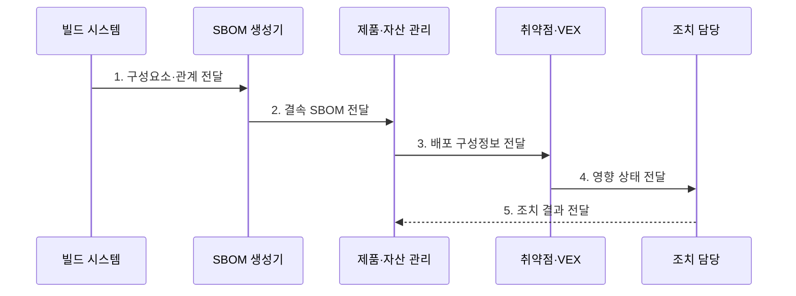

---
sidebar:
  order: 187
  label: "187. SBOM 소프트웨어 자재명세서 (Software Bill of Materials)"
  badge:
    text: "기출 · 85%"
    variant: note
title: "SBOM 소프트웨어 자재명세서 (Software Bill of Materials)"
date: "2026-07-31T12:08:08+09:00"
tags:
  - "notes-latest-tech"
weight: 187
extra:
  question_no: "187"
  source_status: "기출"
  source_history: "134회, 135회"
  priority: 85
  priority_note: "SBOM 구성요소 투명성·취약점 대응이 반복됨"
---

## 미리 알고가기

- **소프트웨어 자재명세서(Software Bill of Materials, SBOM)**: 소프트웨어 구성요소·버전·관계를 기록한 명세서
- **VEX(벡스)**: Vulnerability Exploitability eXchange의 약자로, 특정 취약점의 제품 영향 여부와 조치 상태를 전달
- **시스템 패키지 데이터 교환(System Package Data Exchange, SPDX)·CycloneDX(사이클론디엑스)**: 기계가 판독할 수 있는 대표 SBOM 표준 형식
- **전이 의존성(Transitive Dependency)**: 직접 사용한 구성요소가 다시 참조해 제품에 간접 포함되는 의존성
- **패키지 URL(Package URL, purl)**: '피유알엘'로 읽으며, 패키지 유형·이름·버전 등을 나타내는 표준 구성요소 식별자
- **출처 증명(Provenance)**: 아티팩트가 어떤 소스·빌더·입력으로 생성됐는지 기록한 증거

## Ⅰ. 개요

- 정의/개념: **SBOM**은 소프트웨어 구성요소·버전·의존 관계를 기록한 기계 판독 명세서
- 배경/필요성: 완성 제품만으로는 직접·전이 의존성의 **취약점·라이선스 영향** 식별 곤란
### 쉽게 이해하기 (학습용)

- 제품의 구성 목록을 검색해 취약점·라이선스 영향 범위를 빠르게 확인한다.

## Ⅱ. 특징

- 식별자·버전·관계 기반 **직접·전이 구성요소 추적**
- **SPDX·CycloneDX** 기반 **기계 판독·자동 교환**
- 제품 해시·서명으로 **배포본 결속**, VEX로 **영향 판정**
### 쉽게 이해하기 (학습용)

- 성분표만으로 안전성과 포장 무결성을 보장할 수 없듯 SBOM도 다른 증거와 함께 사용한다.

## Ⅲ. 구조 및 구성요소

| 구성요소 | 책임 |
|:---|:---|
| 대상 제품 | 제품명·버전·배포 단위의 **SBOM 연결** |
| 구성요소 식별 | **purl·버전**과 해시·라이선스 기록 |
| 의존 관계 | 직접·전이 **포함·의존 관계 표현** |
| 작성·결속 정보 | 도구·시간·표준과 **제품 해시·서명 결속** |
| 취약점·VEX | 취약점 매핑과 **영향·조치 상태 관리** |

### 쉽게 이해하기 (학습용)

- 제품 번호에 성분표·제조 기록·봉인을 연결해 보관하는 구조와 같다.

## Ⅳ. 흐름도

**동작 원리**

- **1. 구성요소·관계 전달**: 빌드 입력·결과에서 직접·전이 의존성과 식별자 추출
- **2. 결속 SBOM 전달**: 형식·완전성 검증 후 제품 해시·서명·출처와 연결
- **3. 배포 구성정보 전달**: 제품 버전별 SBOM을 실제 배포 자산에 매핑
- **4. 영향 상태 전달**: 취약점 정보와 VEX를 결합해 영향·비영향·조치 상태 판정
- **5. 조치 결과 전달**: 패치·완화·예외 결과와 SBOM·VEX 최신화

### 쉽게 이해하기 (학습용)

- 빌드 때 명세를 만들고 제품 해시와 결속한 뒤 배포 자산과 연결해 영향 제품만 조치한다.

## Ⅴ. 종류 및 비교

| 판단 기준 | SBOM | VEX | Provenance·전자서명 |
|:---|:---|:---|:---|
| 적용 기준 | **구성요소·의존성 식별** | 취약점의 **영향 상태 전달** | **빌드 출처·변조 여부** 검증 |
| 핵심 특징 | 제품별 **구성 인벤토리** | **영향 여부·조치 상태** 기록 | 빌더 신원과 **다이제스트 결속** |
| 한계 | **구성 누락·제품 오결속** 가능 | **판단 오류·상태 노후화** | **구성 완전성·안전성** 미보장 |

### 쉽게 이해하기 (학습용)

- SBOM은 구성, VEX는 취약점 영향, 출처·서명은 생성 과정과 변조 여부를 설명한다.

## Ⅵ. 실무 고려사항 및 대책

| 고려사항 | 대책 | 효과 |
|:---|:---|:---|
| **완전성** 미검증 시 전이·동적 구성의 **누락** | 다단계 생성·누락 표시와 **정확도 검증** | SBOM **누락률** 감소 |
| **제품 결속** 미검증 시 SBOM과 배포본의 **버전 불일치** | 해시·서명·출처 기반 **아티팩트 결속** | SBOM·배포본 **동일성** 확보 |
| **최신성** 미검증 시 취약점·VEX 상태의 **노후화** | 자산 연계·재평가와 **수명주기 갱신** | 취약점 판단 **최신성** 유지 |

### 쉽게 이해하기 (학습용)

- 구성요소 목록의 완전성과 제품 결속을 검증하고 취약점·VEX 변경에 따라 영향 자산을 지속 재평가한다.

## Ⅶ. 결론

- 구성요소 식별은 **SBOM**, 취약점 영향 판정은 **VEX**로 분리·연계

### 쉽게 이해하기 (학습용)

- SBOM은 안전 인증서가 아니라 실제 제품 구성을 추적하는 최신 목록이다.
