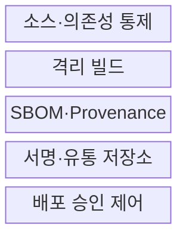
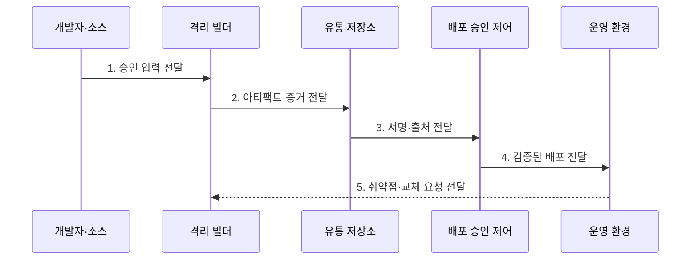

---
sidebar:
  order: 188
  label: "188. Software Supply Chain Security 소프트웨어 공급망 보안 (Software Supply Chain Security)"
  badge:
    text: "기출 · 85%"
    variant: note
title: "Software Supply Chain Security 소프트웨어 공급망 보안 (Software Supply Chain Security)"
date: "2026-07-30T11:10:21+09:00"
tags:
  - "notes-latest-tech"
weight: 188
extra:
  question_no: "188"
  source_status: "기출"
  source_history: "134회, 135회"
  priority: 85
  priority_note: "소프트웨어 공급망 공격·보호가 반복 출제됨"
---

## 미리 알고가기

- **SSDF(에스에스디에프)**: Secure Software Development Framework의 머리글자로, 안전한 개발 관행을 제시하는 프레임워크
- **SLSA(살사)**: Supply-chain Levels for Software Artifacts의 머리글자로, 빌드 출처와 무결성 보증 수준을 정의
- **Provenance(프로비넌스)**: 아티팩트가 어떤 소스·빌더·입력·과정으로 생성됐는지 기록한 출처 증거
- **SBOM(에스봄)**: Software Bill of Materials의 머리글자로, 제품의 구성요소·버전·의존 관계를 기록한 명세서
- **다이제스트(Digest)**: 파일 내용으로 계산해 변경 여부와 동일성을 확인하는 고정 길이 값
- **배포 승인 제어(Admission Control)**: 배포 요청의 서명·출처·정책 충족 여부를 검사해 실행을 허용하거나 차단하는 통제

## Ⅰ. 개요

- 정의/개념: 소스·의존성·빌드·유통·배포 전 과정의 **변조·오염을 증거 생성과 정책 검증으로 통제**하는 보안 체계
- 배경/필요성: 결과 아티팩트 검사만으로 입증하기 어려운 **오염된 입력·빌드 도구·유통 경로와 승인되지 않은 구성요소**의 차단 필요
### 쉽게 이해하기 (학습용)

- 승인된 입력과 빌드 증거를 검증해 오염된 아티팩트의 배포를 차단한다.

## Ⅱ. 특징

- 소스·의존성·빌드·유통·배포의 **전 경로 통제**
- SBOM·Provenance·서명과 아티팩트 다이제스트의 **검증 가능한 결속**
- 배포 승인 제어와 취약점 발견 후 **재빌드·교체 수명주기**

### 쉽게 이해하기 (학습용)

- 각 개발 단계에서 증거를 만들고 배포 때 검증하며 취약점 발견 시 영향 제품을 재빌드한다.

## Ⅲ. 구조 및 구성요소

| 구성요소 | 책임 |
|:---|:---|
| 소스·의존성 통제 | **최소 권한·변경 승인·허용 저장소·버전 고정** |
| 격리 빌드 | 독립 환경의 **재현 가능한 아티팩트 생성** |
| SBOM·Provenance | **구성요소·빌드 입력·과정 증거 생성** |
| 서명·유통 저장소 | 다이제스트 **서명·증거 결속·불변 게시** |
| 배포 승인 제어 | 서명자·빌더·정책 **검증·차단** |

> 요약: 개발 증거를 배포 검증·운영 대응까지 연결

### 쉽게 이해하기 (학습용)

- 승인된 소스·의존성으로 빌드하고 생성된 증거를 유통·배포 단계에서 검증한다.

## Ⅳ. 흐름도

### 동작 원리

- **1. 승인 입력 전달**: 변경 승인·최소 권한·허용 의존성 기반 빌드 입력 확정
- **2. 아티팩트·증거 전달**: 격리 빌드에서 결과·SBOM·Provenance 생성과 다이제스트 결속
- **3. 서명·출처 전달**: 신뢰한 서명자·빌더와 불변 유통 경로 검증
- **4. 검증된 배포 전달**: 배포 정책을 충족한 아티팩트만 운영 환경에 허용
- **5. 취약점·교체 요청 전달**: 영향 분석 후 패치·재빌드·재서명·교체 수행

> 요약: 개발 입력을 통제하고 빌드별 증거를 검증해 출시한다

### 쉽게 이해하기 (학습용)

- 아티팩트 다이제스트에 생산 기록·부품표·서명을 묶어 배포와 취약점 대응에 사용한다.

## Ⅴ. 종류 및 비교

| 판단 기준 | SLSA provenance | SBOM | 아티팩트 서명 |
|:---|:---|:---|:---|
| 적용 기준 | 빌드 과정·출처 확인 | 구성요소 영향 분석 | 파일 무결성·서명자 확인 |
| 핵심 특징 | 소스·빌더·입력·산출물 기록 | 구성요소·버전·관계 목록 | 다이제스트와 서명자 신원 결속 |
| 한계 | 구성요소 안전성은 보장하지 않음 | 빌드 과정·파일 무결성 미증명 | 소스·빌드 안전성은 미보장 |

> 요약: SLSA·SBOM·서명을 정책 게이트에서 함께 검증

### 쉽게 이해하기 (학습용)

- Provenance는 생성 과정, SBOM은 구성, 서명은 변조 여부를 설명하므로 함께 검증한다.

## Ⅵ. 실무 고려사항 및 대책

| 고려사항 | 대책 | 효과 |
|:---|:---|:---|
| **빌드 신뢰** 미검증 시 빌더 침해·**증거 위조** | 격리·단기 자격증명·**SLSA 수준 검증** | 빌드 증거 **위·변조** 축소 |
| **의존성 유입** 미검증 시 유사 이름의 **악성 패키지** | 허용 저장소·버전 고정·**서명 검증** | 악성 의존성 **유입률** 감소 |
| **배포 정책** 미검증 시 증거 없는 아티팩트의 **우회 배포** | 승인 제어·예외 만료·**감사 로그** | 증거 없는 **배포 우회** 차단 |

### 쉽게 이해하기 (학습용)

- 신뢰한 입력과 격리 빌드에서 생성한 증거를 배포 시 검증하고, 예외 경로와 자격증명을 지속 감사한다.

## Ⅶ. 결론

- **입력 통제·격리 빌드·SBOM·Provenance·서명·배포 검증**을 연결한 종단 간 공급망 신뢰 체계

### 쉽게 이해하기 (학습용)

- 소프트웨어 공급망 보안은 개발부터 배포까지 증거 생성과 검증을 연결해야 한다.
