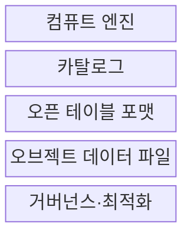
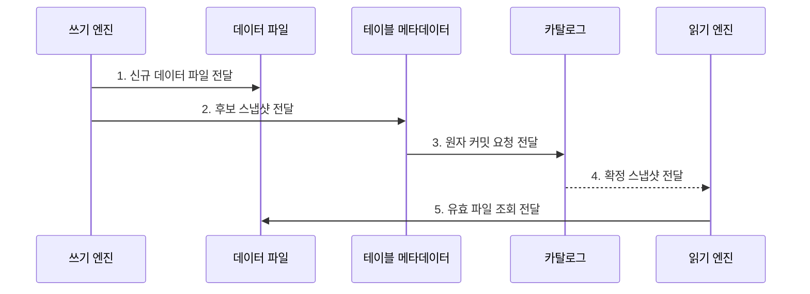

---
sidebar:
  order: 189
  label: "189. Data Lakehouse 데이터 레이크하우스 (Data Lakehouse)"
  badge:
    text: "기출 · 70%"
    variant: note
title: "Data Lakehouse 데이터 레이크하우스 (Data Lakehouse)"
date: "2026-07-30T11:10:21+09:00"
tags:
  - "notes-latest-tech"
weight: 189
extra:
  question_no: "189"
  source_status: "기출"
  source_history: "137회"
  priority: 70
  priority_note: "레이크하우스 통합 저장·트랜잭션이 최근 출제됨"
---

## 미리 알고가기

- **레이크하우스(Data Lakehouse)**: 데이터 레이크의 개방형 저장에 웨어하우스의 테이블 관리 기능을 결합한 아키텍처
- **ACID(에이시드)**: Atomicity·Consistency·Isolation·Durability의 머리글자로, 안전한 트랜잭션 성질을 표기
- **오픈 테이블 포맷(Open Table Format)**: 파일 위에 스키마·스냅샷·트랜잭션 메타데이터를 정의해 여러 엔진이 공유
- **스냅샷(Snapshot)**: 특정 시점에 유효한 데이터 파일·스키마·통계의 일관된 테이블 상태
- **카탈로그(Catalog)**: 테이블 이름을 현재 메타데이터 위치와 연결하고 원자 커밋을 조정하는 관리 계층
- **BI·ML**: '비아이·엠엘'로 읽으며, 각각 비즈니스 인텔리전스 분석과 기계학습 워크로드
- **SQL(Structured Query Language)**: '에스큐엘'로 읽으며, 정형 데이터를 정의·조회·변경하는 질의 언어

## Ⅰ. 개요

- 정의/개념: 개방형 파일 저장소에 **ACID 트랜잭션·스키마·카탈로그·테이블 메타데이터**를 결합한 데이터 아키텍처
- 배경/필요성: 레이크·웨어하우스 분리로 발생하는 **데이터 복제·파이프라인 중복·버전 불일치·엔진 종속** 해소 필요
### 쉽게 이해하기 (학습용)

- **워크로드 통합**: BI·스트리밍·ML이 동일 테이블을 공유해 정합성 유지

## Ⅱ. 특징

- 개방형 저장소·컴퓨트 분리 기반 **다중 엔진 선택권**
- 테이블 메타데이터 기반 **ACID·스키마 진화·스냅샷 관리**
- 동일 테이블 공유 기반 **BI·스트리밍·ML 통합과 파일 최적화 부담**

### 쉽게 이해하기 (학습용)

- 여러 엔진이 같은 파일을 공유하되 스냅샷으로 일관된 시점을 읽고 파일·통계를 계속 최적화한다.

## Ⅲ. 구조 및 구성요소

| 구성요소 | 책임 |
|:---|:---|
| 컴퓨트 엔진 | SQL·배치·스트리밍·ML의 **읽기·쓰기 실행** |
| 카탈로그 | 테이블 식별자와 **현재 메타데이터 위치 연결** |
| 오픈 테이블 포맷 | **트랜잭션·스냅샷·스키마·파일 목록 관리** |
| 오브젝트 데이터 파일 | 개방형 열 지향 형식의 **데이터 저장** |
| 거버넌스·최적화 | **품질·접근 통제·파일·통계 유지관리** |

> 요약: 카탈로그·테이블 포맷·엔진의 책임을 분리

### 쉽게 이해하기 (학습용)

- 파일 저장소 위의 테이블 포맷과 카탈로그가 상태를 관리하고 각 엔진이 계산을 수행한다.

## Ⅳ. 흐름도

### 동작 원리

- **1. 신규 데이터 파일 전달**: 변경 결과를 기존 파일 덮어쓰기 없이 새 파일로 생성
- **2. 후보 스냅샷 전달**: 스키마·통계·유효 파일 목록을 새 메타데이터로 구성
- **3. 원자 커밋 요청 전달**: 기준 버전 충돌 검증 후 현재 메타데이터 위치를 원자 갱신
- **4. 확정 스냅샷 전달**: 독자에게 완전히 확정된 이전·신규 상태 중 하나를 공개
- **5. 유효 파일 조회 전달**: 읽기 엔진이 선택한 스냅샷의 파일만 일관되게 처리

> 요약: 원자 확정한 스냅샷을 일관되게 조회

### 쉽게 이해하기 (학습용)

- 새 물건과 장부 페이지를 먼저 만든 뒤 최신 장부 표시만 한 번에 바꾸므로 독자는 완성된 이전 장부나 새 장부 중 하나를 일관되게 보게 됨

## Ⅴ. 종류 및 비교

| 판단 기준 | Data Lake | Data Warehouse | Data Lakehouse |
|:---|:---|:---|:---|
| 적용 기준 | 원시·비정형 데이터 대량 저장 | 정형 BI와 고성능 SQL | BI·스트리밍·ML 테이블 통합 |
| 핵심 특징 | 개방형 파일을 저비용 저장 | DBMS가 저장·테이블을 통합 관리 | 파일 위에 테이블 메타데이터 추가 |
| 한계 | 트랜잭션·품질 관리가 어려움 | 저장·엔진 종속과 복제 비용 | 파일 병합·통계 관리 필요 |

> 요약: 레이크 저장소에 테이블 의미를 더해 엔진 공유

### 쉽게 이해하기 (학습용)

- 레이크가 파일 창고이고 웨어하우스가 전용 장부까지 가진 매장이라면, 레이크하우스는 공동 창고에 표준 장부를 붙여 여러 매장이 함께 쓰는 방식임

## Ⅵ. 실무 고려사항 및 대책

| 고려사항 | 대책 | 효과 |
|:---|:---|:---|
| **엔진 호환성** 미검증 시 기능·포맷 버전의 **지원 편차** | 읽기·쓰기 기능의 **상호운용 시험** | 다중 엔진 **포맷 호환성** 확보 |
| **파일 구조** 미검증 시 작은 파일·파티션의 **질의 성능 저하** | 병합·파일 재배치·**통계 최적화** | **질의 지연·비용** 감소 |
| **거버넌스** 미검증 시 다중 엔진의 **권한·스키마 불일치** | 중앙 카탈로그·정책·**스키마 계약** | **권한·스키마 일관성** 확보 |

### 쉽게 이해하기 (학습용)

- 다중 엔진의 기능 호환성을 검증하고 파일·통계 최적화와 중앙 정책으로 동일 테이블의 품질을 유지한다.

## Ⅶ. 결론

- **개방형 저장·ACID 테이블·다중 엔진 호환성·파일 최적화**를 결합한 통합 분석 데이터 아키텍처

### 쉽게 이해하기 (학습용)

- 데이터 레이크하우스는 테이블 포맷과 카탈로그·파일 유지관리를 함께 운영해야 한다.
