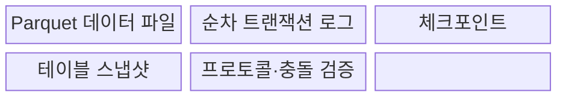
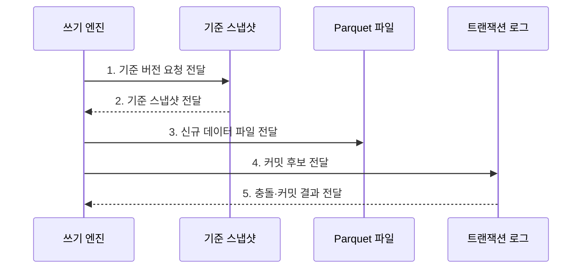

---
sidebar:
  order: 190
  label: "190. Delta Lake (Delta Lake)"
  badge:
    text: "기출 · 50%"
    variant: note
title: "Delta Lake (Delta Lake)"
date: "2026-07-31T12:09:12+09:00"
tags:
  - "notes-latest-tech"
weight: 190
extra:
  question_no: "190"
  source_status: "기출"
  source_history: "137회"
  priority: 50
  priority_note: "Delta Lake 로그·동시성은 제품 비교에 유효함"
---

## 미리 알고가기

- **Delta Lake(델타 레이크)**: Parquet 데이터 파일과 트랜잭션 로그를 결합한 오픈 테이블 형식
- **`_delta_log`(델타 로그)**: 밑줄은 시스템 관리 경로임을 나타내며, 버전별 파일 추가·제거와 스키마 동작을 기록
- **ACID(에이시드)**: 원자성·일관성·고립성·지속성을 뜻하며 동시 읽기·쓰기의 테이블 정합성을 보장
- **Parquet(파케이)**: 분석 질의에 적합한 개방형 열 지향 데이터 파일 형식
- **체크포인트(Checkpoint)**: 특정 로그 버전까지의 테이블 상태를 요약해 전체 로그 재생을 줄이는 파일
- **낙관적 동시성 제어(Optimistic Concurrency Control)**: 기준 상태에서 변경을 준비한 뒤 커밋 직전에 동시 변경과의 충돌을 검사하는 방식
- **시간 여행(Time Travel)**: 버전·시각을 지정해 보존된 과거 스냅샷을 조회하는 기능
- **Apache Iceberg(아파치 아이스버그)**: 스냅샷과 매니페스트 계층으로 대규모 분석 테이블의 파일 상태를 관리하는 오픈 테이블 형식
- **Apache Hudi(아파치 후디)**: 타임라인과 파일 그룹을 기반으로 증분 처리·갱신 작업을 관리하는 오픈 테이블 형식

> **키워드:** Delta Lake (Delta Lake)

## Ⅰ. 개요

- 정의/개념: **Delta Lake**는 Parquet·트랜잭션 로그 기반 **ACID 테이블 형식**
- 배경/필요성: 객체 저장소의 파일만으로는 **동시 쓰기 충돌·부분 실패**의 일관된 복구 곤란
### 쉽게 이해하기 (학습용)

- **데이터 관리**: 변경 추적, 스키마 관리, 과거 상태 재현 가능

## Ⅱ. 특징

- **`_delta_log`·체크포인트** 기반 **스냅샷 재구성**
- **낙관적 동시성 제어** 기반 **충돌 검증·원자 커밋**
- 스키마 관리·시간 여행과 **로그·파일 유지관리 부담**
### 쉽게 이해하기 (학습용)

- 장부를 요약한 중간 결산표에서 이후 거래만 더하면 빠르게 재고를 알 수 있지만 폐기된 옛 물건까지 되살릴 수는 없음

## Ⅲ. 구조 및 구성요소

| 구성요소 | 책임 |
|:---|:---|
| Parquet 데이터 파일 | 행 데이터를 **열 지향 파일로 저장** |
| 순차 트랜잭션 로그 | 버전별 파일·스키마와 **프로토콜 동작** 기록 |
| 체크포인트 | 테이블 상태 요약 기반 **로그 재생 단축** |
| 테이블 스냅샷 | 특정 버전의 **스키마·유효 파일 상태 제공** |
| 프로토콜·충돌 검증 | 기능 호환성과 **동시 변경 커밋 판정** |

### 쉽게 이해하기 (학습용)

- 마지막 결산표와 그 뒤 거래 장부를 합쳐야 현재 재고가 나오며 창고에 남아 있는 상자만 세면 제외된 파일까지 잘못 포함할 수 있음

## Ⅳ. 흐름도

**동작 원리**

1. **기준 버전 요청 전달**: 커밋의 **기준 로그 버전** 요청
2. **기준 스냅샷 전달**: 체크포인트·후속 로그 기반 **유효 파일 상태** 제공
3. **신규 데이터 파일 전달**: 변경 결과의 **새 Parquet 파일** 제공
4. **커밋 후보 전달**: 추가·제거 파일과 **스키마·프로토콜 동작** 제출
5. **충돌·커밋 결과 전달**: 동시 변경 검증과 **원자 로그 버전** 제공

### 쉽게 이해하기 (학습용)

- 새 파일을 준비한 뒤 동시 변경과 충돌하지 않을 때만 다음 로그 버전을 확정한다.

## Ⅴ. 종류 및 비교

| 판단 기준 | Delta Lake | Apache Iceberg | Apache Hudi |
|:---|:---|:---|:---|
| 적용 기준 | 로그 중심 **배치·스트리밍 통합** | **다중 엔진·대규모 분석** | **증분 처리·업서트** 중심 |
| 핵심 특징 | **순차 로그·체크포인트** | **스냅샷·매니페스트 트리** | 타임라인·파일 그룹 기반 **테이블 서비스** |
| 한계 | 엔진별 **프로토콜 기능 편차** | **메타데이터 유지관리** 필요 | **테이블 서비스 운영** 복잡 |

### 쉽게 이해하기 (학습용)

- Delta는 순차 로그, Iceberg는 매니페스트 트리, Hudi는 타임라인과 파일 그룹을 중심으로 관리한다.

## Ⅵ. 실무 고려사항 및 대책

| 고려사항 | 대책 | 효과 |
|:---|:---|:---|
| **프로토콜 호환성** 미검증 시 엔진별 **읽기·쓰기 기능 편차** | 최소 프로토콜 버전과 **상호운용 시험** | 엔진 간 **상호운용성** 확보 |
| **파일·로그 관리** 미검증 시 작은 파일·장기 로그의 **성능·비용 증가** | 파일 병합·체크포인트·**보존 정책** | **질의·저장 비용** 감소 |
| **시간 여행** 미검증 시 정리 작업에 따른 **과거 파일 소실** | 재현 기간 기반 보존과 **정리 안전검사** | 과거 버전 **재현 기간** 보존 |

### 쉽게 이해하기 (학습용)

- 엔진별 프로토콜 지원을 검증하고 파일 병합·체크포인트·보존 기간을 함께 운영해 성능과 과거 재현성을 유지한다.

## Ⅶ. 결론

- 엔진 프로토콜이 호환되면 **Delta Lake** 채택, 미지원 기능은 **상호운용 시험** 후 제외

### 쉽게 이해하기 (학습용)

- Delta Lake는 사용하는 엔진과 저장소가 트랜잭션 프로토콜을 지원하는지 확인해야 한다.
