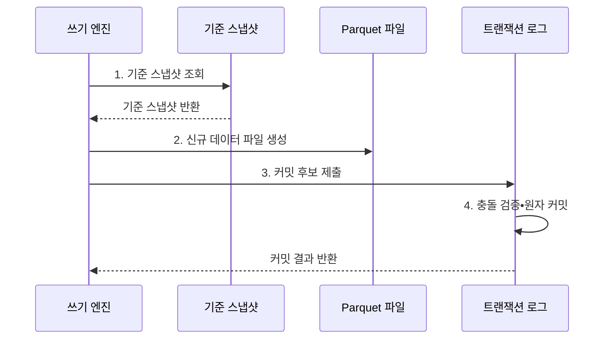

---
sidebar:
  order: 190
  label: "190. 델타 레이크 (Delta Lake)"
  badge:
    text: "기출 • 50%"
    variant: note
title: "델타 레이크 (Delta Lake)"
date: "2026-08-05T15:49:50+09:00"
tags:
  - "notes-latest-tech"
weight: 190
extra:
  question_no: "190"
  source_status: "기출"
  source_history: "137회"
  priority: 50
  priority_note: "Delta Lake 로그•동시성은 제품 비교에 유효함"
---

## Ⅰ. 개요

<details>
<summary>핵심 용어</summary>

- **델타 레이크(Delta Lake)**: Parquet 데이터 파일과 순차 트랜잭션 로그를 결합해 ACID 테이블을 관리하는 오픈 테이블 형식이다.
- **원자성•일관성•격리성•지속성(Atomicity, Consistency, Isolation, Durability, ACID)**: 트랜잭션이 보장해야 하는 네 가지 성질이다.
- **Parquet**: 분석 질의에 적합한 개방형 열 지향 데이터 파일 형식이다.

</details>

- 정의/개념: Parquet 파일과 순차 로그로 **ACID 테이블** 을 관리하는 **델타 레이크**
- 배경/필요성: 객체 저장소의 파일만으로는 동시 쓰기 충돌•부분 실패에 대한 **일관된 복구** 곤란
#### 한줄 요약

- **데이터 관리**: 변경 추적, 스키마 관리, 과거 상태 재현 가능

## Ⅱ. 특징

<details>
<summary>핵심 용어</summary>

- **`_delta_log`**: 버전별 파일 추가•제거와 스키마•프로토콜 동작을 기록하는 시스템 관리 경로이다.
- **체크포인트(Checkpoint)**: 특정 로그 버전까지의 테이블 상태를 요약해 전체 로그 재생을 줄이는 파일이다.

</details>

- **`_delta_log`•체크포인트** 기반 **스냅샷 재구성**
- **낙관적 동시성 제어** 기반 **충돌 검증•원자 커밋**
- 스키마 관리•시간 여행과 **로그•파일 유지관리 부담**
#### 한줄 요약

- 체크포인트와 후속 로그 기반 테이블 스냅샷 재구성

## Ⅲ. 구조 및 구성요소

<details>
<summary>핵심 용어</summary>

- **테이블 스냅샷**: 특정 로그 버전에서 유효한 스키마와 데이터 파일 집합을 나타내는 일관된 상태이다.
- **프로토콜 버전**: 읽기•쓰기 엔진이 지원해야 할 Delta 기능과 동작 규칙의 수준이다.

</details>

```text
                         [테이블 스냅샷]
                      /          |          \
          [순차 트랜잭션 로그] [체크포인트] [프로토콜•충돌 검증]
                    |
          [Parquet 데이터 파일]
```
선의 의미: 테이블 스냅샷은 순차 트랜잭션 로그와 체크포인트로 재구성되며 프로토콜•충돌 검증의 기능•동시성 계약을 따르고, 순차 트랜잭션 로그는 스냅샷에 포함된 Parquet 데이터 파일을 식별한다.

| 구성요소 | 책임 |
|:---|:---|
| Parquet 데이터 파일 | 행 데이터를 **열 지향 파일로 저장** |
| 순차 트랜잭션 로그 | 버전별 파일•스키마와 **프로토콜 동작** 기록 |
| 체크포인트 | 테이블 상태 요약 기반 **로그 재생 단축** |
| 테이블 스냅샷 | 특정 버전의 **스키마•유효 파일 상태 제공** |
| 프로토콜•충돌 검증 | 기능 호환성과 **동시 변경 커밋 판정** |

#### 한줄 요약

- 체크포인트•후속 로그 기반 유효 파일 상태 복원

## Ⅳ. 흐름도

<details>
<summary>핵심 용어</summary>

- **낙관적 동시성 제어**: 기준 상태에서 변경을 준비한 뒤 커밋 직전에 동시 변경과의 충돌을 검사하는 방식이다.
- **원자 로그 버전**: 충돌 검증을 통과한 변경 전체가 하나의 순차 버전으로 확정된 기록이다.

</details>



**동작 원리**

1. **기준 스냅샷 조회**: 체크포인트•후속 로그로 **유효 파일 상태** 확인
2. **신규 데이터 파일 생성**: 변경 결과를 **새 Parquet 파일**로 기록
3. **커밋 후보 제출**: 추가•제거 파일과 **스키마•프로토콜 동작** 제출
4. **충돌 검증•원자 커밋**: 동시 변경 검증 후 **원자 로그 버전** 확정

#### 한줄 요약

- 새 파일을 준비한 뒤 동시 변경과 충돌하지 않을 때만 다음 로그 버전을 확정한다.

## Ⅴ. 종류 및 비교

<details>
<summary>핵심 용어</summary>

- **Apache Iceberg**: 스냅샷과 매니페스트 계층으로 대규모 분석 테이블의 파일 상태를 관리하는 오픈 테이블 형식이다.
- **Apache Hudi**: 타임라인과 파일 그룹으로 증분 처리•갱신 작업을 관리하는 오픈 테이블 형식이다.

</details>

| 판단 기준 | Delta Lake | Apache Iceberg | Apache Hudi |
|:---|:---|:---|:---|
| 적용 기준 | 로그 중심 **배치•스트리밍 통합** | **다중 엔진•대규모 분석** | **증분 처리•업서트** 중심 |
| 핵심 특징 | **순차 로그•체크포인트** | **스냅샷•매니페스트 트리** | 타임라인•파일 그룹 기반 **테이블 서비스** |
| 한계 | 엔진별 **프로토콜 기능 편차** | **메타데이터 유지관리** 필요 | **테이블 서비스 운영** 복잡 |

#### 한줄 요약

- Delta는 순차 로그, Iceberg는 매니페스트 트리, Hudi는 타임라인과 파일 그룹을 중심으로 관리한다.

## Ⅵ. 실무 고려사항 및 대책

<details>
<summary>핵심 용어</summary>

- **시간 여행(Time Travel)**: 버전이나 시각을 지정해 보존된 과거 스냅샷을 조회하는 기능이다.
- **보존 정책**: 과거 재현 기간과 저장 비용을 고려해 로그•데이터 파일을 유지•삭제하는 규칙이다.

</details>

| 문제 | 대책 | 효과 |
|:---|:---|:---|
| **프로토콜 호환성** 미검증 시 엔진별 **읽기•쓰기 기능 편차** | 최소 프로토콜 버전과 **상호운용 시험** | 엔진 간 **상호운용성** 확보 |
| **파일•로그 관리** 미검증 시 작은 파일•장기 로그의 **성능•비용 증가** | 파일 병합•체크포인트•**보존 정책** | **질의•저장 비용** 감소 |
| **시간 여행** 미검증 시 정리 작업에 따른 **과거 파일 소실** | 재현 기간 기반 보존과 **정리 안전검사** | 과거 버전 **재현 기간** 보존 |

#### 한줄 요약

- 엔진별 프로토콜 지원을 검증하고 파일 병합•체크포인트•보존 기간을 함께 운영해 성능과 과거 재현성을 유지한다.

## Ⅶ. 결론

<details>
<summary>핵심 용어</summary>

- **상호운용 시험**: 서로 다른 엔진이 같은 Delta 테이블의 읽기•쓰기•삭제 기능을 일관되게 처리하는지 확인하는 시험이다.
- **정리 안전검사**: 삭제할 파일이 보존 중인 스냅샷에서 참조되지 않는지 확인하는 절차이다.

</details>

- 프로토콜 호환 엔진만 **채택**, 보존 스냅샷 참조 파일은 **삭제 제외**

#### 한줄 요약

- Delta Lake는 사용하는 엔진과 저장소가 트랜잭션 프로토콜을 지원하는지 확인해야 한다.
