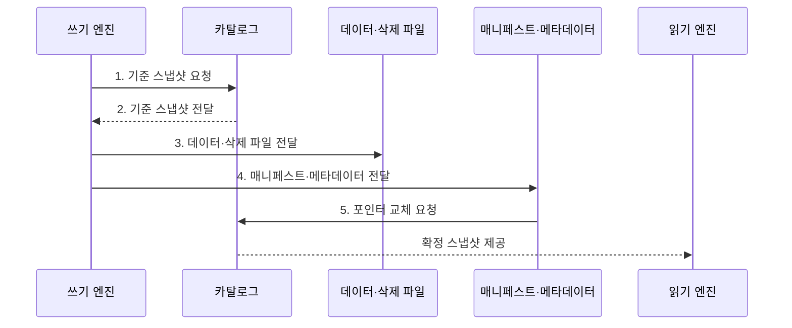

---
sidebar:
  order: 191
  label: "191. Apache Iceberg"
  badge:
    text: "기출 · 70%"
    variant: note
title: "Apache Iceberg"
date: "2026-07-31T12:10:01+09:00"
tags:
  - "notes-latest-tech"
weight: 191
extra:
  question_no: "191"
  source_status: "기출"
  source_history: "137회"
  priority: 70
  priority_note: "Iceberg 스냅샷·스키마 진화가 최근 출제됨"
---

## Ⅰ. 개요

핵심 용어

- **Apache Iceberg**: 스냅샷·매니페스트 계층으로 대규모 분석 테이블의 유효 파일과 스키마를 관리하는 오픈 테이블 형식이다.
- **오픈 테이블 형식**: 객체 저장소 파일 위에 공개된 메타데이터·스냅샷·커밋 규칙을 제공하는 계층이다.

- 정의/개념: 스냅샷·매니페스트 계층으로 대규모 분석 테이블의 유효 파일과 스키마를 관리하는 **아파치 아이스버그(Apache Iceberg) 형식**
- 배경/필요성: 파일 경로 기반 테이블은 탐색 비용 증가와 **동시 커밋·스키마 진화** 제약

#### 한줄 요약

- 디렉터리를 모두 나열하지 않고 스냅샷 색인으로 필요한 파일만 찾는 방식과 같다.

## Ⅱ. 특징

핵심 용어

- **매니페스트(Manifest)**: 스냅샷이 참조하는 데이터·삭제 파일과 파티션·열 통계를 기록한 메타데이터이다.
- **숨은 파티셔닝(Hidden Partitioning)**: 질의가 물리 파티션 열을 직접 알지 않아도 필터를 자동 변환해 파일을 선별하는 기능이다.

- 스냅샷·매니페스트 계층 기반 **데이터·삭제 파일 추적**
- 필드 식별자(Field Identifier, Field ID)와 **스키마 진화·숨은 파티셔닝**
- 매니페스트 통계 기반 **파일 프루닝·메타데이터 관리**
#### 한줄 요약

- 사용자는 물리 파티션 열을 몰라도 원본 열 조건으로 필요한 파일을 찾을 수 있다.

## Ⅲ. 구조 및 구성요소

핵심 용어

- **카탈로그**: 현재 테이블 메타데이터 포인터를 원자적으로 교체하는 관리 계층이다.
- **삭제 파일**: 데이터 파일을 다시 쓰지 않고 삭제할 행이나 위치를 기록한 파일이다.

| 구성요소 | 책임 |
|:---|:---|
| 카탈로그 | 현재 메타데이터 포인터의 **원자적 교체** |
| 테이블 메타데이터 | 스키마·파티션 명세와 **스냅샷 이력** 관리 |
| 스냅샷·매니페스트 목록 | 특정 시점 상태와 **매니페스트 연결** |
| 매니페스트 | 파일 경로·파티션과 **열 통계** 기록 |
| 데이터·삭제 파일 | 행 데이터와 **행·위치 삭제 정보** 저장 |

#### 한줄 요약

- 현재 스냅샷의 메타데이터 트리를 따라 유효한 데이터·삭제 파일만 읽는다.

## Ⅳ. 흐름도

핵심 용어

- **기준 스냅샷**: 쓰기 작업이 변경을 시작할 때 참조한 현재 테이블 상태이다.
- **원자 커밋**: 기준 포인터가 바뀌지 않았는지 확인한 뒤 새 메타데이터 포인터를 한 번에 게시하는 연산이다.

**동작 원리**

1. **기준 스냅샷 요청**: 커밋의 **기준 메타데이터 포인터** 요청
2. **기준 스냅샷 전달**: 현재 스키마·파티션·파일의 **테이블 상태** 제공
3. **데이터·삭제 파일 전달**: 변경 행과 **삭제 정보·열 통계** 제공
4. **매니페스트·메타데이터 전달**: 신규 파일과 **스냅샷 연결 정보** 제공
5. **포인터 교체 요청**: 기준 포인터 비교와 **원자 커밋** 요청

#### 한줄 요약

- 새 판본의 색인을 모두 만든 뒤 현재판 표지만 한 번에 바꾸어 이용자는 갱신 완료된 자료만 봄

## Ⅴ. 종류 및 비교

핵심 용어

- **Delta Lake**: 순차 트랜잭션 로그와 체크포인트로 테이블 상태를 관리하는 오픈 테이블 형식이다.
- **Apache Hudi**: 타임라인과 파일 그룹으로 업서트·증분 처리를 관리하는 오픈 테이블 형식이다.

| 판단 기준 | Apache Iceberg | Delta Lake | Apache Hudi |
|:---|:---|:---|:---|
| 적용 기준 | **다중 엔진·대규모 분석** | 로그 중심 **배치·스트리밍** | **증분 처리·업서트** 중심 |
| 핵심 특징 | **스냅샷·매니페스트 계층** | **순차 로그·체크포인트** | **타임라인·파일 그룹** |
| 한계 | **메타데이터 유지관리** 필요 | 엔진별 **기능 지원 편차** | **테이블 서비스 운영** 복잡 |

#### 한줄 요약

- Iceberg는 스냅샷·매니페스트, Delta Lake는 순차 로그, Hudi는 타임라인·파일 그룹을 중심으로 테이블을 관리함

## Ⅵ. 실무 고려사항 및 대책

핵심 용어

- **매니페스트 재작성**: 누적된 작은 매니페스트를 합쳐 계획 단계의 메타데이터 읽기 비용을 줄이는 작업이다.
- **고아 파일**: 실패한 쓰기 등으로 저장소에 남았지만 어떤 유효 스냅샷도 참조하지 않는 파일이다.

| 문제 | 대책 | 효과 |
|:---|:---|:---|
| **작은 파일·매니페스트 누적** | 파일 병합·매니페스트 **재작성 주기** 운영 | **계획·스캔 비용** 감소 |
| **스냅샷·고아 파일 저장비** 증가 | 참조 확인 후 **만료·정리** | **저장 비용·삭제 위험** 균형 |
| 엔진별 **쓰기·삭제 기능 편차** | 버전별 호환 행렬·**교차 엔진 시험** | **다중 엔진 일관성** 확보 |

#### 한줄 요약

- 이벤트 테이블의 파티션을 진화시킬 때 구·신 엔진의 읽기와 동시 커밋을 함께 시험한다.

## Ⅶ. 결론

핵심 용어

- **파티션 진화**: 기존 데이터를 다시 쓰지 않고 이후 파일에 적용할 파티션 변환 규칙을 변경하는 기능이다.
- **교차 엔진 시험**: 서로 다른 처리 엔진이 동일 테이블의 읽기·쓰기·삭제를 일관되게 수행하는지 확인하는 시험이다.

- **파티션 진화·교차 엔진 시험별 선택**: 다중 엔진 분석은 Iceberg, 로그 중심 스트리밍은 Delta Lake

#### 한줄 요약

- Apache Iceberg는 카탈로그의 원자적 교체와 스냅샷·작은 파일 유지관리가 함께 필요하다.
