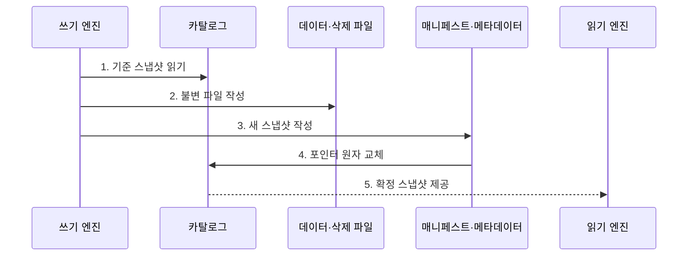

---
sidebar:
  order: 191
  label: "191. Apache Iceberg"
  badge:
    text: "기출 · 70%"
    variant: note
title: "Apache Iceberg"
date: "2026-07-30T20:20:00+09:00"
tags:
  - "notes-latest-tech"
weight: 191
extra:
  question_no: "191"
  source_status: "기출"
  source_history: "137회"
  priority: 70
  priority_note: "Iceberg 스냅샷·스키마 진화가 최근 출제됨"
---

## 미리 알고가기

- **Apache Iceberg(아파치 아이스버그)**: 대규모 분석 테이블을 스냅샷으로 관리하는 오픈 테이블 형식
- **Manifest(매니페스트)**: 스냅샷이 참조하는 데이터·삭제 파일과 파티션·열 통계를 기록한 메타데이터
- **숨은 파티셔닝(Hidden Partitioning)**: 질의가 물리 파티션 열을 직접 알지 않아도 필터를 자동 변환해 파일을 선별

## Ⅰ. 개요

- 정의/개념: 스냅샷·매니페스트 계층으로 대규모 분석 파일의 테이블 상태를 관리하는 오픈 테이블 형식이다
- 배경/필요성: 파일 경로 기반 테이블의 **탐색 비용·동시 커밋·스키마와 파티션 진화** 한계 개선

### 쉽게 이해하기 (학습용)

- 디렉터리를 모두 나열하지 않고 스냅샷 색인으로 필요한 파일만 찾는 방식과 같다.

## Ⅱ. 특징

- **1. 스냅샷·매니페스트 계층**: 현재 데이터 파일과 삭제 파일의 일관된 추적
- **2. 스키마·파티션 진화**: 필드 ID와 파티션 명세 기반의 안전한 구조 변경
- **3. 매니페스트 프루닝**: 통계 기반 파일 제거와 메타데이터 유지관리 병행
### 쉽게 이해하기 (학습용)

- 사용자는 물리 파티션 열을 몰라도 원본 열 조건으로 필요한 파일을 찾을 수 있다.

## Ⅲ. 구조 및 구성요소

| 구성요소 | 책임 |
|:---|:---|
| 카탈로그 | 현재 메타데이터 포인터의 원자적 교체 |
| 테이블 메타데이터 | 스키마·파티션 명세·스냅샷 이력 관리 |
| 스냅샷·매니페스트 목록 | 특정 시점 상태와 매니페스트 연결 |
| 매니페스트 | 파일 경로·파티션·열 통계 기록 |
| 데이터·삭제 파일 | 행 데이터와 행·위치 삭제 정보 저장 |

### 쉽게 이해하기 (학습용)

- 현재 스냅샷의 메타데이터 트리를 따라 유효한 데이터·삭제 파일만 읽는다.

## Ⅳ. 흐름도

**동작 원리**

- **1. 기준 스냅샷 읽기**: 현재 메타데이터 포인터와 테이블 상태 고정
- **2. 불변 파일 작성**: 데이터·삭제 파일과 통계 생성
- **3. 새 스냅샷 작성**: 매니페스트와 새 테이블 메타데이터 연결
- **4. 포인터 원자 교체**: 기준 포인터 비교 후 성공한 커밋만 게시
- **5. 확정 스냅샷 제공**: 읽기 엔진이 통계로 파일을 제거해 조회

### 쉽게 이해하기 (학습용)

- 새 판본의 색인을 모두 만든 뒤 현재판 표지만 한 번에 바꾸어 이용자는 갱신 완료된 자료만 봄

## Ⅴ. 종류 및 비교

| 판단 기준 | Apache Iceberg | Delta Lake | Apache Hudi |
|:---|:---|:---|:---|
| 적용 기준 | 다중 엔진·대규모 분석 | 로그 중심 배치·스트리밍 | 증분 처리·업서트 중심 |
| 핵심 특징 | 스냅샷·매니페스트 계층 | 순차 로그·체크포인트 | 타임라인·파일 그룹 |
| 한계 | 메타데이터 유지관리 필요 | 엔진별 기능 지원 편차 | 테이블 서비스 운영 복잡 |

### 쉽게 이해하기 (학습용)

- 이용자는 이름으로 찾고, 시스템이 자동으로 바뀐 분류 규칙을 적용해 상자를 찾음

## Ⅵ. 실무 고려사항 및 대책

| 고려사항 | 대책 | 효과 |
|:---|:---|:---|
| 작은 파일·매니페스트 누적 | 파일 병합·매니페스트 재작성 주기 운영 | 계획·스캔 비용 감소 |
| 스냅샷·고아 파일 저장비 증가 | 보존 정책·참조 확인 후 만료·정리 | 저장 비용과 삭제 위험 균형 |
| 엔진별 쓰기·삭제 기능 편차 | 버전별 호환 행렬·교차 엔진 시험 | 다중 엔진 일관성 확보 |

### 쉽게 이해하기 (학습용)

- 이벤트 테이블의 파티션을 진화시킬 때 구·신 엔진의 읽기와 동시 커밋을 함께 시험한다.

## Ⅶ. 결론

- 다중 엔진의 대규모 테이블을 안전하게 관리하기 위해 **카탈로그 원자성·엔진 호환성·스냅샷 보존·작은 파일·메타데이터 유지관리**를 검토해 Apache Iceberg를 선택한다.

### 쉽게 이해하기 (학습용)

- Apache Iceberg는 카탈로그의 원자적 교체와 스냅샷·작은 파일 유지관리가 함께 필요하다.
