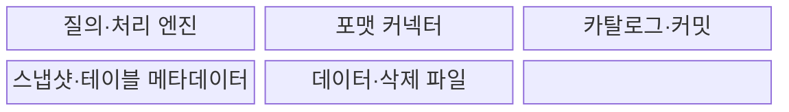

---
sidebar:
  order: 192
  label: "192. 오픈 테이블 포맷 (Open Table Format)"
  badge:
    text: "기출 · 70%"
    variant: note
title: "오픈 테이블 포맷 (Open Table Format)"
date: "2026-07-31T12:10:18+09:00"
tags:
  - "notes-latest-tech"
weight: 192
extra:
  question_no: "192"
  source_status: "기출"
  source_history: "137회"
  priority: 70
  priority_note: "오픈 테이블 포맷의 커밋·호환 설계가 출제됨"
---

## 미리 알고가기

- **오픈 테이블 포맷(Open Table Format)**: '오픈 테이블 포맷'으로 읽으며, 객체 저장소의 파일을 논리 테이블로 관리하는 공개 메타데이터 규격
- **스냅샷(Snapshot)**: 특정 시점의 유효한 데이터 파일 집합과 테이블 상태
- **원자성·일관성·격리성·지속성(Atomicity, Consistency, Isolation, Durability, ACID)**: '에이시드'로 읽으며, 트랜잭션이 안전하게 완료되기 위한 성질
- **표기 이유**: '오픈'은 데이터 파일 형식이 아니라 **테이블 메타데이터·커밋 규칙을 여러 엔진에 공개**한다는 의미
- **대표 형식**: Delta Lake, Apache Iceberg, Apache Hudi

## Ⅰ. 개요

- 정의/개념: **오픈 테이블 포맷**은 파일 위에 스냅샷·원자 커밋 규칙을 제공하는 공개 계층
- 배경/필요성: 단순 파일 저장만으로는 **동시 쓰기 충돌·일관된 버전 조회** 관리 곤란

### 쉽게 이해하기 (학습용)

- 데이터 파일 자체가 책의 쪽이라면, 오픈 테이블 포맷은 유효한 쪽과 현재 판본을 정하는 공개 목차·개정 규칙이다.

## Ⅱ. 특징

- 메타데이터 기반 스키마·파티션과 **유효 파일 집합 관리**
- 스냅샷·원자 커밋 기반 **일관된 읽기·충돌 검증**
- 공개 규격 기반 다중 엔진 접근과 **기능별 호환성 확인**
### 쉽게 이해하기 (학습용)

- 완성된 판본만 공개해 읽는 도중 내용이 섞이지 않게 하며, 도구마다 지원하는 개정 기능은 따로 확인해야 한다.

## Ⅲ. 구조 및 구성요소

| 구성요소 | 책임 |
|:---|:---|
| 질의·처리 엔진 | 논리 **질의·변경 요청**과 결과 처리 |
| 포맷 커넥터 | 형식별 읽기·쓰기와 **실행 계획** 수행 |
| 카탈로그·커밋 | 테이블 식별과 **새 상태 원자 게시** |
| 스냅샷·테이블 메타데이터 | 스키마·파티션과 **유효 파일 집합** 관리 |
| 데이터·삭제 파일 | **행 데이터와 변경 정보 저장** |

### 쉽게 이해하기 (학습용)

- 처리 엔진은 카탈로그가 가리키는 확정 스냅샷을 읽어 같은 테이블 상태를 본다.

## Ⅳ. 흐름도

**동작 원리**

1. **기준 스냅샷 요청**: 커밋의 **기준 테이블 버전** 요청
2. **기준 스냅샷 전달**: 현재 **스키마·유효 파일 집합** 제공
3. **새 파일 전달**: 변경 데이터의 **불변 파일** 제공
4. **변경 메타데이터 전달**: 스키마·파티션·통계의 **새 상태** 제공
5. **커밋 요청**: 동시 변경 검증과 **원자 포인터 교체** 요청

### 쉽게 이해하기 (학습용)

- 새 판본을 완성한 뒤 다른 편집과 충돌하지 않는지 확인하고 공식 판본 번호를 붙인다.

## Ⅴ. 종류 및 비교

| 오픈 테이블 포맷 | Delta Lake | Apache Iceberg | Apache Hudi |
|:---|:---|:---|:---|
| 적용 기준 | **배치·스트림 통합 처리** | **다중 엔진·대규모 분석** | **업서트·증분 처리** 중심 |
| 핵심 특징 | **트랜잭션 로그·체크포인트** | **스냅샷·매니페스트 트리** | **타임라인·파일 그룹** |
| 한계 | 기능별 **엔진 호환** 확인 | **카탈로그·기능 지원** 확인 | **테이블 유형 운영** 복잡 |

### 쉽게 이해하기 (학습용)

- 모두 공개 테이블 규칙이지만 판본 관리와 변경 처리 구조가 달라 엔진 호환성을 검증해야 한다.

## Ⅵ. 실무 고려사항 및 대책

| 고려사항 | 대책 | 효과 |
|:---|:---|:---|
| 엔진별 **포맷 기능 지원 차이** | 읽기·쓰기·삭제의 **호환 행렬** 관리 | **교차 엔진 오류** 방지 |
| **카탈로그 장애·원자성 약화** | 고가용 카탈로그·**커밋 재시도** | **테이블 포인터 일관성** 확보 |
| **스냅샷·작은 파일 누적** | 보존·압축·정리의 **자동화** | **조회 성능** 개선과 **저장 비용** 안정화 |

### 쉽게 이해하기 (학습용)

- Spark와 Trino가 같은 테이블을 공유할 때 읽기뿐 아니라 쓰기·삭제·스키마 진화를 교차 검증한다.

## Ⅶ. 결론

- 다중 엔진 호환성이 검증된 **포맷**을 선택하고 미지원 쓰기·삭제 기능은 **배제**

### 쉽게 이해하기 (학습용)

- 오픈 테이블 포맷은 공개 규격 여부보다 실제 엔진의 읽기·쓰기 호환성이 중요하다.
