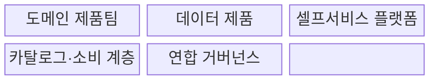
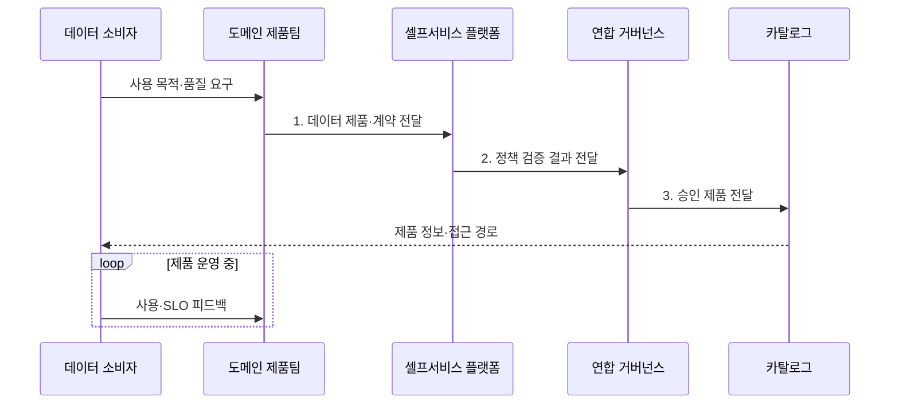

---
sidebar:
  order: 193
  label: "193. 데이터 메시 (Data Mesh)"
  badge:
    text: "기출 · 70%"
    variant: note
title: "데이터 메시 (Data Mesh)"
date: "2026-07-31T09:04:55+09:00"
tags:
  - "notes-latest-tech"
weight: 193
extra:
  question_no: "193"
  source_status: "기출"
  source_history: "123회, 135회"
  priority: 70
  priority_note: "데이터 메시의 도메인 소유·제품화가 반복됨"
---

## Ⅰ. 개요

핵심 용어

- **데이터 메시(Data Mesh)**: 도메인 팀이 데이터 제품의 소유·품질·운영을 책임지고 공통 규칙으로 연결하는 분산 데이터 운영 모델이다.
- **도메인(Domain)**: 주문·고객처럼 업무 의미와 책임 경계가 같은 영역이다.

- 정의/개념: 도메인 팀이 데이터 제품의 소유·품질·운영을 책임지고 공통 규칙으로 연결하는 **데이터 메시(Data Mesh) 운영 모델**
- 배경/필요성: 중앙 데이터팀은 요청 증가 시 처리 병목·업무 의미 단절과 **품질 책임 공백** 발생

#### 한줄 요약

- 각 업무팀이 자기 데이터 상품의 품질을 책임지고, 공통 생산 설비와 전사 규칙으로 소비자에게 제공하는 방식이다.

## Ⅱ. 특징

핵심 용어

- **데이터 제품(Data Product)**: 발견·이해·접근·신뢰·재사용할 수 있도록 계약과 품질 목표를 갖춘 데이터 제공 단위이다.
- **연합 거버넌스**: 도메인 대표와 중앙 조직이 전역 규칙을 합의하고 자동 집행하는 운영 방식이다.

- 도메인 팀의 데이터 의미·품질에 대한 **종단 책임**
- 계약·문서·서비스 수준 목표(Service Level Objective, SLO) 기반 **소비자 중심 데이터 제품**
- 셀프서비스 플랫폼·연합 거버넌스 기반 **분산 자율성·상호운용성**
#### 한줄 요약

- 각 팀이 상품을 책임지되 공통 설비와 자동 검사 규칙으로 다른 팀이 안전하게 조합하도록 한다.

## Ⅲ. 구조 및 구성요소

핵심 용어

- **셀프서비스 데이터 플랫폼**: 도메인 팀이 파이프라인·저장·관측·정책 기능을 직접 소비하게 하는 공통 기반이다.
- **카탈로그**: 데이터 제품의 소유자·계약·품질·접근 경로를 발견하도록 제공하는 목록이다.

| 구성요소 | 책임 |
|:---|:---|
| 도메인 제품팀 | 데이터 의미·품질과 **운영 책임** 보유 |
| 데이터 제품 | 데이터·코드와 **계약·서비스 수준 목표(Service Level Objective, SLO)** 제공 |
| 셀프서비스 플랫폼 | 파이프라인·저장과 **관측 기능** 제공 |
| 카탈로그·소비 계층 | 제품 발견·이해와 **접근 지원** |
| 연합 거버넌스 | **전역 규칙 합의·자동 집행** |

#### 한줄 요약

- 업무팀은 상품을 만들고 공통 공장은 생산·배포 도구를, 연합 조직은 호환 규칙을 제공한다.

## Ⅳ. 흐름도

핵심 용어

- **데이터 계약**: 생산자와 소비자가 스키마·의미·품질·변경 호환성을 합의한 규칙이다.
- **서비스 수준 목표(Service Level Objective, SLO)**: 데이터 제품이 약속한 신선도·정확성·가용성 목표이다.

**동작 원리**

1. **데이터 제품·계약 전달**: 데이터·코드와 **스키마·SLO** 제공
2. **정책 검증 결과 전달**: 보안·품질 규칙의 **준수 결과** 제공
3. **승인 제품 전달**: 연합 정책을 통과한 **카탈로그 게시 정보** 제공

#### 한줄 요약

- 고객이 원하는 상품과 품질 약속을 정해 공통 설비에서 만들고, 사용 결과로 품질을 높인다.

## Ⅴ. 종류 및 비교

핵심 용어

- **데이터 패브릭**: 활성 메타데이터로 이기종 데이터의 발견·접근·통합·거버넌스를 자동화하는 구조이다.
- **중앙 데이터 플랫폼**: 중앙팀이 여러 도메인의 파이프라인과 데이터 품질을 직접 운영하는 접근법이다.

| 데이터 운영 접근법 | Data Mesh | Data Fabric | 중앙 데이터 플랫폼 |
|:---|:---|:---|:---|
| 적용 기준 | 다수 도메인의 **책임 분산** | 이기종 자산의 **기술 통합** | 소수 도메인의 **중앙 관리** |
| 핵심 특징 | **도메인 소유·데이터 제품** | 메타데이터 기반 **자동 연결** | **중앙팀 파이프라인 운영** |
| 한계 | **조직 전환·제품 역량** 필요 | **도메인 책임** 별도 설계 | **중앙 병목·의미 단절** |

#### 한줄 요약

- 지역 상품 조직과 자동 물류망, 중앙 창고는 해결하는 문제가 서로 다르다.

## Ⅵ. 실무 고려사항 및 대책

핵심 용어

- **온콜(On-call)**: 데이터 제품 장애에 대해 정한 시간 안에 대응하는 담당 체계이다.
- **호환성 검사**: 데이터 계약의 버전 변경이 기존 소비자의 처리와 의미를 깨뜨리지 않는지 확인하는 시험이다.

서비스 수준 목표(Service Level Objective, SLO)와 온콜 책임을 데이터 제품별로 운영한다.

| 문제 | 대책 | 효과 |
|:---|:---|:---|
| 명목상 소유권과 **운영 책임 불일치** | 제품 소유자·지원 SLO와 **온콜** 명시 | **품질 장애 책임** 확보 |
| 도메인별 **계약·용어 불일치** | 연합 표준·버전 계약과 **호환성 검사** | **제품 조합 가능성** 향상 |
| 플랫폼 역량 부족의 **중복 구현** | 셀프서비스 파이프라인·**관측·정책** 제공 | **도메인 인지 부하** 감소 |

#### 한줄 요약

- 주문·고객·재고 팀은 버전 계약과 신선도 SLO를 소유하고 플랫폼은 발견·권한·관측을 제공한다.

## Ⅶ. 결론

핵심 용어

- **종단 책임**: 도메인 팀이 데이터 생성부터 품질·지원·폐기까지 제품 수명주기 전체를 맡는 원칙이다.
- **제품 역량**: 데이터를 소비자 요구·계약·서비스 수준 목표(Service Level Objective, SLO)·지원 체계가 있는 지속 운영 제품으로 관리하는 능력이다.

- **종단 책임·제품 역량별 선택**: 도메인이 수명주기와 SLO를 운영하면 데이터 메시, 그렇지 않으면 중앙 플랫폼

#### 한줄 요약

- 데이터 메시는 책임 분산과 함께 공통 도구와 전사 규칙을 제공해야 작동한다.
