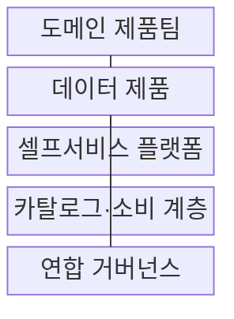
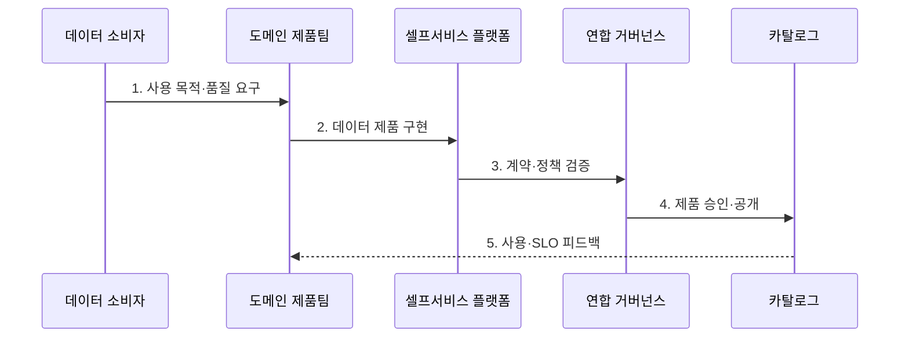

---
sidebar:
  order: 193
  label: "193. 데이터 메시 (Data Mesh)"
  badge:
    text: "기출 · 70%"
    variant: note
title: "데이터 메시 (Data Mesh)"
date: "2026-07-27T23:59:59+09:00"
tags:
  - "notes-latest-tech"
weight: 193
extra:
  question_no: "193"
  source_status: "기출"
  source_history: "123회, 135회"
  priority: 70
  priority_note: "데이터 메시의 도메인 소유·제품화가 반복됨"
---

## 미리 알고가기

- **데이터 메시(Data Mesh)**: '데이터 메시'로 읽으며, 도메인 팀이 데이터 제품의 소유·품질·운영을 책임지는 분산 데이터 운영 모델
- **도메인(Domain)**: 주문·고객처럼 업무 의미와 책임 경계가 같은 영역
- **데이터 제품(Data Product)**: 발견·이해·접근·신뢰·재사용할 수 있도록 계약과 품질 목표를 갖춘 데이터 제공 단위
- **서비스 수준 목표(Service Level Objective, SLO)**: '에스엘오'로 읽으며, 데이터 제품이 약속한 신선도·정확성·가용성 목표
- **표기 이유**: '메시'는 중앙 저장소가 아니라 **분산된 도메인 데이터 제품이 공통 규칙으로 연결된 구조**를 의미

## Ⅰ. 개요

- 정의/개념: 도메인 팀이 **데이터를 제품으로 소유·운영**하고 플랫폼과 연합 거버넌스로 연결하는 분산 운영 모델
- 기존 한계: 중앙 데이터팀 방식은 요청 병목이 발생하고 업무 의미가 전달 과정에서 단절되며 데이터 품질 책임이 불명확해진다.

### 쉽게 이해하기 (학습용)

- 각 업무팀이 자기 데이터 상품의 품질을 책임지고, 공통 생산 설비와 전사 규칙으로 소비자에게 제공하는 방식이다.

## Ⅱ. 특징

- 도메인 팀이 **데이터 의미·품질·생애주기의 종단 책임**을 가진다.
- 데이터 제품은 계약·문서·SLO를 갖춰 **소비자 중심으로 제공**된다.
- 셀프서비스 플랫폼과 연합 거버넌스가 **분산 자율성과 전사 상호운용성을 연결**한다.

### 쉽게 이해하기 (학습용)

- 각 팀이 상품을 책임지되 공통 설비와 자동 검사 규칙으로 다른 팀이 안전하게 조합하도록 한다.

## Ⅲ. 구조 및 구성요소

| 구성요소 | 책임 |
|:---|:---|
| 도메인 제품팀 | **데이터 의미·품질·운영 책임** |
| 데이터 제품 | **데이터·코드·계약·SLO 제공** |
| 셀프서비스 플랫폼 | **파이프라인·저장·관측 기능 제공** |
| 카탈로그·소비 계층 | **제품 발견·이해·접근 지원** |
| 연합 거버넌스 | **전역 규칙 합의·자동 집행** |

> 요약: 도메인 제품 책임을 셀프서비스 플랫폼과 연합 정책이 지원한다.

### 쉽게 이해하기 (학습용)

- 업무팀은 상품을 만들고 공통 공장은 생산·배포 도구를, 연합 조직은 호환 규칙을 제공한다.

## Ⅳ. 흐름도

### 동작 원리

1. **사용 목적·품질 요구**: 소비자와 도메인 경계·가치·SLO 합의
2. **데이터 제품 구현**: 데이터·코드·계약·문서·관측 구성
3. **계약·정책 검증**: 공통 플랫폼에서 스키마·보안·품질 규칙 실행
4. **제품 승인·공개**: 연합 정책 통과 후 카탈로그에 게시
5. **사용·SLO 피드백**: 채택·신선도·오류를 제품 백로그에 반영

> 요약: 소비자 요구를 데이터 제품 계약으로 만들고 플랫폼·정책 검증 후 지속 개선한다.

### 쉽게 이해하기 (학습용)

- 고객이 원하는 상품과 품질 약속을 정해 공통 설비에서 만들고, 사용 결과로 품질을 높인다.

## Ⅴ. 종류 및 비교

| 데이터 운영 접근법 | Data Mesh | Data Fabric | 중앙 데이터 플랫폼 |
|:---|:---|:---|:---|
| 적용 기준 | 다수 도메인의 책임 분산 | 이기종 자산의 기술 통합 | 소수 도메인의 중앙 관리 |
| 핵심 특징 | 도메인 소유·데이터 제품 | 메타데이터 기반 자동 연결 | 중앙팀 파이프라인 운영 |
| 한계 | 조직 전환·제품 역량 필요 | 도메인 책임은 별도 설계 | 중앙 병목·의미 단절 |

> 요약: 데이터 메시는 조직 책임, 패브릭은 기술 연결, 중앙 플랫폼은 집중 운영 방식이다.

### 쉽게 이해하기 (학습용)

- 지역 상품 조직과 자동 물류망, 중앙 창고는 해결하는 문제가 서로 다르다.

## Ⅵ. 실무 고려사항 및 대책

| 고려사항 | 대책 | 효과 |
|:---|:---|:---|
| 명목상 소유권과 실제 운영 책임 불일치 | 제품 소유자·지원 SLO·온콜 명시 | 품질 장애 책임 확보 |
| 도메인별 계약·용어 불일치 | 연합 표준·버전 계약·호환성 검사 | 제품 조합 가능성 향상 |
| 플랫폼 역량 부족으로 중복 구현 | 셀프서비스 파이프라인·관측·정책 제공 | 도메인 인지 부하 감소 |

### 쉽게 이해하기 (학습용)

- 주문·고객·재고 팀은 버전 계약과 신선도 SLO를 소유하고 플랫폼은 발견·권한·관측을 제공한다.

## Ⅶ. 결론

- 도메인별 책임과 확장성을 확보하기 위해 **제품 소유권·소비자 가치·계약·SLO·셀프서비스 역량·연합 거버넌스**를 검토해 데이터 메시를 적용한다.

### 쉽게 이해하기 (학습용)

- 데이터 메시는 책임 분산과 함께 공통 도구와 전사 규칙을 제공해야 작동한다.
