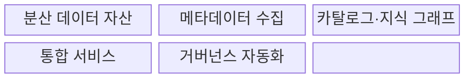
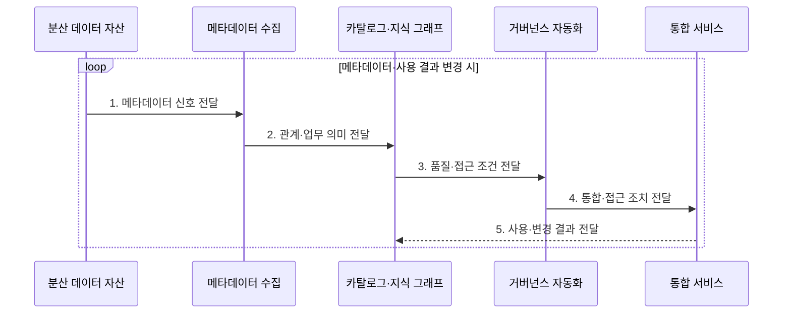

---
sidebar:
  order: 194
  label: "194. 데이터 패브릭 (Data Fabric)"
  badge:
    text: "기출 · 70%"
    variant: note
title: "데이터 패브릭 (Data Fabric)"
date: "2026-07-31T09:05:39+09:00"
tags:
  - "notes-latest-tech"
weight: 194
extra:
  question_no: "194"
  source_status: "기출"
  source_history: "135회"
  priority: 70
  priority_note: "데이터 패브릭의 메타데이터 자동화가 기출됨"
---

## Ⅰ. 개요

핵심 용어

- **데이터 패브릭(Data Fabric)**: 분산 데이터의 발견·접근·통합·거버넌스를 활성 메타데이터로 자동화하는 아키텍처이다.
- **활성 메타데이터(Active Metadata)**: 수집·분석에 그치지 않고 추천·정책·자동 조치를 구동하는 메타데이터이다.

- 정의/개념: 활성 메타데이터로 분산 데이터의 연결·정책을 자동화하는 **데이터 패브릭(Data Fabric) 구조**
- 배경/필요성: 개별 도구·수작업 연결은 이기종 자산의 탐색 지연과 **통합 중복·정책 불일치** 유발

#### 한줄 요약

- 여러 창고의 물품·경로·출입 규칙을 공통 지도에 연결하고 실제 이동과 검사를 자동화하는 물류망이다.

## Ⅱ. 특징

핵심 용어

- **지식 그래프(Knowledge Graph)**: 데이터 자산·업무 용어·관계·계보를 그래프로 연결한 지식 구조이다.
- **고위험 조치 승인**: 접근 차단·데이터 이동처럼 영향이 큰 자동화 결과를 사람이 검토하도록 하는 통제이다.

- 사용·품질·계보 신호 기반 **활성 메타데이터 자동 조치**
- 자산·업무 의미의 지식 그래프 기반 **발견·영향 분석**
- 복제·스트리밍·가상화 자동화와 **고위험 조치 승인**
#### 한줄 요약

- 공통 지도가 자산 관계와 이용 이력을 바탕으로 경로와 규칙을 추천하되 위험한 변경은 사람이 승인한다.

## Ⅲ. 구조 및 구성요소

핵심 용어

- **메타데이터 수집**: 분산 자산에서 스키마·계보·품질·사용량·소유자 정보를 모으는 기능이다.
- **통합 서비스**: 복제·스트리밍·가상화를 실행해 이기종 데이터 접근 경로를 제공하는 계층이다.

| 구성요소 | 책임 |
|:---|:---|
| 분산 데이터 자산 | 데이터베이스(Database, DB)·데이터 레이크(Data Lake)·서비스형 소프트웨어(Software as a Service, SaaS)의 **원천 데이터** 제공 |
| 메타데이터 수집 | 스키마·계보와 **품질·사용량** 수집 |
| 카탈로그·지식 그래프 | 자산·업무 의미와 **관계·규칙** 연결 |
| 통합 서비스 | 복제·스트리밍과 **가상화 실행** |
| 거버넌스 자동화 | 품질·보안 정책의 **평가·집행** |

#### 한줄 요약

- 자산 지도는 위치만 보여 주지 않고 실제 연결 방법과 접근 규칙까지 실행한다.

## Ⅳ. 흐름도

핵심 용어

- **기술·운영 메타데이터**: 스키마·위치·계보와 사용량·품질·오류 상태를 함께 나타내는 정보이다.
- **자동화 피드백**: 실제 접근·통합 결과와 오류를 메타데이터에 되돌려 다음 추천·정책을 개선하는 정보이다.

**동작 원리**

1. **메타데이터 신호 전달**: 분산 자산의 **기술·운영 메타데이터** 제공
2. **관계·업무 의미 전달**: 자산·용어·소유자의 **지식 그래프** 제공
3. **품질·접근 조건 전달**: 민감도·신뢰도·규제의 **정책 조건** 제공
4. **통합·접근 조치 전달**: 복제·스트리밍·가상화의 **실행 조건** 제공
5. **사용·변경 결과 전달**: 실제 사용·오류의 **자동화 피드백** 제공

#### 한줄 요약

- 운송 결과와 사고 이력을 지도에 되돌려 다음 경로와 출입 규칙을 개선한다.

## Ⅴ. 종류 및 비교

핵심 용어

- **데이터 메시**: 도메인 팀이 데이터 제품의 소유·품질·운영을 책임지는 분산 운영 모델이다.
- **레이크하우스**: 개방형 파일 저장소에 원자성·일관성·격리성·지속성(Atomicity, Consistency, Isolation, Durability, ACID) 테이블 관리 기능을 결합한 분석 아키텍처이다.

| 분산 데이터 접근법 | Data Fabric | Data Mesh | Lakehouse |
|:---|:---|:---|:---|
| 적용 기준 | 이기종 자산의 **기술 통합** | 도메인별 **책임 분산** | 분석 **저장·처리 통합** |
| 핵심 특징 | 메타데이터 기반 **자동 연결** | **데이터 제품·연합 정책** | **객체 저장소·테이블 계층** |
| 한계 | **도구 복잡성·메타데이터 품질** | **조직 전환·역량 편차** | **분산 책임 문제** 별도 |

#### 한줄 요약

- 자동 물류망, 지역별 책임 조직, 통합 창고는 역할이 달라 함께 사용할 수 있다.

## Ⅵ. 실무 고려사항 및 대책

핵심 용어

- **메타데이터 신뢰도**: 계보·소유자·품질 정보가 실제 데이터 상태를 정확하고 최신으로 나타내는 정도이다.
- **공통 식별자**: 서로 다른 도구가 같은 데이터 자산·용어·주체를 일관되게 연결하도록 사용하는 값이다.

| 문제 | 대책 | 효과 |
|:---|:---|:---|
| 부정확한 **계보·소유자 메타데이터** | 자동 수집·소유자 검증과 **신뢰도 표시** | 잘못된 **영향 분석** 감소 |
| 자동 정책의 **과잉 차단·오승인** | 위험 등급별 사람 승인·**감사·롤백** | **자동화 사고 범위** 제한 |
| 도구 간 **메타데이터 모델 종속** | 개방 응용 프로그래밍 인터페이스(Application Programming Interface, API)·공통 식별자와 **반출 검증** | **패브릭 공급자 종속** 완화 |

#### 한줄 요약

- 은행은 고객 식별자·계보·민감도를 연결하되 고위험 접근 정책은 사람이 승인하게 한다.

## Ⅶ. 결론

핵심 용어

- **기술 통합**: 이기종 데이터 자산의 발견·접근·이동·정책 집행을 공통 자동화 계층으로 연결하는 활동이다.
- **공급자 종속**: 특정 패브릭 도구의 메타데이터 모델과 응용 프로그래밍 인터페이스(Application Programming Interface, API)에 의존해 다른 환경으로 이전하기 어려운 상태이다.

- **기술 통합·공급자 종속별 선택**: 이기종 자산 연결 자동화는 데이터 패브릭, 도메인 책임 분산은 데이터 메시

#### 한줄 요약

- 데이터 패브릭의 자동화 품질은 메타데이터 정확도와 위험한 조치의 사람 승인에 달려 있다.
