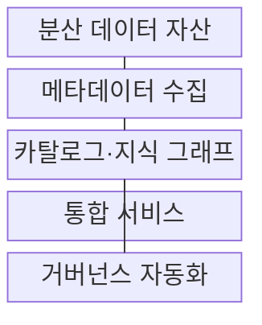
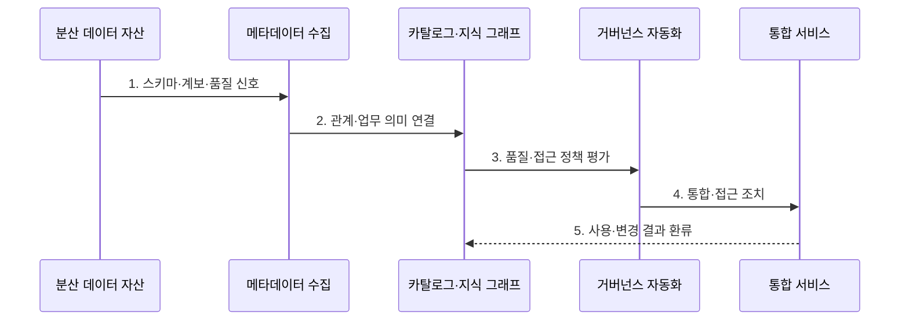

---
sidebar:
  order: 194
  label: "194. 데이터 패브릭 (Data Fabric)"
  badge:
    text: "기출 · 70%"
    variant: note
title: "데이터 패브릭 (Data Fabric)"
date: "2026-07-27T23:59:59+09:00"
tags:
  - "notes-latest-tech"
weight: 194
extra:
  question_no: "194"
  source_status: "기출"
  source_history: "135회"
  priority: 70
  priority_note: "데이터 패브릭의 메타데이터 자동화가 기출됨"
---

## 미리 알고가기

- **데이터 패브릭(Data Fabric)**: '데이터 패브릭'으로 읽으며, 분산 데이터의 발견·접근·통합·거버넌스를 메타데이터로 자동화하는 아키텍처
- **활성 메타데이터(Active Metadata)**: 수집·분석에 그치지 않고 추천·정책·자동 조치를 구동하는 메타데이터
- **지식 그래프(Knowledge Graph)**: 데이터 자산·업무 용어·관계·계보를 그래프로 연결한 지식 구조
- **서비스형 소프트웨어(Software as a Service, SaaS)**: '사스'로 읽으며, 인터넷을 통해 제공되는 외부 소프트웨어 서비스
- **표기 이유**: '패브릭'은 모든 데이터를 한곳에 복제한다는 뜻이 아니라 **분산 자산 위에 연결·자동화 계층을 촘촘히 구성**한다는 의미

## Ⅰ. 개요

- 정의/개념: 활성 메타데이터와 지식 그래프로 **분산 데이터의 통합·접근·정책 실행을 자동화**하는 아키텍처
- 기존 한계: 이기종 저장소를 개별 도구와 수작업으로 연결하면 데이터 탐색이 늦고 통합 작업이 중복되며 정책이 일관되지 않는다.

### 쉽게 이해하기 (학습용)

- 여러 창고의 물품·경로·출입 규칙을 공통 지도에 연결하고 실제 이동과 검사를 자동화하는 물류망이다.

## Ⅱ. 특징

- 활성 메타데이터가 사용·품질·계보 신호로 **추천·탐지·자동 조치를 구동**한다.
- 지식 그래프가 데이터 자산과 업무 의미를 연결해 **발견·영향 분석·추론을 지원**한다.
- 복제·스트리밍·가상화와 정책 자동화를 조율하되 **고위험 조치는 승인 경계를 둔다**.

### 쉽게 이해하기 (학습용)

- 공통 지도가 자산 관계와 이용 이력을 바탕으로 경로와 규칙을 추천하되 위험한 변경은 사람이 승인한다.

## Ⅲ. 구조 및 구성요소

| 구성요소 | 책임 |
|:---|:---|
| 분산 데이터 자산 | DB·Lake·SaaS의 원천 데이터 제공 |
| 메타데이터 수집 | **스키마·계보·품질·사용량 수집** |
| 카탈로그·지식 그래프 | 자산 발견·업무 의미·관계·규칙 연결 |
| 통합 서비스 | **복제·스트리밍·가상화 실행** |
| 거버넌스 자동화 | **품질·보안 정책 평가·집행** |

> 요약: 분산 자산의 메타데이터 관계가 통합 방식과 거버넌스 조치를 구동한다.

### 쉽게 이해하기 (학습용)

- 자산 지도는 위치만 보여 주지 않고 실제 연결 방법과 접근 규칙까지 실행한다.

## Ⅳ. 흐름도

### 동작 원리

1. **스키마·계보·품질 신호**: 분산 자산의 기술·운영 메타데이터 수집
2. **관계·업무 의미 연결**: 자산·용어·소유자·변환 관계를 그래프로 구성
3. **품질·접근 정책 평가**: 민감도·신뢰도·규제 조건 판단
4. **통합·접근 조치**: 복제·스트리밍·가상화와 접근 통제 실행
5. **사용·변경 결과 환류**: 실제 사용과 오류로 추천·정책 개선

> 요약: 메타데이터를 연결해 통합·정책을 실행하고 결과를 다시 자동화에 반영한다.

### 쉽게 이해하기 (학습용)

- 운송 결과와 사고 이력을 지도에 되돌려 다음 경로와 출입 규칙을 개선한다.

## Ⅴ. 종류 및 비교

| 분산 데이터 접근법 | Data Fabric | Data Mesh | Lakehouse |
|:---|:---|:---|:---|
| 적용 기준 | 이기종 자산의 기술 통합 | 도메인별 책임 분산 | 분석 저장·처리 통합 |
| 핵심 특징 | 메타데이터 기반 자동 연결 | 데이터 제품·연합 정책 | 객체 저장소·테이블 계층 |
| 한계 | 도구 복잡성·메타데이터 품질 | 조직 전환·역량 편차 | 분산 책임 문제는 별도 |

> 요약: 패브릭은 기술 통합 계층, 메시는 조직 운영 모델, 레이크하우스는 저장·처리 구조다.

### 쉽게 이해하기 (학습용)

- 자동 물류망, 지역별 책임 조직, 통합 창고는 역할이 달라 함께 사용할 수 있다.

## Ⅵ. 실무 고려사항 및 대책

| 고려사항 | 대책 | 효과 |
|:---|:---|:---|
| 부정확한 계보·소유자 메타데이터 | 자동 수집·소유자 검증·신뢰도 표시 | 잘못된 영향 분석 감소 |
| 자동 정책의 과잉 차단·오승인 | 위험 등급별 사람 승인·감사·롤백 | 자동화 사고 범위 제한 |
| 도구 간 메타데이터 모델 종속 | 개방 API·공통 식별자·내보내기 검증 | 패브릭 공급자 종속 완화 |

### 쉽게 이해하기 (학습용)

- 은행은 고객 식별자·계보·민감도를 연결하되 고위험 접근 정책은 사람이 승인하게 한다.

## Ⅶ. 결론

- 분산 데이터의 발견과 통합을 자동화하기 위해 **메타데이터 품질·의미 연결·계보 신뢰도·정책 승인 경계·도구 상호운용성**을 검토해 데이터 패브릭을 적용한다.

### 쉽게 이해하기 (학습용)

- 데이터 패브릭의 자동화 품질은 메타데이터 정확도와 위험한 조치의 사람 승인에 달려 있다.
