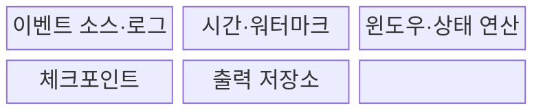
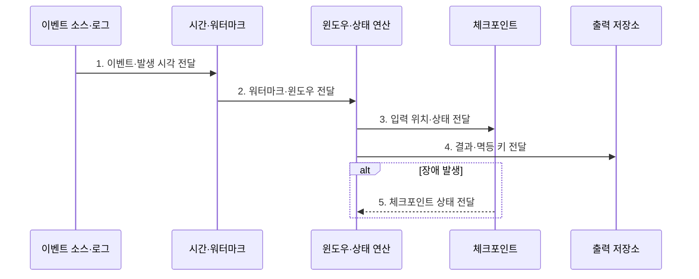

---
sidebar:
  order: 195
  label: "195. 실시간 스트리밍 (Real-Time Streaming)"
  badge:
    text: "미출 · 70%"
    variant: note
title: "실시간 스트리밍 (Real-Time Streaming)"
date: "2026-07-31T12:10:45+09:00"
tags:
  - "notes-latest-tech"
weight: 195
extra:
  question_no: "195"
  source_status: "미출"
  source_history: ""
  priority: 70
  priority_note: "실시간 스트림의 상태·시간 설계가 유력함"
---

## Ⅰ. 개요

핵심 용어

- **실시간 스트리밍(Real-Time Streaming)**: 연속 이벤트를 제한된 지연으로 지속 처리하며 시간·상태·복구를 관리하는 데이터 처리 방식이다.
- **연속 이벤트**: 완료된 유한 집합이 아니라 시간에 따라 끊임없이 도착하는 사건 기록이다.

- 정의/개념: 연속 이벤트를 제한된 지연으로 지속 처리하며 시간·상태·복구를 관리하는 **실시간 스트리밍(Real-Time Streaming) 방식**
- 배경/필요성: 배치 처리는 데이터 수집 완료 전 이상 거래·설비 변화에 대한 **즉시 대응** 곤란

#### 한줄 요약

- 마감 뒤 계산이 아닌 주문 즉시 합계를 갱신하되 늦은 도착과 장애까지 바로잡는 처리임

## Ⅱ. 특징

핵심 용어

- **이벤트 시간(Event Time)**: 사건이 실제 발생한 시각으로 처리 순서가 아닌 업무 시간 기준 집계에 사용한다.
- **워터마크(Watermark)**: 이벤트 시간 진행 정도를 추정해 윈도우 완료와 지연 데이터 처리를 결정하는 기준이다.

- **1. 이벤트 시간**: 실제 사건 발생 시각을 기준으로 한 순서·집계
- **2. 윈도·트리거**: 계산 범위와 중간·최종 결과 출력 시점 결정
- **3. 워터마크**: 지연 데이터의 대기 한계와 마감 시점 판정
#### 한줄 요약

- 주문 시각과 처리 시각은 다르므로 마감선을 정하고, 늦은 영수증은 고칠지 별도 보관할지 정해야 함

## Ⅲ. 구조 및 구성요소

핵심 용어

- **체크포인트(Checkpoint)**: 장애 복구를 위해 입력 위치와 연산 상태의 일관된 시점을 저장한 복구점이다.
- **상태 연산**: 이벤트 키별 과거 값과 중간 결과를 유지하며 새 입력에 따라 결과를 갱신하는 연산이다.

| 구성요소 | 책임 |
|:---|:---|
| 이벤트 소스·로그 | 이벤트 유입 완충과 **재생 위치** 관리 |
| 시간·워터마크 | 이벤트 시간 진행과 **허용 지연** 추정 |
| 윈도우·상태 연산 | 구간별 **키 상태·결과** 계산 |
| 체크포인트 | 입력 위치·연산 상태의 **일관된 복구점** 저장 |
| 출력 저장소 | **멱등·트랜잭션 계약**으로 결과 반영 |

#### 한줄 요약

- 접수함에서 영수증을 꺼내 장부를 만들고, 읽은 위치와 상태, 결과 저장 시점을 함께 기억함

## Ⅳ. 흐름도

핵심 용어

- **멱등 키**: 같은 결과가 반복 출력되어도 저장소에 한 번만 반영되게 식별하는 값이다.
- **허용 지연**: 워터마크 뒤에도 늦게 도착한 이벤트를 집계 수정에 받아들일 시간 범위이다.

**동작 원리**

1. **이벤트·발생 시각 전달**: 재생 가능한 로그의 키와 **이벤트 시간** 제공
2. **워터마크·윈도우 전달**: 시간 진행·허용 지연의 **계산 범위** 제공
3. **입력 위치·상태 전달**: 복구할 소비 위치와 **키별 상태** 제공
4. **결과·멱등 키 전달**: 확정·수정 결과와 **중복 제거 키** 제공
5. **체크포인트 상태 전달**: 재실행할 **입력 위치·연산 상태** 제공

#### 한줄 요약

- 마감선이 지나면 결과를 내고, 늦은 주문은 규칙대로 고치며 장애 시 마지막 위치부터 다시 계산함

## Ⅴ. 종류 및 비교

핵심 용어

- **마이크로배치**: 짧은 시간이나 건수 단위로 입력을 묶어 반복 실행하는 준실시간 처리 방식이다.
- **레코드 스트리밍**: 이벤트가 도착할 때마다 연산과 상태를 지속 갱신하는 처리 방식이다.

| 처리 방식 | 배치 처리 | 마이크로배치 | 레코드 스트리밍 |
|:---|:---|:---|:---|
| 적용 기준 | 정산·학습과 **대규모 일괄 처리** | **준실시간 대시보드** | 탐지·제어와 **상태 연산** |
| 핵심 특징 | **유한 데이터 완료 후 처리** | 짧은 **시간·건수 단위 실행** | **이벤트별 지속 처리** |
| 한계 | **긴 결과 지연** | **배치 경계 지연·부하 진동** | 상태·시간과 **복구 복잡성** |

#### 한줄 요약

- 배치는 일괄 처리, 마이크로배치는 묶음 처리, 스트리밍은 입력마다 장부를 갱신함

## Ⅵ. 실무 고려사항 및 대책

핵심 용어

- **키 편향**: 특정 키에 이벤트와 상태가 몰려 일부 처리 노드가 병목이 되는 현상이다.
- **트랜잭션 싱크(Transactional Sink)**: 체크포인트 상태와 출력 커밋을 조정해 복구 후 중복·누락을 억제하는 저장소 연결 방식이다.

| 문제 | 대책 | 효과 |
|:---|:---|:---|
| **지연·순서 역전 이벤트** | 워터마크·허용 지연과 **수정 정책** | 허용 지연 내 **집계 정확도** 유지 |
| **키 편향·무제한 상태** 증가 | 키 재분할·유효시간(Time to Live, TTL)과 **상태 크기 경보** | **처리 병목·저장 폭증** 방지 |
| 복구 후 **중복 출력** | 체크포인트·멱등 키와 **트랜잭션 Sink** | **중복·누락** 억제 |

#### 한줄 요약

- 결제 이상 탐지기는 카드별 5분 이벤트 시간 윈도에 금액·지역 상태를 누적하고 워터마크 이후 허용 지연 안의 결제는 점수를 수정하며 중복 경보는 거래 식별자(Identifier, ID)로 제거함

## Ⅶ. 결론

핵심 용어

- **제한 지연**: 업무가 요구하는 최대 시간 안에 이벤트 처리 결과를 제공하는 조건이다.
- **복구 정합성**: 장애 전 입력 위치·연산 상태·출력 결과를 일관된 시점으로 되돌리는 성질이다.

- **제한 지연·복구 정합성별 선택**: 초 단위 제어는 레코드 스트리밍, 수초·분 지연 허용은 마이크로배치

#### 한줄 요약

- 빠른 처리뿐 아니라 늦은 기록과 장애 뒤 장부 복구까지 정해야 함
