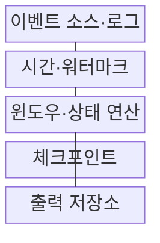
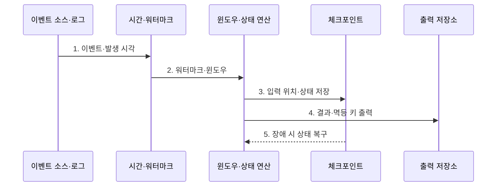

---
sidebar:
  order: 195
  label: "195. 실시간 스트리밍 (Real-Time Streaming)"
  badge:
    text: "미출제 · 70%"
    variant: note
title: "실시간 스트리밍 (Real-Time Streaming)"
date: "2026-07-25T03:24:00+09:00"
tags:
  - "notes-latest-tech"
weight: 195
extra:
  question_no: "195"
  source_status: "미출제"
  source_history: ""
  priority: 70
  priority_note: "실시간 스트림의 상태·시간 설계가 유력함"
---

## 미리 알고가기

- **이벤트 시간(Event Time)**: 사건이 실제 발생한 시각으로, 처리 순서가 아닌 업무 시간 기준 집계에 사용
- **워터마크(Watermark)**: 이벤트 시간 진행 정도를 추정해 윈도우 완료와 지연 데이터 처리를 결정하는 기준
- **체크포인트(Checkpoint)**: 장애 복구를 위해 입력 위치와 연산 상태의 일관된 시점을 저장

## Ⅰ. 개요

- 정의/개념: 연속 이벤트를 제한된 지연으로 처리하는 방식
- 기존 한계: 배치 처리는 데이터가 모일 때까지 기다려야 하므로 이상 거래·장애·설비 변화에 발생 즉시 대응하기 어렵다.

### 쉽게 이해하기 (학습용)

- 마감 뒤 계산이 아닌 주문 즉시 합계를 갱신하되 늦은 도착과 장애까지 바로잡는 처리임

## Ⅱ. 특징

> 검은 점선 워터마크 아래의 붉은 사건은 기준 밖 지연으로 분리되고 파란•주황 사건은 처리 대상으로 남으며, 처리 성능 실측값이 아닌 이벤트 시간 설명용 좌표다.

- event time이 사건 기준 처리를 가능하게 한다.
- window·trigger가 계산 범위와 출력 시점을 정한다.
- watermark가 지연 데이터 처리 기준을 만든다.
- 체크포인트·sink 결속이 중복·누락을 줄인다.

### 쉽게 이해하기 (학습용)

- 주문 시각과 처리 시각은 다르므로 마감선을 정하고, 늦은 영수증은 고칠지 별도 보관할지 정해야 함

## Ⅲ. 구조 및 구성요소

| 구성요소 | 책임 |
|:---|:---|
| 이벤트 소스·로그 | 이벤트 유입 완충과 재생 위치 관리 |
| 시간·워터마크 | 이벤트 시간 진행과 허용 지연 추정 |
| 윈도우·상태 연산 | 구간별 키 상태 갱신과 결과 계산 |
| 체크포인트 | 입력 위치와 연산 상태의 일관된 복구점 저장 |
| 출력 저장소 | 멱등·트랜잭션 계약으로 결과 반영 |

> 요약: 시간·완료 기준으로 결과와 복구 상태 일치

### 쉽게 이해하기 (학습용)

- 접수함에서 영수증을 꺼내 장부를 만들고, 읽은 위치와 상태, 결과 저장 시점을 함께 기억함

## Ⅳ. 흐름도

### 동작 원리

1. **이벤트·발생 시각**: 재생 가능한 로그에서 키와 이벤트 시간 수신
2. **워터마크·윈도우**: 시간 진행과 허용 지연으로 계산 범위 결정
3. **입력 위치·상태 저장**: 키별 상태와 소비 위치를 일관된 체크포인트로 기록
4. **결과·멱등 키 출력**: 확정·수정 결과를 중복 제거 가능한 계약으로 반영
5. **장애 시 상태 복구**: 체크포인트에서 상태와 입력 위치를 맞춰 재실행

> 요약: 시간 구간·지연 데이터·복구를 일관 처리

### 쉽게 이해하기 (학습용)

- 마감선이 지나면 결과를 내고, 늦은 주문은 규칙대로 고치며 장애 시 마지막 위치부터 다시 계산함

## Ⅴ. 종류 및 비교

| 처리 방식 | 배치 처리 | 마이크로배치 | 레코드 스트리밍 |
|:---|:---|:---|:---|
| 적용 기준 | 정산·학습·대규모 일괄 | 준실시간 대시보드 | 탐지·제어·상태 연산 |
| 핵심 특징 | 유한 데이터 완료 후 처리 | 짧은 시간·건수 단위 실행 | 이벤트별 지속 처리 |
| 한계 | 긴 결과 지연 | 배치 경계 지연·부하 진동 | 상태·시간·복구 복잡성 |

> 요약: 스트리밍은 단순 반복이 아닌 시간과 상태의 연속적 관리임

### 쉽게 이해하기 (학습용)

- 배치는 일괄 처리, 마이크로배치는 묶음 처리, 스트리밍은 입력마다 장부를 갱신함

## Ⅵ. 실무 고려사항 및 대책

| 고려사항 | 대책 | 효과 |
|:---|:---|:---|
| 지연·순서 역전 이벤트 | 업무별 워터마크·허용 지연·수정 정책 | 정확도와 지연 균형 |
| 키 편향과 무제한 상태 증가 | 키 재분할·TTL·상태 크기 경보 | 처리 병목·저장 폭증 방지 |
| 복구 후 중복 출력 | 체크포인트 연계·멱등 키·트랜잭션 Sink | 중복·누락 억제 |

### 쉽게 이해하기 (학습용)

- 결제 이상 탐지기는 카드별 5분 event-time window에 금액·지역 상태를 누적하고 watermark 이후 허용 지연 안의 결제는 점수를 수정하며 중복 경보는 거래 ID로 제거함

## Ⅶ. 결론

- 지연 이벤트가 포함된 연속 데이터를 정확하게 처리하기 위해 **이벤트 시간·워터마크·상태 크기·중복 처리·복구 보장**을 검토하고, 업무 지연 허용도에 맞는 실시간 스트리밍 정책을 설계해야 한다.

### 쉽게 이해하기 (학습용)

- 빠른 처리뿐 아니라 늦은 기록과 장애 뒤 장부 복구까지 정해야 함
