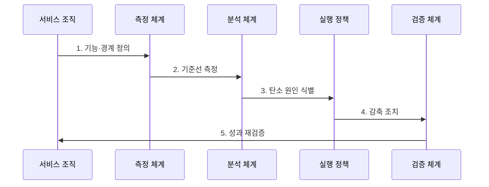

---
sidebar:
  order: 196
  label: "196. 그린 소프트웨어 (Green Software)"
  badge:
    text: "기출 · 70%"
    variant: note
title: "그린 소프트웨어 (Green Software)"
date: "2026-07-30T11:10:21+09:00"
tags:
  - "notes-latest-tech"
weight: 196
extra:
  question_no: "196"
  source_status: "기출"
  source_history: "137회"
  priority: 70
  priority_note: "그린 소프트웨어의 탄소 절감 설계가 최근 출제됨"
---

## 미리 알고 가기

- **그린 소프트웨어**: 소프트웨어 기능 단위의 탄소 배출을 줄이는 개발·운영 접근법
- **소프트웨어 탄소 집약도(SCI)**: 기능 단위당 운영 탄소와 장비 내재 탄소를 나타내는 지표
- **이산화탄소 환산량(CO2e)**: 여러 온실가스 영향을 이산화탄소 기준으로 환산한 양
- **서비스 수준 목표(SLO)**: 탄소 감축 과정에서도 지켜야 할 서비스 품질 목표
- **SCI 표기 이유**: `SCI = ((E × I) + M) / R`에서 에너지 `E`, 탄소 강도 `I`, 내재 탄소 `M`을 기능 단위 `R`로 나눠 비교

## Ⅰ. 개요

- 정의/개념: 에너지·하드웨어·탄소 인지 설계로 **기능 단위 탄소 배출을 감축하는 소프트웨어 공학**
- 기존 한계: 성능과 비용만 최적화하면 소프트웨어의 전력 소비·장비 내재 탄소·시간대별 전력 탄소 강도를 의사결정에 반영하기 어렵다.

### 쉽게 이해하기

- 같은 서비스를 적은 전기와 장비로 제공하고, 미룰 수 있는 작업은 전력이 더 깨끗한 시간·지역에서 실행하는 방식이다.

## Ⅱ. 특징

- 에너지 효율로 **연산·전송·저장에 필요한 전력량을 감축**한다.
- 하드웨어 효율로 **장비 활용률·수명을 높여 기능별 내재 탄소를 감축**한다.
- 탄소 인지 실행으로 **시간·지역별 전력 탄소 강도에 맞춰 유연한 작업을 이동**한다.

### 쉽게 이해하기

- 계산을 가볍게 하고 장비를 충분히 쓰며, 가능한 작업은 저탄소 전력 시간에 처리한다.

## Ⅲ. 구조 및 구성요소

| 구성요소 | 책임 |
|:---|:---|
| 기능 단위·경계 | **요청·작업당 측정 범위 정의** |
| 에너지 계측 | **연산·전송·저장 전력 측정** |
| 탄소 강도 정보 | **시간·지역별 전력 배출 반영** |
| 내재 탄소 배분 | **장비 제조·폐기 탄소 배분** |
| 감축·검증 정책 | **SCI·총배출·SLO 함께 검증** |

> 요약: 운영 에너지와 전력 탄소 강도, 장비 내재 탄소를 기능 단위로 측정·감축한다.

### 쉽게 이해하기

- 한 요청에 들어간 전기와 장비 몫을 계산하고, 서비스 품질을 유지하면서 줄인다.

## Ⅳ. 흐름도

### 동작 원리

1. **기능·경계 정의**: 기능 단위와 포함 자원 결정
2. **기준선 측정**: 에너지·강도·내재 탄소 산정
3. **탄소 원인 식별**: 코드·자원·시간별 영향 분석
4. **감축 조치**: 효율화·적정화·실행 이동
5. **성과 재검증**: SCI·총배출·SLO 비교

> 요약: 같은 측정 경계에서 탄소 원인을 줄이고 기능당·총배출·서비스 품질을 다시 확인한다.

### 쉽게 이해하기

- 같은 시험 조건에서 낭비 원인을 고친 뒤 탄소와 응답 품질이 실제로 개선됐는지 비교한다.

## Ⅴ. 종류 및 비교

| 그린 소프트웨어 감축 축 | 에너지 효율 | 하드웨어 효율 | 탄소 인지 |
|:---|:---|:---|:---|
| 적용 기준 | 연산·전송·저장 낭비 | 저활용·과잉 장비 | 시간·지역 이동 가능 작업 |
| 핵심 특징 | 기능당 에너지 감축 | 활용률·수명 향상 | 저탄소 전력 시점 활용 |
| 한계 | 성능 저하·재시도 증가 | 과밀 운영·신뢰성 저하 | 지연·이동 비용·예측 오차 |

> 요약: 에너지 사용량, 장비 배분, 전력 탄소 강도를 각각 줄이고 상충 효과를 검증한다.

### 쉽게 이해하기

- 적은 전기로 계산하고 장비를 오래 활용하며 더 깨끗한 전력 시간에 실행한다.

## Ⅵ. 실무 고려사항 및 대책

| 고려사항 | 대책 | 효과 |
|:---|:---|:---|
| **측정 경계 변경** 미검증 시 개선 전후의 포함 자원이 달라 SCI 왜곡 | 기능 단위·자원·기간 기준선 고정과 변경 이력 관리 | SCI **측정 비교성** 확보 |
| **반동 효과** 미검증 시 기능당 효율 개선 후 사용량 증가로 총배출 확대 | SCI와 총에너지·총배출을 함께 예산화·감시 | 효율 개선 후 **총배출 증가** 억제 |
| **품질 저하** 미검증 시 작업 이동·자원 축소로 지연과 장애 증가 | SLO를 제약 조건으로 두고 단계 적용·자동 복귀 | 최적화 중 **SLO 저하** 방지 |

## Ⅶ. 결론

- 소프트웨어의 탄소 배출을 실질적으로 줄이기 위해 측정 경계·SCI·총배출·SLO를 함께 검토하여 그린 소프트웨어 기법을 적용해야 한다.
