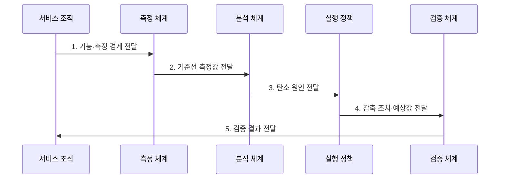

---
sidebar:
  order: 196
  label: "196. 그린 소프트웨어 (Green Software)"
  badge:
    text: "기출 · 70%"
    variant: note
title: "그린 소프트웨어 (Green Software)"
date: "2026-07-31T09:07:06+09:00"
tags:
  - "notes-latest-tech"
weight: 196
extra:
  question_no: "196"
  source_status: "기출"
  source_history: "137회"
  priority: 70
  priority_note: "그린 소프트웨어의 탄소 절감 설계가 최근 출제됨"
---

## 미리 알고가기

- **그린 소프트웨어**: 소프트웨어 기능 단위의 탄소 배출을 줄이는 개발·운영 접근법
- **소프트웨어 탄소 집약도(SCI)**: 기능 단위당 운영 탄소와 장비 내재 탄소를 나타내는 지표
- **ISO/IEC 21031:2024**: 소프트웨어 탄소 집약도 계산 방법을 정의한 국제표준
- **이산화탄소 환산량(CO2e)**: 여러 온실가스 영향을 이산화탄소 기준으로 환산한 양
- **서비스 수준 목표(SLO)**: 탄소 감축 과정에서도 지켜야 할 서비스 품질 목표
- **SCI 표기 이유**: `SCI = ((E × I) + M) / R`에서 에너지 `E`, 탄소 강도 `I`, 내재 탄소 `M`을 기능 단위 `R`로 나눠 비교

## Ⅰ. 개요

- 정의/개념: **그린 소프트웨어**는 기능 단위 탄소 배출을 줄이는 개발·운영 접근법
- 배경/필요성: 성능·비용 지표만으로는 **전력 소비·장비 내재 탄소**를 설계 결정에 반영하기 곤란

### 쉽게 이해하기 (학습용)

- 같은 서비스를 적은 전기와 장비로 제공하고, 미룰 수 있는 작업은 전력이 더 깨끗한 시간·지역에서 실행하는 방식이다.

## Ⅱ. 특징

- ISO/IEC 21031 기반 **기능 단위 SCI 측정**
- 연산·전송·저장 효율화 기반 **운영 탄소 감축**
- 장비 활용·수명과 작업 이동 기반 **내재 탄소·탄소 인지 절충**
### 쉽게 이해하기 (학습용)

- 계산을 가볍게 하고 장비를 충분히 쓰며, 가능한 작업은 저탄소 전력 시간에 처리한다.

## Ⅲ. 구조 및 구성요소

| 구성요소 | 책임 |
|:---|:---|
| 기능 단위·경계 | 요청·작업당 **측정 범위** 정의 |
| 에너지 계측 | 연산·전송·저장의 **전력 측정** |
| 탄소 강도 정보 | 시간·지역별 **전력 배출계수** 반영 |
| 내재 탄소 배분 | 장비 제조·폐기의 **탄소 배분** |
| 감축·검증 정책 | SCI·총배출과 **SLO 검증** |

### 쉽게 이해하기 (학습용)

- 한 요청에 들어간 전기와 장비 몫을 계산하고, 서비스 품질을 유지하면서 줄인다.

## Ⅳ. 흐름도

**동작 원리**

1. **기능·측정 경계 전달**: 기능 단위와 **포함 자원** 제공
2. **기준선 측정값 전달**: 에너지·배출계수와 **내재 탄소** 제공
3. **탄소 원인 전달**: 코드·자원·시간별 **배출 영향** 제공
4. **감축 조치·예상값 전달**: 효율화·적정화의 **예상 감축량** 제공
5. **검증 결과 전달**: SCI·총배출과 **SLO 비교 결과** 제공

### 쉽게 이해하기 (학습용)

- 같은 시험 조건에서 낭비 원인을 고친 뒤 탄소와 응답 품질이 실제로 개선됐는지 비교한다.

## Ⅴ. 종류 및 비교

| 그린 소프트웨어 감축 축 | 에너지 효율 | 하드웨어 효율 | 탄소 인지 |
|:---|:---|:---|:---|
| 적용 기준 | 연산·전송·저장의 **에너지 낭비** | **저활용·과잉 장비** | 시간·지역 **이동 가능 작업** |
| 핵심 특징 | 기능당 **에너지 감축** | **활용률·장비 수명** 향상 | **저탄소 전력 시점** 활용 |
| 한계 | **성능 저하·재시도 증가** | **과밀 운영·신뢰성 저하** | 지연·이동과 **예측 오차** |

### 쉽게 이해하기 (학습용)

- 적은 전기로 계산하고 장비를 오래 활용하며 더 깨끗한 전력 시간에 실행한다.

## Ⅵ. 실무 고려사항 및 대책

| 고려사항 | 대책 | 효과 |
|:---|:---|:---|
| **측정 경계 변경** 미검증 시 개선 전후의 포함 자원이 달라 SCI 왜곡 | 기능 단위·자원·기간 기준선 고정과 변경 이력 관리 | SCI **측정 비교성** 확보 |
| **반동 효과** 미검증 시 기능당 효율 개선 후 사용량 증가로 총배출 확대 | SCI와 총에너지·총배출을 함께 예산화·감시 | 효율 개선 후 **총배출 증가** 억제 |
| **품질 저하** 미검증 시 작업 이동·자원 축소로 지연과 장애 증가 | SLO를 제약 조건으로 두고 단계 적용·자동 복귀 | 최적화 중 **SLO 저하** 방지 |

### 쉽게 이해하기 (학습용)

- 핵심 운영 위험마다 실행 가능한 대책과 검증 효과를 함께 확인한다.

## Ⅶ. 결론

- 지연 가능한 작업은 **저탄소 시간·지역 이동**, 상시 작업은 **에너지 효율화** 적용

### 쉽게 이해하기 (학습용)

- 핵심 판단 기준을 먼저 정한 뒤 적용 범위를 결정하는 것이 중요하다.
