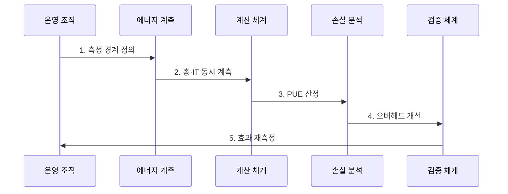

---
sidebar:
  order: 198
  label: "198. 전력 사용 효과성 (PUE)"
  badge:
    text: "기출 · 70%"
    variant: note
title: "전력 사용 효과성 (Power Usage Effectiveness)"
date: "2026-07-30T20:20:00+09:00"
tags:
  - "notes-latest-tech"
weight: 198
extra:
  question_no: "198"
  source_status: "기출"
  source_history: "138회"
  priority: 70
  priority_note: "PUE 전력 효율 산정·개선이 138회 출제됨"
---

## 미리 알고가기

- **전력 사용 효과성(PUE)**: 총 데이터센터 에너지를 IT 장비 에너지로 나눈 시설 효율 지표
- **데이터센터 인프라 효율(DCiE)**: IT 에너지를 총 시설 에너지로 나눈 백분율
- **부분 PUE(pPUE)**: 명시한 구역·모듈의 총에너지를 해당 IT 에너지로 나눈 지표
- **표기 이유**: `PUE = 총 시설 에너지 / IT 장비 에너지`이므로 이상적 하한은 1이며, 1에 가까울수록 비IT 오버헤드가 작음
- **해석 경계**: PUE는 냉각·배전 효율 지표이며 IT 작업 효율·탄소·물 사용량을 직접 나타내지 않음

## Ⅰ. 개요

$$PUE = \frac{\text{데이터센터 총 시설 에너지}}{\text{IT 장비 에너지}}$$

- 정의/개념: 같은 기간의 **총 시설 에너지를 IT 장비 에너지로 나눈 무차원 비율**
- 배경/필요성: 데이터센터의 총전력량만으로는 IT 장비 소비와 냉각·배전·조명 등 시설 오버헤드를 구분해 효율을 비교하기 어렵다.

### 쉽게 이해하기 (학습용)

- 서버가 100을 쓰고 데이터센터 전체가 150을 쓰면 PUE는 1.5이며, 나머지 50은 냉각·배전 등의 시설 사용량이다.

## Ⅱ. 특징

- **1. 같은 경계·기간에 계측**: 총 시설과 IT 에너지를 같은 경계·기간에 계측해야 비교할 수 있다.
- **2. 비IT 시설 에너지 오버헤드가 작다**: PUE가 1에 가까울수록 비IT 시설 에너지 오버헤드가 작다.
- **3. IT 효율·탄소·물 지표와 함께 해석**: 부하·기후·계측 경계의 영향을 받으므로 IT 효율·탄소·물 지표와 함께 해석해야 한다.
### 쉽게 이해하기 (학습용)

- 점수가 낮아도 서버가 일을 효율적으로 하는지는 알 수 없으므로 같은 조건의 시설 손실만 비교해야 한다.

## Ⅲ. 구조 및 구성요소

| 구성요소 | 책임 |
|:---|:---|
| 총 시설 계측 | **경계 내 전체 에너지 측정** |
| IT 장비 계측 | **서버·저장·네트워크 에너지 측정** |
| 경계·기간 명세 | **계측 위치·범주·기간 고정** |
| 오버헤드 분해 | **냉각·배전·조명 손실 분석** |
| 보조 지표 | **IT 효율·탄소·물·신뢰성 보완** |

### 쉽게 이해하기 (학습용)

- 건물 전체와 서버 전력을 같은 시간에 재고 그 차이를 냉각·배전 항목으로 나눈다.

## Ⅳ. 흐름도

**동작 원리**

- **1. 측정 경계 정의**: 시설·IT 계측 위치와 기간 고정
- **2. 총·IT 동시 계측**: 같은 기간의 두 에너지 값을 수집
- **3. PUE 산정**: 총 시설 에너지를 IT 장비 에너지로 나누고 부하·기후 함께 기록
- **4. 오버헤드 개선**: 냉각·배전·조명 손실을 분해해 개선하고 신뢰성 확인
- **5. 효과 재측정**: 동일 경계·기간에서 PUE와 총전력·SLO 비교

### 쉽게 이해하기 (학습용)

- 계절과 서버 부하를 함께 기록해야 냉각 조정이 실제로 시설 전력을 줄였는지 알 수 있다.

## Ⅴ. 종류 및 비교

| 시설 전력 효율 지표 | PUE | pPUE | DCiE |
|:---|:---|:---|:---|
| 적용 기준 | 데이터센터 전체 효율 | 구역·모듈별 병목 진단 | IT 전력 비중 표시 |
| 핵심 특징 | 총 시설 / IT 에너지 | 부분 시설 / 부분 IT | IT / 총 시설 × 100 |
| 한계 | 경계·부하가 다르면 오비교 | 전체 시설로 일반화 불가 | PUE와 같은 정보의 역수 |

### 쉽게 이해하기 (학습용)

- 전체 점수와 특정 구역 점수는 섞어 비교하지 않고, DCiE는 PUE를 반대로 표현한 값으로 본다.

## Ⅵ. 실무 고려사항 및 대책

| 고려사항 | 대책 | 효과 |
|:---|:---|:---|
| **계측 경계 차이** 미검증 시 서로 다른 설비 포함 범위로 PUE 오비교 | 계측 위치·포함 설비·기간을 명시하고 동일 조건 비교 | PUE **동일 경계 비교성** 확보 |
| **부하·계절 영향** 미검증 시 낮은 IT 부하나 기후 차이를 개선 효과로 오판 | IT 부하·외기 온도를 함께 기록하고 연간·부하구간별 분석 | 부하·계절 **효과 오판** 감소 |
| **PUE 단독 최적화** 미검증 시 총전력·물 사용·장비 효율·신뢰성 악화 | 총에너지, WUE, IT 작업 효율, 온도·SLO를 공동 검증 | 물·탄소·**신뢰성 악화** 방지 |

### 쉽게 이해하기 (학습용)

- 핵심 운영 위험마다 실행 가능한 대책과 검증 효과를 함께 확인한다.

## Ⅶ. 결론

- 데이터센터의 시설 에너지 손실을 줄이기 위해 동일 경계·기간의 총전력·IT 전력·신뢰성을 검토하여 PUE를 해석해야 한다.

### 쉽게 이해하기 (학습용)

- 핵심 판단 기준을 먼저 정한 뒤 적용 범위를 결정하는 것이 중요하다.
