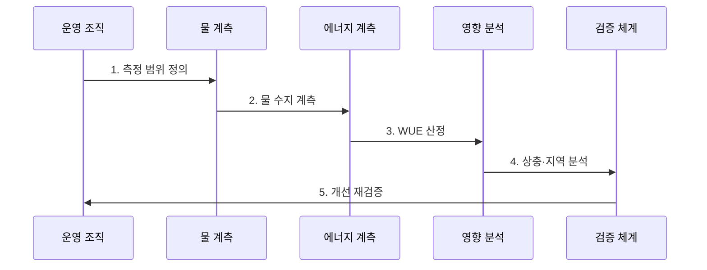

---
sidebar:
  order: 199
  label: "199. 물 사용 효과성 (WUE)"
  badge:
    text: "기출 · 70%"
    variant: note
title: "물 사용 효과성 (Water Usage Effectiveness)"
date: "2026-07-27T23:59:59+09:00"
tags:
  - "notes-latest-tech"
weight: 199
extra:
  question_no: "199"
  source_status: "기출"
  source_history: "138회"
  priority: 70
  priority_note: "WUE 물 사용 효율 산정·개선이 138회 출제됨"
---

## 미리 알고 가기

- **물 사용 효과성(WUE)**: 데이터센터 물 사용량을 IT 장비 에너지로 나눈 물 집약도
- **현장 WUE(site WUE)**: 데이터센터 경계에서 직접 사용하는 물을 기준으로 계산
- **원천 WUE(source WUE)**: 현장 물에 전력 생산 과정의 간접 물 사용까지 포함
- **킬로와트시(kWh)**: 일정 시간 동안 사용한 전기 에너지의 양을 나타내는 단위
- **표기 이유**: `WUE = 물 사용량(L) / IT 에너지(kWh)`이므로 단위는 `L/kWh`이며 낮을수록 IT 에너지당 물 사용이 적음

## Ⅰ. 개요

$$WUE = \frac{\text{데이터센터 물 사용량}(L)}{\text{IT 장비 에너지}(kWh)}$$

- 정의/개념: 같은 기간의 **데이터센터 물 사용량을 IT 장비 에너지로 나눈 물 집약도**
- 기존 한계: 전력과 냉각 효율만으로는 데이터센터의 현장 물 소비와 지역 수자원에 미치는 부담을 판단하기 어렵다.

### 쉽게 이해하기

- 서버가 전기 1kWh를 사용할 때 데이터센터 운영에 몇 리터의 물이 필요한지 나타낸 값이다.

## Ⅱ. 특징

- 물 사용량과 IT 에너지를 **같은 경계·기간에 측정**해야 한다.
- 수원·취수·방류·재사용·소비를 구분해 **물 수지와 지역 부담을 해석**한다.
- 증발 냉각은 PUE를 낮추고 WUE를 높일 수 있어 **전력·탄소·신뢰성과 함께 판단**한다.

### 쉽게 이해하기

- 물의 양뿐 아니라 출처와 재사용 여부를 밝히고, 전력 절감과 물 증가의 맞바꿈을 함께 본다.

## Ⅲ. 구조 및 구성요소

| 설계 요소 | 설명 |
|:---|:---|
| 수원별 취수 계측 | **상수·재생수 등 입력량 측정** |
| 물 수지 | **방류·재사용·소비량 구분** |
| IT 에너지 계측 | **같은 기간 분모 에너지 측정** |
| 냉각 방식 | **증발·공랭·액랭의 물 영향 분석** |
| 지역 거버넌스 | **물 스트레스·PUE·탄소 병행** |

> 요약: 수원별 물 수지와 같은 기간의 IT 에너지를 연결해 물 집약도와 지역 영향을 판단한다.

### 쉽게 이해하기

- 들어온 물이 재사용·방류·증발된 양을 구분하고 같은 기간의 서버 전력으로 나눈다.

## Ⅳ. 흐름도

### 동작 원리

1. **측정 범위 정의**: 현장·원천 포함 범위와 기간 결정
2. **물 수지 계측**: 수원별 취수·방류·재사용·소비와 같은 기간 IT 에너지 수집
3. **WUE 산정**: 물 사용량을 IT 장비 에너지로 나누고 수원 정보 기록
4. **상충·지역 분석**: PUE·탄소·물 스트레스와 냉각 신뢰성 비교
5. **개선 재검증**: 냉각 정책을 적용한 뒤 같은 경계에서 환경·SLO 지표 확인

> 요약: 물과 IT 에너지의 경계를 고정해 계산하고 지역 수자원·전력·신뢰성 상충을 검증한다.

### 쉽게 이해하기

- 물을 줄인 조치가 전력을 늘리거나 서버를 과열시키지 않는지 같은 조건에서 다시 확인한다.

## Ⅴ. 종류 및 비교

| 데이터센터 환경 효율 지표 | WUE | PUE | CUE |
|:---|:---|:---|:---|
| 적용 기준 | 물 집약도 관리 | 시설 전력 손실 관리 | 탄소 집약도 관리 |
| 핵심 특징 | 물 / IT 에너지 | 총 시설 / IT 에너지 | CO2e / IT 에너지 |
| 한계 | 지역 물 스트레스 미표현 | 물·탄소 직접 미표현 | 물·시설 손실 직접 미표현 |

> 요약: WUE·PUE·CUE는 각각 물·전력 시설·탄소 영향을 측정하므로 함께 해석해야 한다.

### 쉽게 이해하기

- 물 점수, 시설 전력 점수, 탄소 점수는 서로 대체할 수 없는 별도 계기판이다.

## Ⅵ. 실무 고려사항 및 대책

| 고려사항 | 위험 | 대책 |
|:---|:---|:---|
| **물 경계 혼용** | 현장·원천 물 사용을 섞어 잘못 비교 | WUE 범위와 수원별 취수·방류·재사용 정의 명시 |
| **지역 물 스트레스** | 같은 WUE라도 가뭄 지역의 사회·생태 영향 확대 | 유역별 물 스트레스 가중, 재생수 우선, 계절별 취수 한도 |
| **전력·물 상충** | 물 절감 냉각이 PUE·탄소·과열 위험 증가 | WUE·PUE·탄소·온도·SLO를 함께 시험하고 단계 적용 |

## Ⅶ. 결론

- 데이터센터의 물 부담을 줄이기 위해 동일 경계의 물 사용량·IT 에너지·지역 물 스트레스·수원을 검토하여 WUE를 해석해야 한다.
