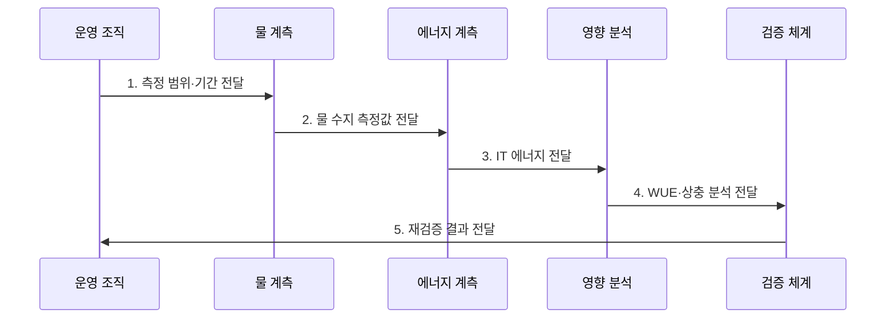

---
sidebar:
  order: 199
  label: "199. 물 사용 효과성 (WUE)"
  badge:
    text: "기출 · 70%"
    variant: note
title: "물 사용 효과성 (Water Usage Effectiveness)"
date: "2026-07-31T09:09:25+09:00"
tags:
  - "notes-latest-tech"
weight: 199
extra:
  question_no: "199"
  source_status: "기출"
  source_history: "138회"
  priority: 70
  priority_note: "WUE 물 사용 효율 산정·개선이 138회 출제됨"
---

## 미리 알고가기

- **물 사용 효과성(Water Usage Effectiveness, WUE)**: 데이터센터 물 사용량을 IT 장비 에너지로 나눈 물 집약도
- **현장 WUE(site WUE)**: 데이터센터 경계에서 직접 사용하는 물을 기준으로 계산
- **원천 WUE(source WUE)**: 현장 물에 전력 생산 과정의 간접 물 사용까지 포함
- **탄소 사용 효과성(Carbon Usage Effectiveness, CUE)**: 데이터센터 탄소 배출량을 IT 장비 에너지로 나눈 지표
- **ISO/IEC 30134-9:2022**: WUE 측정·계산·보고와 해석을 정의한 국제표준
- **킬로와트시(kWh)**: 일정 시간 동안 사용한 전기 에너지의 양을 나타내는 단위
- **표기 이유**: `WUE = 물 사용량(L) / IT 에너지(kWh)`이므로 단위는 `L/kWh`이며 낮을수록 IT 에너지당 물 사용이 적음

## Ⅰ. 개요

$$WUE = \frac{\text{데이터센터 물 사용량}(L)}{\text{IT 장비 에너지}(kWh)}$$

- 정의/개념: **WUE**는 같은 기간의 물 사용량을 IT 장비 에너지로 나눈 물 집약도
- 배경/필요성: 전력·냉각 효율만으로는 **현장 물 소비·지역 수자원 부담** 판단 곤란

### 쉽게 이해하기 (학습용)

- 서버가 전기 1kWh를 사용할 때 데이터센터 운영에 몇 리터의 물이 필요한지 나타낸 값이다.

## Ⅱ. 특징

- ISO/IEC 30134-9:2022 기반 **동일 경계·기간 측정**
- 수원·취수·방류·재사용을 구분한 **물 수지·지역 부담 해석**
- 증발 냉각의 PUE·WUE 상충과 **탄소·신뢰성 병행 판단**
### 쉽게 이해하기 (학습용)

- 물의 양뿐 아니라 출처와 재사용 여부를 밝히고, 전력 절감과 물 증가의 맞바꿈을 함께 본다.

## Ⅲ. 구조 및 구성요소

| 구성요소 | 책임 |
|:---|:---|
| 수원별 취수 계측 | 상수·재생수의 **입력량 측정** |
| 물 수지 | 방류·재사용과 **소비량 구분** |
| IT 에너지 계측 | **같은 기간 분모 에너지 측정** |
| 냉각 방식 | 증발·공랭·액랭의 **물 영향 분석** |
| 지역 거버넌스 | 물 스트레스와 **PUE·탄소 병행** |

### 쉽게 이해하기 (학습용)

- 들어온 물이 재사용·방류·증발된 양을 구분하고 같은 기간의 서버 전력으로 나눈다.

## Ⅳ. 흐름도

**동작 원리**

1. **측정 범위·기간 전달**: 현장·원천 포함 범위와 **측정 기간** 제공
2. **물 수지 측정값 전달**: 취수·방류·재사용과 **소비량** 제공
3. **IT 에너지 전달**: 같은 기간의 **분모 에너지 값** 제공
4. **WUE·상충 분석 전달**: PUE·탄소·물 스트레스의 **비교 결과** 제공
5. **재검증 결과 전달**: 냉각 정책 적용 후 **환경·SLO 지표** 제공

### 쉽게 이해하기 (학습용)

- 물을 줄인 조치가 전력을 늘리거나 서버를 과열시키지 않는지 같은 조건에서 다시 확인한다.

## Ⅴ. 종류 및 비교

| 데이터센터 환경 효율 지표 | WUE | PUE | CUE |
|:---|:---|:---|:---|
| 적용 기준 | **물 집약도 관리** | **시설 전력 손실 관리** | **탄소 집약도 관리** |
| 핵심 특징 | **물 / IT 에너지** | **총 시설 / IT 에너지** | **CO2e / IT 에너지** |
| 한계 | **지역 물 스트레스** 미표현 | **물·탄소** 직접 미표현 | **물·시설 손실** 직접 미표현 |

### 쉽게 이해하기 (학습용)

- 물 점수, 시설 전력 점수, 탄소 점수는 서로 대체할 수 없는 별도 계기판이다.

## Ⅵ. 실무 고려사항 및 대책

| 고려사항 | 대책 | 효과 |
|:---|:---|:---|
| **물 경계 혼용** 미검증 시 현장·원천 물 사용을 섞어 잘못 비교 | WUE 범위와 수원별 취수·방류·재사용 정의 명시 | WUE **동일 경계 비교성** 확보 |
| **지역 물 스트레스** 미검증 시 같은 WUE라도 가뭄 지역의 사회·생태 영향 확대 | 유역별 물 스트레스 가중, 재생수 우선, 계절별 취수 한도 | 물 부족 유역 **취수 영향** 감소 |
| **전력·물 상충** 미검증 시 물 절감 냉각이 PUE·탄소·과열 위험 증가 | WUE·PUE·탄소·온도·SLO를 함께 시험하고 단계 적용 | 전력·탄소·**SLO 악화** 방지 |

### 쉽게 이해하기 (학습용)

- 핵심 운영 위험마다 실행 가능한 대책과 검증 효과를 함께 확인한다.

## Ⅶ. 결론

- 현장 물 절감은 **site WUE**, 전력 생산 물까지 포함하면 **source WUE** 선택

### 쉽게 이해하기 (학습용)

- 핵심 판단 기준을 먼저 정한 뒤 적용 범위를 결정하는 것이 중요하다.
