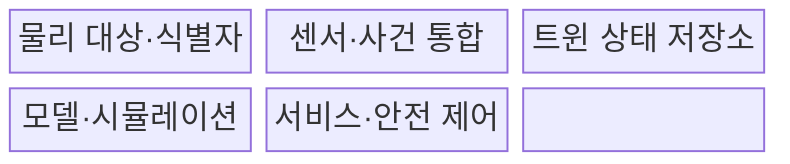
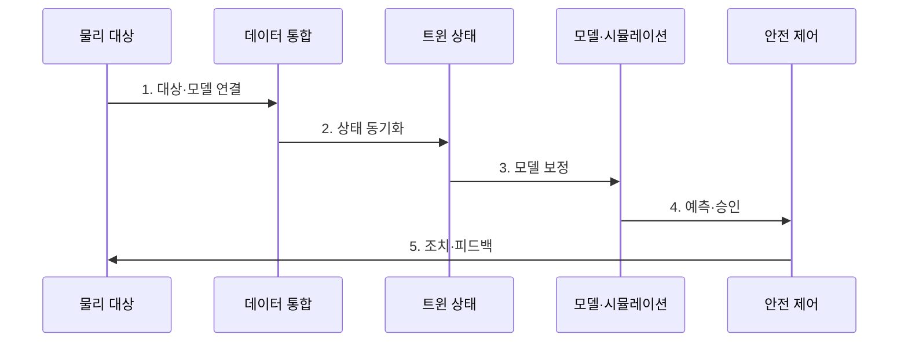

---
sidebar:
  order: 200
  label: "200. 디지털 트윈 (Digital Twin)"
  badge:
    text: "기출 · 70%"
    variant: note
title: "디지털 트윈 (Digital Twin)"
date: "2026-07-30T20:20:00+09:00"
tags:
  - "notes-latest-tech"
weight: 200
extra:
  question_no: "200"
  source_status: "기출"
  source_history: "125회, 128회"
  priority: 70
  priority_note: "디지털 트윈의 동기화·예측 구조가 반복 출제됨"
---

## 미리 알고가기

- **디지털 트윈**: 물리 대상과 데이터를 동기화해 상태 분석·예측·의사결정을 지원하는 가상 표현
- **사물인터넷(IoT)**: 센서·통신으로 물리 대상의 상태와 사건을 수집하는 기술
- **시뮬레이션(Simulation)**: 모델에 조건을 적용해 상태 변화와 결과를 예측하는 실험
- **피드백(Feedback)**: 분석·조치 결과를 물리 대상과 트윈 모델의 다음 상태에 반영하는 과정
- **표기 이유**: '트윈'은 단순히 모양이 같은 3D 모델이 아니라 **실물 식별·상태 동기화·생애주기 관계를 유지**한다는 의미

## Ⅰ. 개요

- 정의/개념: 물리 대상의 상태·맥락·이력을 동기화하고 모델로 **분석·예측·최적화하는 생애주기 가상 표현**
- 배경/필요성: 정적 모델과 사후 점검은 현실 자산의 현재 상태를 반영하지 못해 운영 중단 없이 변경을 검증하거나 고장을 예측하기 어렵다.

### 쉽게 이해하기 (학습용)

- 실제 설비의 현재 상태를 계속 따라가는 가상 복제본에서 미리 실험해 운전과 정비 결정을 돕는 방식이다.

## Ⅱ. 특징

- **1. 트윈 상태를 지속 동기화**: 실물의 센서·사건·이력을 반영해 트윈 상태를 지속 동기화한다.
- **2. 고장·성능·변경 결과를 사전에 예측**: 모델·시뮬레이션으로 고장·성능·변경 결과를 사전에 예측한다.
- **3. 승인·안전 경계와 피드백 검증**: 권고·자동 제어는 모델 오차가 현실로 전파되지 않도록 승인·안전 경계와 피드백 검증을 둔다.
### 쉽게 이해하기 (학습용)

- 가상 복제본은 실제 노후 상태를 반영하고, 예측 결과는 안전 검사를 거쳐 현장에 적용한다.

## Ⅲ. 구조 및 구성요소

| 구성요소 | 책임 |
|:---|:---|
| 물리 대상·식별자 | **실물과 생애주기 이력 식별** |
| 센서·사건 통합 | **상태 데이터 수집·시간 정렬** |
| 트윈 상태 저장소 | **현재 상태·맥락·이력 보존** |
| 모델·시뮬레이션 | **상태 추정·변경 영향 예측** |
| 서비스·안전 제어 | **예측·최적화 결과를 제공하고 검증된 조치만 실물에 반영** |

### 쉽게 이해하기 (학습용)

- 센서가 복제본을 갱신하고 가상 실험 결과가 안전 검사를 거쳐 작업 지시로 돌아간다.

## Ⅳ. 흐름도

**동작 원리**

- **1. 대상·모델 연결**: 실물 식별자, 센서, 모델 버전과 생애주기 이력 연결
- **2. 상태 동기화**: 센서·사건의 품질을 검사하고 시간을 정렬해 현재 상태 갱신
- **3. 모델 보정**: 관측값과 예측값의 차이를 이용해 상태 추정과 모델 오차 보정
- **4. 예측·승인**: 변경·고장·성능을 시뮬레이션하고 안전 규칙과 권한 검증
- **5. 조치·피드백**: 승인된 조치만 실행하고 실제 결과로 상태와 모델 재보정

### 쉽게 이해하기 (학습용)

- 실제와 가상의 차이를 줄인 뒤 실험하고, 현장 결과로 다음 예측을 다시 고친다.

## Ⅴ. 종류 및 비교

| 물리·가상 연계 수준 | Digital Model | Digital Shadow | Digital Twin |
|:---|:---|:---|:---|
| 적용 기준 | 설계·오프라인 검증 | 현황 가시화·상태 추적 | 예측·최적화·안전 조치 |
| 핵심 특징 | 수동 데이터 갱신 | 물리→가상 자동 갱신 | 양방향 연계·피드백 |
| 한계 | 실제 상태 불일치 | 현실 조치 환류 부재 | 모델 오류의 현실 전파 |

### 쉽게 이해하기 (학습용)

- 수동 설계도, 자동 계기판, 안전한 운전 판단까지 돕는 가상 복제본의 차이다.

## Ⅵ. 실무 고려사항 및 대책

| 고려사항 | 대책 | 효과 |
|:---|:---|:---|
| **상태 동기화 오류** 미검증 시 지연·결측·식별 오류로 실제와 다른 트윈 상태 사용 | 시간 동기화, 데이터 품질 규칙, 최신성 표시와 안전 기본값 | 트윈·실물 **상태 정합성** 향상 |
| **모델 드리프트** 미검증 시 설비 노후·환경 변화로 예측 오차 증가 | 실측 오차 감시, 버전 관리, 주기적 재보정과 유효 범위 명시 | 모델 **오차 증가 조기 탐지** |
| **자동 제어 권한** 미검증 시 잘못된 예측이 물리 사고로 전파 | 조치별 승인 등급, 물리 안전장치, 제한 구역 시험과 즉시 복귀 | 오예측의 **물리 제어 전파** 제한 |

### 쉽게 이해하기 (학습용)

- 핵심 운영 위험마다 실행 가능한 대책과 검증 효과를 함께 확인한다.

## Ⅶ. 결론

- 현실 설비를 안전하게 예측·최적화하기 위해 상태 동기화 정확도·모델 오차·승인·안전 경계를 검토하여 디지털 트윈의 제어 권한을 제한해야 한다.

### 쉽게 이해하기 (학습용)

- 핵심 판단 기준을 먼저 정한 뒤 적용 범위를 결정하는 것이 중요하다.
