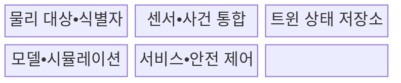
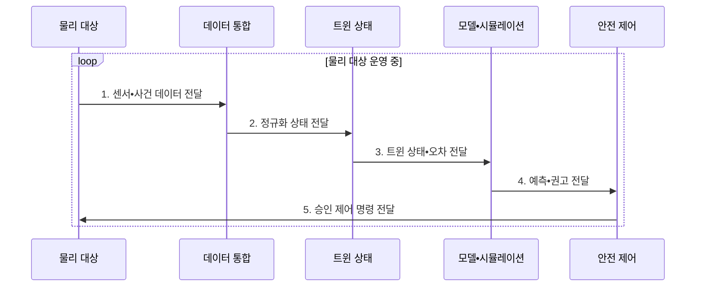

---
sidebar:
  order: 200
  label: "200. 디지털 트윈 (Digital Twin)"
  badge:
    text: "기출 • 70%"
    variant: note
title: "디지털 트윈 (Digital Twin)"
date: "2026-08-04T16:20:00+09:00"
tags:
  - "notes-latest-tech"
weight: 200
extra:
  question_no: "200"
  source_status: "기출"
  source_history: "125회, 128회"
  priority: 70
  priority_note: "디지털 트윈의 동기화•예측 구조가 반복 출제됨"
---

## Ⅰ. 개요

핵심 용어

- **디지털 트윈(Digital Twin)**: 물리 대상과 상태•이력을 동기화하여 분석•예측•의사결정을 지원하는 생애주기 가상 표현이다.

- 정의/개념: **디지털 트윈** 은 물리 대상과 상태•이력을 동기화하는 생애주기 가상 표현
- 배경/필요성: 정적 모델•사후 점검은 현실 자산의 **현재 상태•변경 영향** 반영과 고장 예측 곤란

#### 한줄 요약

- 실물 상태 동기화와 가상 실험 기반 운전•정비 의사결정

## Ⅱ. 특징

핵심 용어

- **상태 동기화**: 센서 사건과 이력을 반영하여 가상 모델의 상태를 실제 대상과 일치시키는 과정이다.
- **사물인터넷(Internet of Things, IoT)**: 센서와 통신으로 물리 대상의 상태와 사건을 수집하는 기술이다.
- **국제표준화기구(International Organization for Standardization, ISO)**: 국제 표준을 개발•발행하는 비정부 기구이다.

- **IoT 센서•사건** 과 이력 기반 **트윈 상태 동기화**
- 모델•시뮬레이션 기반 **고장•변경 영향 예측**
- **ISO 23247** 기반 생애주기 연계와 **승인•안전 피드백**

#### 한줄 요약

- 가상 복제본은 실제 노후 상태를 반영하고, 예측 결과는 안전 검사를 거쳐 현장에 적용한다.

## Ⅲ. 구조 및 구성요소

핵심 용어

- **물리 대상•식별자**: 현실 자산과 디지털 표현을 일대일로 연결하는 대상 및 고유 식별 정보이다.
- **트윈 상태 저장소**: 센서 사건과 이력을 반영해 물리 대상의 현재•과거 상태를 보존하는 데이터 계층이다.
- **모델•시뮬레이션**: 상태를 바탕으로 거동을 재현하고 미래 상태•고장•대안을 예측하는 계산 계층이다.
- **서비스•안전 제어**: 분석 결과를 운영 의사결정에 제공하고 검증된 명령만 물리 대상에 되돌리는 계층이다.

**IoT 센서** 가 물리 대상의 상태를 수집해 트윈 상태 저장소를 갱신한다.

| 구성요소 | 책임 |
|:---|:---|
| 물리 대상•식별자 | 실물과 **생애주기 이력** 식별 |
| 센서•사건 통합 | 상태 데이터 수집과 **시간 정렬** |
| 트윈 상태 저장소 | 현재 상태•맥락과 **이력 보존** |
| 모델•시뮬레이션 | **상태 추정•변경 영향** 예측 |
| 서비스•안전 제어 | 예측 결과 제공과 **검증된 조치** 반영 |

#### 한줄 요약

- 센서 기반 트윈 상태 갱신과 안전 검증된 조치의 실물 반영

## Ⅳ. 흐름도

핵심 용어

- **피드백**: 분석•조치 결과를 물리 대상과 트윈 모델의 다음 상태에 반영하는 과정이다.

**동작 원리**

1. **센서•사건 데이터 전달**: 실물 식별자와 **상태•시간 정보** 제공
2. **정규화 상태 전달**: 품질 검사•시간 정렬을 거친 **현재 상태** 제공
3. **트윈 상태•오차 전달**: 관측값과 예측값의 **차이 정보** 제공
4. **예측•권고 전달**: 변경•고장•성능의 **시뮬레이션 결과** 제공
5. **승인 제어 명령 전달**: 안전 규칙을 통과한 **실물 조치** 제공

#### 한줄 요약

- 실물•트윈 오차 보정과 시뮬레이션•안전 제어 피드백

## Ⅴ. 종류 및 비교

핵심 용어

- **디지털 섀도(Digital Shadow)**: 물리 대상의 변화가 가상 모델에 자동 반영되지만 가상 모델의 결과가 물리 대상에 자동 환류되지는 않는 표현이다.
- **디지털 모델(Digital Model)**: 물리 대상과 자동 동기화 없이 설계•분석에 사용하는 가상 표현이다.

| 물리•가상 연계 수준 | 디지털 모델 | 디지털 섀도 | 디지털 트윈 |
|:---|:---|:---|:---|
| 적용 기준 | **설계•오프라인 검증** | **현황 가시화•상태 추적** | 예측•최적화와 **안전 조치** |
| 핵심 특징 | **수동 데이터 갱신** | **물리→가상 자동 갱신** | **양방향 연계•피드백** |
| 한계 | **실제 상태 불일치** | **현실 조치 환류 부재** | **모델 오류의 현실 전파** |

#### 한줄 요약

- 수동 갱신은 모델, 단방향은 섀도, 양방향은 트윈

## Ⅵ. 실무 고려사항 및 대책

핵심 용어

- **모델 드리프트**: 설비 노후나 환경 변화로 모델의 예측과 실제 결과 사이의 오차가 커지는 현상이다.

| 문제 | 대책 | 효과 |
|:---|:---|:---|
| **상태 동기화 오류** 미검증 시 지연•결측•식별 오류로 실제와 다른 트윈 상태 사용 | 시간 동기화, 데이터 품질 규칙, 최신성 표시와 안전 기본값 | 트윈•실물 **상태 정합성** 향상 |
| **모델 드리프트** 미검증 시 설비 노후•환경 변화로 예측 오차 증가 | 실측 오차 감시, 버전 관리, 주기적 재보정과 유효 범위 명시 | 모델 **오차 증가 조기 탐지** |
| **자동 제어 권한** 미검증 시 잘못된 예측이 물리 사고로 전파 | 조치별 승인 등급, 물리 안전장치, 제한 구역 시험과 즉시 복귀 | 오예측의 **물리 제어 전파** 제한 |

#### 한줄 요약

- 핵심 운영 위험마다 실행 가능한 대책과 검증 효과를 함께 확인한다.

## Ⅶ. 결론

핵심 용어

- **ISO 23247 시리즈**: 제조 디지털 트윈의 원칙•참조 구조•정보 교환을 정의한 국제표준이다.

- 단방향 상태 추적은 **디지털 섀도**, 예측•제어 피드백은 **디지털 트윈** 선택과 ISO 23247 참조

#### 한줄 요약

- 핵심 판단 기준을 먼저 정한 뒤 적용 범위를 결정하는 것이 중요하다.
